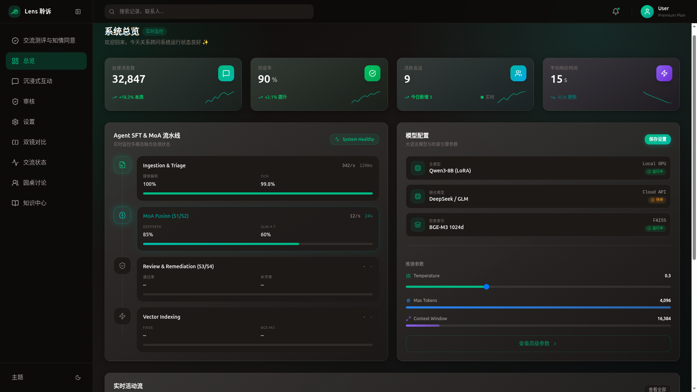
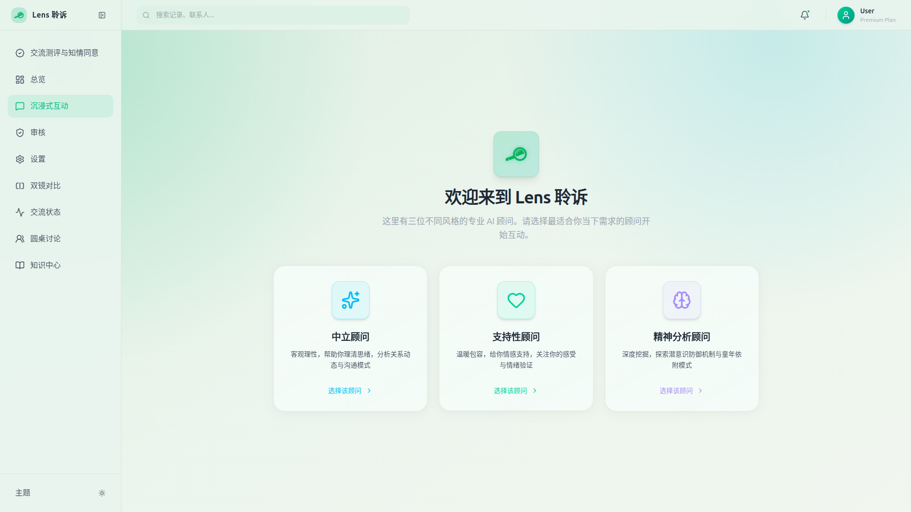
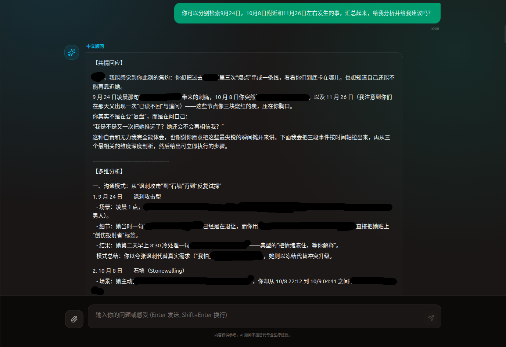
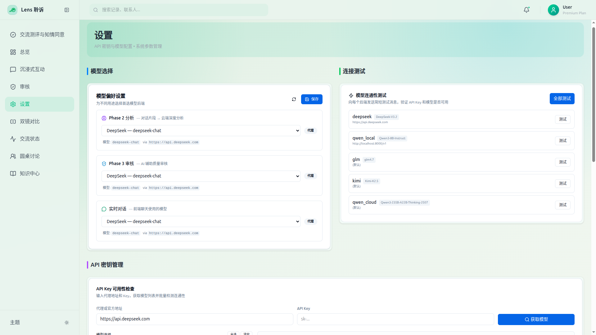
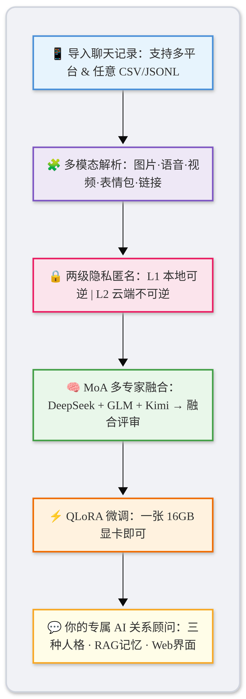
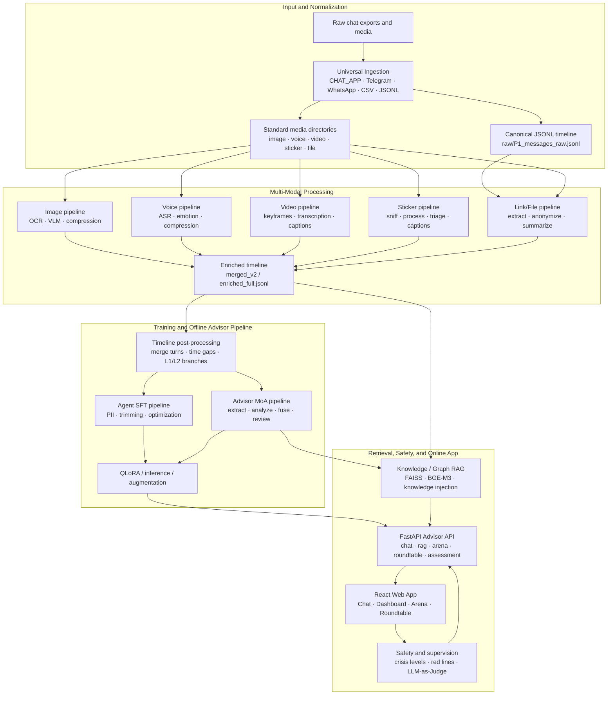

# Lens_opensource — CHAT_APP Multi-Modal Dataset & Relationship Advisor Pipeline

> Transform CHAT_APP chat history into high-quality multi-modal datasets for LLM fine-tuning, with an integrated AI relationship advisor system.

[](LICENSE)
[](https://www.python.org/)
[](https://ubuntu.com/)
[](https://www.microsoft.com/windows/)
[](https://mp.weixin.qq.com/mp/profile_ext?action=home&__biz=Mzg2MzAxNDQwMQ==&scene=124#wechat_redirect)

[English](README.md) | [中文](README_CN.md) | [Contributing](CONTRIBUTING.md) | [Security](SECURITY.md) | [RoadMap](RoadMap.md)

<div align="center">
  
  
</div>

## Overview

Lens is an end-to-end, local-first pipeline for transforming private CHAT_APP-style communication exports into privacy-safe multi-modal timelines, Agent SFT datasets, and an AI relationship advisor application. It normalizes heterogeneous chat exports, enriches messages with image/voice/video/sticker/link-file analysis, applies anonymization and PII controls, and builds downstream training and retrieval assets.

The current system is a modular pipeline stack rather than a single converter. It includes Universal Ingestion, multi-modal processing, Agent SFT preparation, Advisor MoA analysis, Knowledge/Graph RAG, a FastAPI + React advisor app, Dual-Mirror Arena evaluation, safety/crisis guardrails, and LLM-as-Judge supervision.

Lens is designed for research, personal data organization, and relationship reflection tooling. It is not a medical, diagnostic, psychotherapy, crisis-counseling, or emergency-response system.

### Key Capabilities

<div align="center">
  
  
  <br>
  
  
</div>

- **Universal Ingestion**: Plugin-based adapters normalize CHAT_APP, Telegram, WhatsApp, generic CSV, and generic JSONL exports into a canonical JSONL timeline.
- **Multi-Modal Processing**: Dedicated Image, Voice, Video, Sticker, and Link/File pipelines extract, analyze, compress, merge, and update the shared timeline.
- **Privacy-First Design**: Local anonymization, L1/L2 data branches, two-stage PII detection, public templates, and gitignored runtime/private data boundaries.
- **Agent SFT Data Pipeline**: Timeline post-processing, semantic compression, field trimming, privacy shielding, and SFT optimization for local or anonymized training data.
- **Advisor MoA Pipeline**: Conversation extraction, multi-expert analysis, fusion, AI/human review, remediation, formatting, QLoRA training, inference, and augmentation.
- **Knowledge-Augmented RAG**: Timeline retrieval, professional knowledge injection, assessment context injection, FAISS indexing, and hybrid graph/chunk retrieval.
- **Knowledge Center**: Web-based index for active and planned knowledge bases, including interdisciplinary perspectives, communication methods, crisis resources, and EFT resources.
- **Advisor Web Application**: React + Vite frontend and modular FastAPI backend for chat, dashboard, assessment, privacy, knowledge center, Arena, Roundtable, and supervision views.
- **Dual-Mirror Arena**: Blind A/B comparison for models, advisor styles, and interdisciplinary perspectives with voting, multi-dimensional scoring, and ranking data.
- **Roundtable Discussion**: Three-persona multi-agent discussion with SSE streaming, multi-round continuation, context injection, deep mode, and moderator synthesis.
- **Safety and Supervision**: Four-level crisis detection, consent and disclaimers, red-line wording checks, fixed crisis-resource responses, and LLM-as-Judge quality monitoring.

For detailed architecture and implementation details, see [modality_fields_and_models.md](docs/pipelines/modality_fields_and_models.md), [advisor_pipeline_overview.md](docs/advisor/advisor_pipeline_overview.md), and [RoadMap.md](RoadMap.md).

<div align="center">
  
  
</div>


---

## End-to-End Architecture Overview



---

## Architecture

```
┌─────────────────────────────────────────────────────────────────────────────┐
│                         Lens_opensource Pipeline Stack                       │
│                                                                             │
│  Raw Exports ─▶ Universal Ingestion ─▶ Canonical Timeline                    │
│                     │                         │                              │
│                     ▼                         ▼                              │
│        Standard Media Directories     Multi-Modal Pipelines                  │
│                                      Image │ Voice │ Video │ Sticker │ File  │
│                                                │                            │
│                                                ▼                            │
│                                      Enriched Timeline                       │
│                                                │                            │
│                 ┌──────────────────────────────┼─────────────────────────┐  │
│                 ▼                              ▼                         ▼  │
│          Agent SFT Pipeline           Advisor MoA Pipeline          RAG Index │
│      L1/L2 · PII · Optimize       Analyze · Fuse · Review       FAISS · BGE │
│                 │                              │                         │  │
│                 └──────────────┬───────────────┴──────────────┬──────────┘  │
│                                ▼                              ▼             │
│                     FastAPI Advisor API              Safety / Supervision    │
│                 Chat · RAG · Arena · Roundtable      Crisis · Judge          │
│                                │                                            │
│                                ▼                                            │
│                         React + Vite Web App                                 │
└─────────────────────────────────────────────────────────────────────────────┘
```

---

## Pipeline Modules

| Module | Main Responsibility | Main Entry / Area | Detailed Docs |
|---|---|---|---|
| Universal Ingestion | Normalize multiple chat export formats into the canonical timeline | `scripts/workspace/run_ingest.py`, `scripts/workspace/ingestion/` | [Ingestion Pipeline](docs/pipelines/ingestion_pipeline_overview.md) |
| Workspace Initialization | Create standard workspace folders and local configuration scaffolding | `scripts/workspace/init_workspace.py` | [Workspace Init](docs/pipelines/workspace_init.md) |
| Multi-Modal Processing | Process image, voice, video, sticker, and link/file messages | `run_all_pipelines.py`, `scripts/*/run_all/` | [Full Pipeline](docs/pipelines/pipeline.md) |
| Shared Utilities | Text normalization, anonymization, media filtering, schema/path helpers | `scripts/_common/` | [Modality Fields](docs/pipelines/modality_fields_and_models.md) |
| Agent SFT Data | Convert enriched timelines into L1/L2 SFT-ready datasets | `scripts/timeline/`, `scripts/compression/`, `scripts/advisor/run_all/_05*.py` | [Agent SFT](docs/pipelines/agent_sft_pipeline_overview.md) |
| Advisor MoA | Extract conversations, generate multi-expert analyses, fuse/review/remediate | `scripts/advisor/run_all/_01*` to `_04*` | [MoA Fusion](docs/advisor/advisor_moa_fusion_overview.md) |
| Training / Inference | QLoRA training, inference comparison, optional augmentation | `scripts/advisor/run_all/_06*` to `_10*` | [Advisor Training](docs/advisor/advisor_training_overview.md) |
| Knowledge / Graph RAG | Build retrieval indexes and inject timeline/knowledge/assessment context | `scripts/advisor/run_all/_09_build_graph.py` | [Knowledge RAG](docs/pipelines/knowledge_rag_upgrade_overview.md) |
| Knowledge Center | Web index for active/planned knowledge bases and RAG-ready FAQ resources | `frontend/src/pages/KnowledgeCenterPage.tsx` | [Knowledge RAG](docs/pipelines/knowledge_rag_upgrade_overview.md) |
| Advisor API | Modular FastAPI backend for chat, RAG, review, models, safety, Arena, Roundtable | `scripts/advisor/api/main.py`, `scripts/advisor/api/routes/` | [Advisor Service](docs/advisor/advisor_service_overview.md) |
| Web App | React pages for dashboard, chat, consent, privacy, assessment, knowledge, Arena, Roundtable | `frontend/src/pages/` | [Web App Design](docs/app/web_app_overview.md) |
| Roundtable Discussion | Three-persona multi-agent discussion with SSE streaming, multi-round follow-up, context injection, and moderator synthesis | `frontend/src/pages/RoundtablePage.tsx`, `scripts/advisor/api/routes/roundtable.py` | [Roundtable Design](docs/app/roundtable_discussion_overview.md) |
| Safety / Crisis | Four-level crisis detection, red-line wording checks, consent and fixed resources | `scripts/advisor/api/crisis_detector.py`, `scripts/advisor/api/routes/safety.py` | [Safety Crisis](docs/pipelines/safety_crisis_overview.md) |
| Arena / Supervision | Dual-mirror comparison and LLM-as-Judge quality/risk monitoring | `arena.py`, `supervision_agent.py` | [Arena](docs/pipelines/arena_dual_mirror_overview.md), [Supervision](docs/pipelines/supervision_pipeline_overview.md), [Communication Status](docs/app/communication_status_overview.md) |

---

## Data Normalization Pipeline

Before entering multi-modal processing, the system normalizes chat records from different sources into a standard format through the Universal Ingestion engine.

### Universal Data Ingestion

Supports unified access to 5 mainstream chat data sources:

| Source Type | Identifier | Input Format | Adapter |
|-------------|------------|-------------|---------|
| CHAT_APP | `CHAT_APP_html` | HTML + CSV export files | `CHAT_APPAdapter` |
| Telegram | `telegram_json` | JSON export file | `TelegramAdapter` |
| WhatsApp | `whatsapp_txt` | TXT export file | `WhatsAppAdapter` |
| Generic CSV | `generic_csv` | Any CSV (requires field mapping) | `GenericCSVAdapter` |
| Generic JSONL | `generic_jsonl` | Any JSONL (requires field mapping) | `GenericJSONLAdapter` |

### Workspace Initialization Flow

#### Method 1: New Workspace (Recommended)

Use `init_workspace.py` to complete directory creation + data import in one step:

```bash
# 1. Place raw material folder under project directory
cp -r ~/chat_data /path/to/project/chat_workspace

# 2. Copy scripts from template workspace
cp -r /path/to/project/template/scripts /path/to/project/chat_workspace/scripts

# 3. Run initialization (auto-detect source type)
cd /path/to/project/chat_workspace
python scripts/workspace/init_workspace.py --contact-name "ContactName"

# Preview mode (don't execute actual operations)
python scripts/workspace/init_workspace.py --dry-run --contact-name "ContactName"
```

**Initialization automatically executes:**
1. **Create standard directory structure** - `raw/`, `artifacts/`, `timeline_out/` etc.
2. **Migrate raw files** - HTML/CSV → `raw/export/`, media → `raw/image/` etc.
3. **Copy configuration files** - Copy scripts and configs from template workspace
4. **Generate source_manifest.yaml** - Define data source and conversion rules
5. **Run normalization conversion** - Generate `raw/P1_messages_raw.jsonl`
6. **Clean old directories** - Delete original folders in root directory

#### Method 2: Re-import Data for Existing Workspace

Use `run_ingest.py` to run data conversion independently:

```bash
# 1. Edit raw/source_manifest.yaml configuration file
# 2. Preview conversion
python scripts/workspace/run_ingest.py --workspace workspace_name --dry-run

# 3. Execute conversion
python scripts/workspace/run_ingest.py --workspace workspace_name
```

### Standardized Schema

All data sources are finally normalized into unified JSONL format with core fields:

| Field | Type | Description | Example |
|-------|------|-------------|---------|
| `ts` | int | Unix timestamp (seconds) | 1704067200 |
| `speaker` | str | Sender identifier (ME/OTHER) | "ME" |
| `type` | int | Message type code | 1 |
| `modality` | str | Modality type | "text/image/voice/video/sticker" |
| `text_raw` | str | Original text content | "Hello World" |
| `local_path` | str | Local file path | "./raw/image/img_001.jpg" |

### Configuration Management

#### source_manifest.yaml Configuration

```yaml
# Data source type
source_type: CHAT_APP_html

# Input file paths (relative to raw/ directory)
input_paths:
  - ./export/contact.html

# Participant mapping
participant_map:
  "MyNickname": "ME"
  "ContactNickname": "OTHER"

# Timezone setting
timezone: Asia/Shanghai

# Media file base directory (optional)
media_base_dir: ./media
```

#### Field Mapping Syntax (Generic Adapters)

| Syntax | Description | Example |
|--------|-------------|---------|
| `source: target` | Direct field mapping | `timestamp: ts` |
| `_const:value: target` | Constant value | `_const:text: modality` |
| `_default:value: target` | Default value | `_default:0: sub_type` |

### Post-Conversion Operations

After normalization completion, `raw/P1_messages_raw.jsonl` is generated and can directly run multi-modal processing pipelines:

```bash
# Run all modality pipelines at once
python run_all_pipelines.py

# Or run by modality step by step
python run_all_pipelines.py --only image
python run_all_pipelines.py --only voice
python run_all_pipelines.py --only video sticker
```

---

## Multi-Modal Processing Pipelines

Each modality has a dedicated sub-pipeline under `scripts/<modality>/run_all/`, orchestrated by `run_all_pipelines.py`. The shared execution pattern is **Extract → Analyze → Compress (optional) → Merge → Update Timeline**, with modality-specific review, triage, cleanup, and schema validation steps where needed.

### Image Pipeline (4 steps)

| Step | Script | Description | Models |
|------|--------|-------------|--------|
| 1. OCR | `_01_run_ocr.py` | Smart routing (TEXT_HEAVY / PHOTO / HYBRID) + PaddleOCR PP-OCRv4 with detection box reuse (30-40% speedup) | PaddleOCR v4 |
| 2. Caption | `_02_run_caption.py` | Triage classification (NSFW/Gore/Normal/Cross-cultural/Doc) → Expert Router dispatches to specialized models | Qwen2.5-VL-7B, MiniCPM-V 4.5 Abliterated, Pixtral 12B GGUF |
| 2.5. Compress | `_02.5_run_compress.py` | Semantic compression of captions (4-5x ratio) | Qwen2.5-7B |
| 3. Merge | `_03_merge_engine.py` | Merge OCR + Caption results into unified schema | — |
| 4. Timeline | `_04_update_timeline.py` | Write back to main timeline | — |

**Expert Model Routing:**
- `TYPE_C_NORMAL` → Qwen2.5-VL-7B-Instruct (main captioning model)
- `TYPE_A_NSFW` → Dual-model ensemble: MiniCPM-V 4.5 Abliterated (int8) + qwen2.5-vl-7b-nsfw-caption-v3 with intelligent fusion
- `TYPE_B_GORE` → Qwen2.5-VL Abliterated (4-bit) with warning labels
- `TYPE_D_DOC` → Pixtral 12B GGUF (Q5_K_M) for cross-cultural/document/screenshot analysis

### Voice Pipeline (4 steps)

| Step | Script | Description | Models |
|------|--------|-------------|--------|
| 1. ASR | `_01_run_funasr.py` | FunASR (paraformer-zh + VAD + punctuation) with hotword boosting; optional Whisper fallback | FunASR, Whisper |
| 2. Emotion | `_02_run_emotion.py` | 4-phase: SenseVoice fast detection → Keyword triage → Qwen2-Audio deep analysis → Human review file | SenseVoice, Qwen2-Audio-7B |
| 2.5. Compress | `_02.5_run_compress.py` | Compress verbose emotion analysis, preserve transcription | Qwen2.5-7B |
| 3. Merge | `_03_merge_engine.py` | Merge FunASR + Whisper + emotion results | — |
| 4. Timeline | `_04_update_timeline.py` | Write back to main timeline | — |

**Emotion Taxonomy:** 6 categories, 20+ fine-grained labels (Toxic, Intimacy, Distress, Masking, Basic, Cognitive).

### Video Pipeline (5 steps)

| Step | Script | Description | Models |
|------|--------|-------------|--------|
| 1. Extract | `_01_run_extract.py` | Adaptive keyframe extraction using optical flow motion detection + scene change analysis | ffmpeg, OpenCV |
| 2. Transcribe | `_02_run_transcribe.py` | Audio transcription + emotion detection (reuses voice pipeline) | FunASR, SenseVoice |
| 3. Caption | `_03_run_caption.py` | Per-frame triage + expert routing; LLaVA-NeXT-Video fallback for refusals | Qwen2.5-VL-7B, LLaVA-NeXT-Video-7B |
| 3.5. Compress | `_03.5_run_compress.py` | Multi-frame description compression (10x ratio) | Qwen2.5-7B |
| 4. Merge | `_04_merge_engine.py` | Merge extract + transcribe + caption results | — |
| 5. Timeline | `_05_update_timeline.py` | Write back to main timeline | — |

### Sticker Pipeline (8 steps)

| Step | Script | Description |
|------|--------|-------------|
| 1. Download | `_01_run_download.py` | Download stickers from URLs with SHA256 deduplication |
| 2. Sniff | `_02_run_sniff.py` | Magic bytes format detection (GIF/WebP/PNG/JPEG), Pillow decode verification |
| 3. Process | `_03_run_process.py` | Animated/static classification, adaptive frame sampling (4-16 frames), Contact Sheet generation |
| 4. Triage | `_04_run_triage.py` | Per-frame NSFW/Gore detection, max-score aggregation, reusing video pipeline's triage logic |
| 5. Caption | `_05_run_caption.py` | VLM description with expert routing for sensitive content |
| 5.5. Compress | `_05.5_run_compress.py` | Intent mapping + dictionary compression (up to 15x for repeated stickers) |
| 6. Merge | `_06_merge_engine.py` | Merge all stage results with SHA256-based deduplication |
| 7. Timeline | `_07_update_timeline.py` | Write back to main timeline |
| 8. Cleanup | `_08_cleanup_frames.py` | Remove temporary frame files |

### Linkfile Pipeline (3 steps, CPU-only)

| Step | Script | Description |
|------|--------|-------------|
| 1. Extract | `_01_extract_and_anonymize.py` | Strategy pattern routing: Quote / Link / File / Miniprogram / VideoChannel / ChatHistory handlers |
| 1.5. Summary | `_01.5_run_file_summary.py` | Generate file content summaries |
| 2. Merge | `_02_merge_engine.py` | Merge with unified schema |
| 3. Timeline | `_03_update_timeline.py` | Write back to main timeline |

---

## Shared Utilities (`scripts/_common/`)

All modality pipelines share a set of common utilities that handle cross-cutting concerns:

### Text Normalization (`text_normalize.py`)

A comprehensive multi-stage text normalization pipeline designed for ASR post-processing and text cleaning across all modalities:

```
Raw Text → to_simplified() → strip_punc() → ct-punc → dedup_punc() → apply_patches() → fix_false_question()
```

#### Core Processing Stages

| Function | Purpose | Example | Use Case |
|----------|---------|---------|----------|
| `to_simplified()` | Traditional → Simplified Chinese conversion (OpenCC `t2s`) | `雲頂之弈` → `云顶之弈` | Cross-modal text standardization |
| `strip_punc()` | Remove existing punctuation before ct-punc re-punctuation | `你好，世界！` → `你好 世界` | Pre-processing for ct-punc |
| `dedup_punc()` | Deduplicate repeated punctuation after ct-punc | `你好，，世界。。` → `你好，世界。` | Post-processing cleanup |
| `apply_patches()` | Controlled error correction for ASR proper-noun mistakes | `云顶之翼` → `云顶之弈` (with audit log) | ASR error correction |
| `fix_false_question()` | Conservative punctuation fix for false question marks | `什么的？` → `什么的。` (only specific patterns) | ASR punctuation correction |
| `prepare_for_punc()` | One-shot pipeline helper: simplify + strip punctuation | Ready for ct-punc input | Pipeline integration |

#### Advanced Features

**Error Correction System:**
- **Proper Noun Correction**: Fixes common ASR mistakes in game names, brands, and technical terms
- **Homophone Correction**: Handles frequently misrecognized similar-sounding words
- **Audit Logging**: Tracks all corrections with detailed logs for quality control

**Conservative Punctuation Fix:**
- **Pattern-Based**: Only fixes specific non-question patterns ending with question marks
- **Safety-First**: Preserves genuine questions while fixing false positives
- **Narrow Scope**: Targets common ASR punctuation errors without over-correction

**Pipeline Integration:**
- **Modular Design**: Each stage can be used independently or as part of the full pipeline
- **Fallback Handling**: Graceful degradation when optional dependencies (OpenCC) are unavailable
- **Performance Optimized**: Efficient regex patterns and minimal memory footprint

#### Usage Examples

```python
# Full pipeline for ASR post-processing
from scripts._common.text_normalize import prepare_for_punc, dedup_punc, apply_patches, fix_false_question

# Step 1: Prepare text for ct-punc
clean_text, meta = prepare_for_punc(raw_asr_output)
# Result: "云顶之弈 真好玩"

# Step 2: Apply ct-punc (external service)
punctuated = ct_punc_service(clean_text)
# Result: "云顶之弈，真好玩！"

# Step 3: Post-processing
final_text = dedup_punc(punctuated)
final_text, patch_logs = apply_patches(final_text)
final_text, fix_logs = fix_false_question(final_text)
# Result: "云顶之弈，真好玩。"
```

**Configuration:**
- **Patch Mapping**: Customizable error correction dictionary in `DEFAULT_PATCH_MAP`
- **Pattern Rules**: Extensible false question patterns in `_SHENME_DE_PATTERNS`
- **Dependency Management**: Optional OpenCC with automatic fallback

### Anonymizer (`anonymizer.py`)

Unified name anonymization with 4 strategies:

| Function | Scope | Example |
|----------|-------|---------|
| `anonymize_speaker_prefix()` | Quote message speaker prefix | `UserB：是考在职吗` → `OTHER: 是考在职吗` |
| `anonymize_text()` | General text name replacement | `UserB recalled a message` → `OTHER recalled a message` |
| `anonymize_recalled_message()` | Recalled message pattern | `"UserB 某大学" recalled a message` → `OTHER recalled a message` |
| `anonymize_message_text()` | Unified entry point (auto-selects strategy by msg_type) | Routes to appropriate function |

Configuration via `configs/anonymization.yaml` with `me_names` / `other_names` lists. Unknown speakers default to `OTHER` for privacy safety.

### Media Quality Filter (`media_filter.py`)

4-tier quality filtering system for images, videos, and stickers:

| Tier | Decision | Description |
|------|----------|-------------|
| `PROCESS` | Full processing | Meets all quality thresholds |
| `SKIP_LOW_QUALITY` | Skip with marker | Below minimum resolution/duration/size |
| `SKIP_DOWNLOAD_FAILED` | Skip with marker | Media file download or decode failure |
| `SKIP_DECODE_FAILED` | Skip with marker | Media file cannot be decoded |

Per-modality filter functions (`filter_image()`, `filter_video()`, `filter_sticker()`) with configurable thresholds via `configs/media_filter.yaml`.

### Other Shared Modules

| Module | Purpose |
|--------|---------|
| `schema_utils.py` | Unified `merged_v2` schema builder, field ordering, legacy record migration |
| `jsonl_utils.py` | JSONL I/O: `load_jsonl_by_key()` (dict mode), `load_jsonl_list()`, `write_jsonl()`, `update_jsonl_in_place()` (atomic with backup) |
| `path_utils.py` | Centralized path management: loads `configs/paths.yaml`, provides `get_path()`, per-modality directory getters |
| `check_paths.py` | Workspace path validation |
| `download_models.py` | One-click model downloader for all required models |

---

## Agent SFT Data Pipeline

After multi-modal processing, the Agent SFT pipeline transforms the enriched timeline into training-ready data through multiple stages of compression, anonymization, and optimization:

```
enriched_full.jsonl
       │
       ▼
  Timeline Postprocessing (message merging, time gap markers)
       │
       ├──── L1 Branch (local training) ────┐
       │     Field trimming → SFT optimizer  │──▶ agent_sft_l1.jsonl
       │                                     │
       ├──── L2 Branch (cloud training) ────┐│
       │     Two-stage PII anonymization     ││
       │     → Field trimming                ││──▶ agent_sft_l2.jsonl
       │     → SFT optimizer                 │
       │                                     │
       └──── Quality Validation ─────────────┘
```

### Timeline Postprocessing (`scripts/timeline/`)

| Script | Description | Key Features |
|--------|-------------|--------------|
| `postprocess_timeline.py` | Message merging and time gap marking | Merges consecutive messages, inserts time markers for gaps |
| `run_anonymization.py` | L2 anonymization runner | Orchestrates two-stage PII detection and replacement |
| `timeline_postprocessor.py` | Core timeline processing logic | Handles message merging, speaker continuity, time gap detection |

### Compression & Optimization (`scripts/compression/`)

The compression module provides semantic compression and data optimization for training efficiency:

| Script | Description | Function |
|--------|-------------|----------|
| `engine.py` | Semantic compression engine | Core compression logic with LLM-based text summarization |
| `sft_optimizer.py` | SFT data optimization | ID simplification, timestamp compression, message type normalization |
| `sft_trimmer.py` | Field trimming for L1/L2 | Removes technical metadata, preserves semantic fields |
| `quality_validator.py` | Data quality validation | Validates compressed data quality and completeness |

### Modality-Specific Compressors

| Script | Target Modality | Compression Strategy |
|--------|----------------|----------------------|
| `image_compressor.py` | Image captions | 4-5x ratio, preserves key visual information |
| `voice_compressor.py` | Voice transcriptions | Preserves core content, compresses verbose emotion analysis |
| `video_compressor.py` | Video descriptions | 10x ratio, merges multi-frame descriptions |
| `sticker_compressor.py` | Sticker captions | Intent mapping + dictionary compression (up to 15x for repeated stickers) |

### Two-Stage PII Detection (`scripts/compression/two_stage_pii/`)

Advanced PII detection system with high precision:

| Script | Description | Role |
|--------|-------------|------|
| `scanner.py` | Two-stage PII scanner | Orchestrates candidate extraction and LLM validation |
| `candidate_extractor.py` | Candidate word extraction | Rule-based extraction of potential PII terms |
| `llm_validator.py` | LLM-based validation | Uses Qwen2.5-7B to validate and classify PII candidates |
| `name_replacer.py` | High-precision replacement | Exact string matching against confirmed names list |
| `models.py` | Data models | Pydantic models for PII detection workflow |

### Privacy & Security Tools

| Script | Description | Purpose |
|--------|-------------|---------|
| `pii_detector.py` | Rule-based PII detection | Fast regex-based detection of common PII patterns |
| `privacy_shield.py` | Privacy protection layer | Comprehensive PII detection and replacement system |
| `llm_pii_scanner.py` | LLM-enhanced PII scanning | Uses LLM for complex PII pattern recognition |
| `run_full_anonymization.py` | Full anonymization runner | Complete L2 anonymization pipeline execution |

### Utilities & Analysis

| Script | Description | Use Case |
|--------|-------------|----------|
| `generate_report.py` | Compression reports | Generate detailed compression statistics and reports |
| `sample_comparison.py` | Before/after comparison | Compare original vs compressed data quality |
| `scan_pii.py` | PII scanning tool | Standalone PII detection and analysis |
| `validate_sft_quality.py` | SFT data validation | Validate final SFT dataset quality |

**L1 (Local):** Reversible anonymization, real names preserved in local vault. For on-device training.

**L2 (Cloud):** Irreversible anonymization with two-stage PII detection (regex + LLM validation), timestamp shifting, location replacement. Safe for cloud training.

Run with:
```bash
./run_agent_sft_pipeline.sh              # Both L1 and L2
./run_agent_sft_pipeline.sh --only l1    # L1 only
./run_agent_sft_pipeline.sh --only l2    # L2 only
```

---

## Relationship Advisor System

A full-stack AI relationship advisor built on the processed chat data:

### Offline Pipeline (16 scripts across 10+ phases)

| Phase | Script | Description | Models / Tools |
|-------|--------|-------------|----------------|
| 0 | `_00_verify_environment.py` | Verify Python deps (torch, transformers, peft, bitsandbytes, trl, datasets, accelerate), CUDA/GPU, base model files, test 4-bit quantized loading + inference | Qwen3-8B-Instruct (NF4) |
| 1 | `_01_extract_conversations.py` | Sliding window extraction from SFT data (L1/L2). Window size 20, step 10, min 10 messages. Auto-classifies chunks: conflict / sweet / normal | — |
| 2a | `_02_generate_analysis.py` | Single-backend LLM analysis. 5 backends (DeepSeek, Kimi, Qwen, deepseek, GLM). Checkpoint resume support | Any of 5 LLM backends |
| 2b | `_02b_model_comparison.py` | Side-by-side multi-backend comparison on representative chunks. Generates Markdown comparison reports | Multiple backends |
| 2c | `_02c_fusion_pipeline.py` | **MoA (Mixture of Agents) fusion pipeline** — the core analysis engine (see details below) | DeepSeek + GLM + Kimi + Qwen |
| 2c' | `_02c_rerun_moa.py` | Re-run MoA fusion for specific failed/low-quality chunks | Same as 2c |
| 3a | `_03_export_for_review.py` | Export analyses for human review | — |
| 3b | `_03b_ai_review.py` | AI-assisted quality review with per-dimension scoring. Auto-remediation for weak dimensions | Qwen / Kimi |
| 4 | `_04_import_reviewed.py` | Import human-reviewed and approved analyses | — |
| 5a | `_05_format_training_data.py` | Convert to SFT format (JSONL or Alpaca). Data source priority: MoA > reviewed > raw. Auto-strips redundant fields (DeepSeek_raw, GLM_raw) | — |
| 5b | `_05b_filter_split_training.py` | Quality filter (min 13 `【】` fields) + OTHERHER bug fix + stratified train/val/test split (80/10/10) by relationship status | — |
| 5c | `_05c_deanonymize_training.py` | Reverse anonymization for local training: ME/OTHER → real names, Day N → real dates, time range extraction | — |
| 6 | `_06_train_model.py` | QLoRA fine-tuning (4-bit NF4, LoRA r=16 α=32). Supports HuggingFace standard and Unsloth (2x speedup) backends. Checkpoint resume, val_loss monitoring | Qwen3-8B-Instruct |
| 7a | `_07_run_inference.py` | Interactive / single / batch inference. Auto-detects best LoRA (Unsloth deanon > HF deanon > legacy) | Qwen3-8B + LoRA |
| 7b | `_07b_eval_compare.py` | Evaluation: ROUGE-L F1, field completeness, base vs fine-tuned comparison | — |
| 8 | `_08_run_dialogue.py` | Real-time terminal dialogue with listen/consult modes, streaming output, GraphRAG context retrieval | Ollama (local) / DeepSeek (cloud) |
| 9 | `_09_build_graph.py` | Build FAISS vector index with BGE-M3 embeddings + BGE-Reranker-V2-M3. Full/incremental modes. Generates user profile (recurring topics, conflict patterns, relationship trends) | BGE-M3, BGE-Reranker-V2-M3 |
| 10 | `_10_augment_data.py` | Multi-teacher distillation from external datasets (PsyCLIENT-CP, CPsDD, AuraDial). Logic teacher (DeepSeek Reasoner) + Style teacher (DeepSeek V3.2) dual architecture. Quality filtering | DeepSeek Reasoner, DeepSeek V3.2 |

### MoA Fusion Pipeline (Phase 2c) — Deep Dive

The MoA (Mixture of Agents) fusion pipeline is the core analysis engine. It orchestrates multiple frontier LLMs in a 4-stage process:

```
                    ┌─────────────────────────────────────────────┐
                    │           MoA Fusion Pipeline                │
                    │                                             │
  Conversation ──▶  │  S1: Parallel Expert Analysis               │
  Chunk             │    ├── DeepSeek V3.2 → structured analysis    │
                    │    ├── GLM → structured analysis            │
                    │    └── Kimi → structured analysis (if MM) │
                    │                         │                   │
                    │  S2: MoA Aggregation    ▼                   │
                    │    └── Qwen fuses all expert outputs        │
                    │         into unified JSON (6+ fields)       │
                    │                         │                   │
                    │  S3: Quality Review     ▼                   │
                    │    └── Qwen scores each dimension (1-10)    │
                    │         Pass / Needs Revision / Fail        │
                    │                         │                   │
                    │  S4: Remediation Loop   ▼                   │
                    │    └── Targeted fix for dimensions ≤ 7/10   │
                    │         Up to 3 rounds, re-review each      │
                    │         Fallback: Qwen → Kimi-2.5 → Kimi-2-Instruct      │
                    └─────────────────────────────────────────────┘
```

**Key features:**
- **Multi-model fallback chains**: DeepSeek-reasoner (primary) → DeepSeek backup → GLM degraded ; Qwen (primary) → Qwen backup → Kimi → Kimi
- **Multimodal awareness**: Kimi is only invoked for chunks containing multi-modal content (images, voice, video descriptions)
- **Thinking model truncation detection**: Detects `<think>` tag truncation and auto-switches to non-thinking fallback
- **Cloudflare HTML error detection**: Auto-retries with 30s backoff on proxy HTML responses
- **Key pool rotation**: Multi-key round-robin with per-key blacklisting, emergency mode, and global RPM limiting (≤19)
- **Pipeline mode**: Async 4-stage pipeline with configurable S1 concurrency and Qwen concurrency (`--pipeline --max-s1 2 --max-Qwen 3`)
- **Checkpoint resume**: Scans output file for completed chunk_ids, skips already-processed chunks

```bash
# Standard MoA fusion (serial)
python scripts/advisor/run_all/_02c_fusion_pipeline.py --moa --agent-type neutral

# Pipeline mode with concurrency
python scripts/advisor/run_all/_02c_fusion_pipeline.py --pipeline --max-s1 2 --max-Qwen 3

# Multi-worker with key pool
python scripts/advisor/run_all/_02c_fusion_pipeline.py --moa --workers 3 --key-pool local_secrets/key_pool.yaml

# Switch MoA aggregator to Kimi (when Qwen is unstable)
python scripts/advisor/run_all/_02c_fusion_pipeline.py --moa --Qwen-backend kimi
```

### Three Agent Personas × Two Modes

| Agent | Approach | Theoretical Framework |
|-------|----------|----------------------|
| Neutral | Objective multi-dimensional analysis | Communication patterns, attachment styles, NVC, power dynamics |
| Supportive | Unconditionally on the user's side | Emotional validation, protective advice, boundary setting |
| Psychoanalytic | Unconscious-level deep analysis | Object relations, Lacanian registers, defense mechanisms, transference |

| Mode | Response Style |
|------|---------------|
| Listen | 5-7 sentences, empathy-first, open-ended questions |
| Consult | Full structured analysis (500-2500 words), multi-dimensional |

### Online Service

- **Backend:** FastAPI (port 8787) with SSE streaming, multi-turn session management, conversation history compression
- **Frontend:** React 19 + Vite + Tailwind CSS dashboard with chat, pipeline control, human review, model management, and API key checker
- **RAG:** Triple-layer retrieval — date-precise day index lookup + FAISS semantic search (BGE-M3) + keyword fallback + FAQ knowledge base
- **LLM Backends:** 5 backends via unified OpenAI-compatible interface (DeepSeek, Kimi, Qwen, deepseek, GLM, Qwen-local Ollama)
- **Safety:** SafetyLayer P0, GlobalRateLimiter (RPM≤19), auto-failover between backends, Ollama watchdog auto-restart
- **Session Management:** Persistent sessions with agent type, mode switching, memory fact extraction, history truncation

---

## Universal Ingestion

Plugin-based adapter architecture for importing chat data from multiple platforms:

| Adapter | Source | Format |
|---------|--------|--------|
| `wechat_html` | CHAT_APP Desktop export | HTML + CSV |
| `telegram_json` | Telegram Desktop export | result.json |
| `whatsapp_txt` | WhatsApp export | *.txt (8 date formats) |
| `generic_csv` | Any CSV | field_mapping DSL |
| `generic_jsonl` | Any JSONL | field_mapping DSL |

All adapters output to a unified Canonical Schema (`P1_messages_raw.jsonl`) that feeds into the downstream modality pipelines.

```bash
# Auto-detect source type and ingest
python scripts/workspace/run_ingest.py --workspace /path/to/workspace

# Specify source type
python scripts/workspace/run_ingest.py --workspace /path/to/workspace --source-type telegram_json

# Dry run (preview without writing)
python scripts/workspace/run_ingest.py --dry-run
```

---

## Privacy & Anonymization

### Two-Tier System

| Level | Use Case | Reversible | PII Handling |
|-------|----------|------------|--------------|
| **L1** | Local training | Yes (vault) | Names → ME/OTHER, timestamps preserved |
| **L2** | Cloud training | No | Full PII scrub, timestamp shift, location replacement |

### Two-Stage PII Detection

1. **Phase 1 (Offline Scan):** Rule-based candidate extraction → LLM validation (Qwen2.5-7B-AWQ) → Human review → Confirmed names list
2. **Phase 2 (Runtime):** Exact string matching against confirmed list — zero false negatives, high performance

### Configuration

```yaml
# configs/anonymization.yaml
me_names:
  - "YourRealName"
  - "YourNickname"
other_names:
  - "PartnerRealName"
  - "PartnerNickname"
me_alias: "ME"
other_alias: "OTHER"

# Location mapping (L2 only)
location_mapping:
  "Beijing": "Tianjin"
  "Shanghai": "Hangzhou"

# Exclusion list (public figures, etc.)
exclude_patterns:
  - "Einstein"
  - "Shakespeare"
```

---

## Quick Start

### Prerequisites

- Python 3.10+
- NVIDIA GPU with 16GB+ VRAM (RTX 4070 Ti / 5070 Ti or above recommended)
- CUDA 12.x
- Conda

### Installation

```bash
git clone https://github.com/your-repo/CHAT_APP_DHA.git
cd CHAT_APP_DHA

# Create conda environment
conda create -n CHAT_APP_DHA python=3.10
conda activate CHAT_APP_DHA

# Install dependencies
pip install -r requirements.txt

# Download required models (PaddleOCR, FunASR, Qwen2.5-VL, etc.)
python scripts/_common/download_models.py
```

### Workspace Setup

```bash
# Initialize a new workspace
python scripts/workspace/init_workspace.py \
    --template demo \
    --contact-name "PartnerName"
```

Place your exported CHAT_APP data into the workspace `raw/` directory.

### Configuration

1. Edit `configs/anonymization.yaml` with your identity mapping
2. Edit `configs/paths.yaml` to set your workspace name
3. (Optional) Edit modality-specific configs in `configs/`

### Run the Pipeline

```bash
# Run all modality pipelines (image → voice → video → sticker → linkfile)
python run_all_pipelines.py

# Run specific modalities
python run_all_pipelines.py --only voice video

# Skip compression steps (faster)
python run_all_pipelines.py --skip-compression

# Dry run (preview plan without executing)
python run_all_pipelines.py --dry-run

# Continue on error
python run_all_pipelines.py --continue-on-error
```

### Generate SFT Training Data

```bash
./run_agent_sft_pipeline.sh
```

### Start the Advisor Service

```bash
# Load API keys
source local_secrets/.env.advisor

# Start backend
conda run -n CHAT_APP_DHA uvicorn scripts.advisor.api.server:app --reload --port 8787

# Start frontend (in another terminal)
cd frontend && npm run dev
```

---

## Project Structure

```
CHAT_APP_DHA/
├── run_all_pipelines.py              # One-click pipeline runner
├── run_agent_sft_pipeline.sh         # Agent SFT data generation
├── requirements.txt                  # Python dependencies
├── environment.yml                   # Conda environment
│
├── configs/                          # All configuration files
│   ├── paths.yaml                    # Workspace paths
│   ├── anonymization.yaml            # Identity mapping & PII rules
│   ├── compression.yaml              # Semantic compression settings
│   ├── router.yaml                   # Image routing thresholds
│   ├── caption.yaml                  # VLM captioning config
│   ├── voice.yaml                    # ASR & emotion config
│   ├── video.yaml                    # Video extraction config
│   ├── sticker.yaml                  # Sticker processing config
│   ├── linkfile.yaml                 # Link/file handler rules
│   ├── advisor.yaml                  # Advisor system config
│   ├── sft_optimizer.yaml            # SFT optimization rules
│   └── timeline_postprocess.yaml     # Message merging & time gaps
│
├── scripts/
│   ├── _common/                      # Shared utilities
│   │   ├── anonymizer.py             # Text anonymization
│   │   ├── schema_utils.py           # Unified schema (merged_v2)
│   │   ├── jsonl_utils.py            # JSONL I/O utilities
│   │   ├── path_utils.py             # Path management
│   │   ├── media_filter.py           # Media quality filtering (4 tiers)
│   │   └── text_normalize.py         # Text normalization (CJK)
│   │
│   ├── image/                        # Image pipeline
│   │   ├── router.py                 # ImageRouter (smart classification)
│   │   ├── loader.py                 # Image loader
│   │   ├── experts/                  # Expert model system
│   │   │   ├── expert_router.py      # Triage → Expert dispatch
│   │   │   ├── image_triage.py       # NSFW/Gore classifier
│   │   │   ├── nsfw_expert.py        # Dual-model NSFW ensemble
│   │   │   ├── gore_expert.py        # Violence content expert
│   │   │   ├── caption_expert.py     # General captioning
│   │   │   └── doc_expert.py         # Document/screenshot expert
│   │   └── run_all/                  # Pipeline scripts
│   │
│   ├── voice/run_all/                # Voice pipeline scripts
│   ├── video/run_all/                # Video pipeline scripts
│   ├── sticker/run_all/              # Sticker pipeline scripts
│   ├── linkfile/                     # Linkfile pipeline
│   │   ├── handlers/                 # Strategy pattern handlers
│   │   └── run_all/                  # Pipeline scripts
│   │
│   ├── compression/                  # Compression & PII
│   │   ├── engine.py                 # Semantic compression engine
│   │   ├── pii_detector.py           # Rule-based PII detection
│   │   ├── privacy_shield.py         # Privacy shield integration
│   │   ├── two_stage_pii/            # Two-stage PII system
│   │   │   ├── candidate_extractor.py
│   │   │   ├── llm_validator.py
│   │   │   ├── scanner.py
│   │   │   └── name_replacer.py
│   │   ├── sft_trimmer.py            # Field trimming (L1/L2)
│   │   └── sft_optimizer.py          # SFT format optimization
│   │
│   ├── timeline/                     # Timeline postprocessing
│   │   ├── postprocess_timeline.py   # Message merging & time gaps
│   │   └── run_anonymization.py      # L2 anonymization runner
│   │
│   ├── extract/                      # Raw data extraction
│   │   └── extract_html_to_jsonl.py  # CHAT_APP HTML → JSONL
│   │
│   ├── workspace/                    # Workspace management
│   │   ├── init_workspace.py         # Workspace initialization
│   │   ├── run_ingest.py             # Universal ingestion CLI
│   │   └── ingestion/                # Ingestion engine & adapters
│   │
│   └── advisor/                      # Relationship Advisor system
│       ├── run_all/                  # 16-script offline pipeline
│       │   ├── _00_verify_environment.py
│       │   ├── _01_extract_conversations.py
│       │   ├── _02_generate_analysis.py
│       │   ├── _02b_model_comparison.py
│       │   ├── _02c_fusion_pipeline.py  # MoA core engine
│       │   ├── _02c_rerun_moa.py
│       │   ├── _03_export_for_review.py
│       │   ├── _03b_ai_review.py
│       │   ├── _04_import_reviewed.py
│       │   ├── _05_format_training_data.py
│       │   ├── _05b_filter_split_training.py
│       │   ├── _05c_deanonymize_training.py
│       │   ├── _06_train_model.py
│       │   ├── _07_run_inference.py
│       │   ├── _07b_eval_compare.py
│       │   ├── _08_run_dialogue.py
│       │   ├── _09_build_graph.py
│       │   └── _10_augment_data.py
│       ├── api/server.py             # FastAPI backend (60+ endpoints)
│       ├── generator.py              # MoA analysis generator
│       ├── extractor.py              # Conversation extractor
│       ├── formatter.py              # Training data formatter
│       ├── augmentor.py              # Multi-teacher data augmentor
│       ├── chunk_based_rag.py        # Hybrid RAG engine
│       ├── graph_rag.py              # Graph RAG (FAISS + BGE-M3)
│       ├── graph_rag_enhanced.py     # Enhanced Graph RAG
│       ├── trainer.py                # QLoRA training (HF + Unsloth)
│       ├── inference.py              # Model inference
│       ├── streaming.py              # SSE streaming dialogue engine
│       ├── pipeline_executor.py      # Async pipeline executor
│       ├── intent_classifier.py      # User intent classification
│       ├── query_rewriter.py         # Query rewriting for RAG
│       ├── model_router.py           # LLM backend routing
│       ├── safety_layer.py           # Safety & privacy layer
│       ├── key_rotator.py            # API key rotation & pool
│       ├── schema_validator.py       # Analysis schema validation
│       ├── schemas.py                # Pydantic data models
│       ├── config.py                 # Advisor configuration
│       └── errors.py                 # Error definitions
│
├── frontend/                         # React + Vite web dashboard
│   └── src/
│       └── components/               # Dashboard, Chat, Review, Settings
│
├── docs/                             # Detailed documentation
│   ├── pipeline.md                   # Full pipeline reference
│   ├── image_pipeline_overview.md
│   ├── voice_pipeline_overview.md
│   ├── video_pipeline_overview.md
│   ├── sticker_pipeline_overview.md
│   ├── linkfile_pipeline_overview.md
│   ├── advisor_pipeline_overview.md
│   ├── agent_sft_pipeline_overview.md
│   ├── ingestion_pipeline_overview.md
│   ├── privacy_mapping.md
│   └── pii_detection_guide.md
│
├── tests/                            # Test suite
│   ├── test_*_properties.py          # Property-based tests (Hypothesis)
│   └── test_*.py                     # Unit tests
│
├── artifacts/                        # Intermediate processing results
│   ├── before_merge/                 # Per-engine outputs
│   └── after_merge/                  # Merged results (merged_v2 schema)
│
├── timeline_out/                     # Final outputs
│   ├── enriched_full.jsonl           # Full timeline (all fields)
│   ├── enriched_slim.jsonl           # Slim timeline (LLM-ready)
│   ├── agent_sft_l1.jsonl            # L1 SFT training data
│   └── agent_sft_l2.jsonl            # L2 SFT training data (anonymized)
│
└── local_secrets/                    # API keys & identity vault (gitignored)
```

---

## Unified Schema

All modality pipelines output to a unified `merged_v2` schema with common header fields:

| Field | Type | Description |
|-------|------|-------------|
| `schema_version` | string | Always `"merged_v2"` |
| `seq_in_html` | int | Original sequence number |
| `msg_uid` | string | Unique ID (`P1:MsgSvrID`) |
| `ts` | int | Unix timestamp (seconds) |
| `time_local` | string | Local time `YYYY-MM-DD HH:MM:SS` |
| `speaker` | string | `ME` or `OTHER` |
| `type` | int | CHAT_APP message type code |
| `modality` | string | `image` / `voice` / `video` / `sticker` / `link_or_file` |
| `media_path` | string | Relative path to media file |

Modality-specific fields follow the common header. See `scripts/_common/schema_utils.py` for full definitions.

---

## Hardware Requirements

| Component | Minimum | Recommended |
|-----------|---------|-------------|
| GPU | 8GB VRAM | 16GB VRAM (RTX 4070 Ti / 5070 Ti) |
| RAM | 16GB | 32GB |
| Storage | 50GB | 200GB+ (depends on media volume) |
| CUDA | 12.0 | 12.8+ |

**VRAM Management:** All models are loaded serially (one at a time) with explicit cleanup between switches. The pipeline is designed to run within 16GB VRAM constraints.

---

## Models Used

| Model | Purpose | VRAM | Quantization |
|-------|---------|------|-------------|
| PaddleOCR PP-OCRv4 | Chinese OCR | ~2GB | — |
| Qwen2.5-VL-7B-Instruct | Main VLM captioning | ~8GB | bfloat16 |
| MiniCPM-V 4.5 Abliterated | NSFW content analysis | ~10GB | int8 |
| Pixtral 12B | Cross-cultural/Document analysis | ~8.3GB | GGUF Q5_K_M |
| FunASR (paraformer-zh) | Chinese ASR | ~2GB | — |
| SenseVoice Small | Voice emotion detection | ~1GB | — |
| Qwen2-Audio-7B | Deep voice emotion analysis | ~8GB | float16 |
| LLaVA-NeXT-Video-7B | Video understanding fallback | ~8GB | — |
| Qwen2.5-7B-Instruct-AWQ | Semantic compression & PII | ~4GB | AWQ 4-bit |
| BGE-M3 | Semantic embedding (RAG) | ~2GB | — |

---

## Testing

The project uses [Hypothesis](https://hypothesis.readthedocs.io/) for property-based testing alongside standard unit tests:

```bash
# Run all tests
conda run -n CHAT_APP_DHA python -m pytest tests/ -v

# Run specific test file
conda run -n CHAT_APP_DHA python -m pytest tests/test_advisor_analyzers_properties.py -v
```

---

## Documentation

Detailed documentation for each subsystem is available in the `docs/` directory. The top-level README keeps the public project overview; implementation details live in the dedicated documents below.

### Getting Started
- [Quick Start](docs/QUICKSTART.md) - Environment setup and local launch
- [Beta User Guide](docs/BETA_USER_GUIDE.md) - Product-facing usage guide
- [Electron Build](docs/ELECTRON_BUILD.md) - Desktop packaging guide

### Core Architecture Documentation
- [Full Pipeline Reference](docs/pipelines/pipeline.md) - End-to-end pipeline reference
- [Modality Fields & Models Details](docs/pipelines/modality_fields_and_models.md) - Fields, schemas, and models by modality
- [Workspace Initialization](docs/pipelines/workspace_init.md) - Workspace structure and initialization flow

### Data Processing Pipeline
- [Universal Ingestion](docs/pipelines/ingestion_pipeline_overview.md) - Multi-source normalized ingestion design
- [Ingestion Guide](docs/pipelines/ingestion_guide.md) - How to configure and run ingestion
- [Image Pipeline Design](docs/pipelines/image_pipeline_overview.md) - OCR + VLM image processing
- [Voice Pipeline Design](docs/pipelines/voice_pipeline_overview.md) - ASR + emotion detection
- [Video Pipeline Design](docs/pipelines/video_pipeline_overview.md) - Keyframe + transcription + caption processing
- [Sticker Pipeline Design](docs/pipelines/sticker_pipeline_overview.md) - Animated/static sticker processing
- [Link/File Pipeline Design](docs/pipelines/linkfile_pipeline_overview.md) - File extraction and summarization
- [Agent SFT Pipeline](docs/pipelines/agent_sft_pipeline_overview.md) - Timeline-to-training-data pipeline

### AI Advisor System
- [Advisor System Overview](docs/advisor/advisor_pipeline_overview.md) - Offline and online relationship advisor architecture
- [MoA Fusion Mechanism](docs/advisor/advisor_moa_fusion_overview.md) - Multi-expert fusion analysis
- [RAG Retrieval System](docs/advisor/advisor_rag_overview.md) - Hybrid retrieval architecture
- [Service Deployment](docs/advisor/advisor_service_overview.md) - Online service and API structure
- [Training System](docs/advisor/advisor_training_overview.md) - QLoRA fine-tuning and evaluation
- [Step-by-Step Guide](docs/advisor/advisor_step_by_step.md) - Complete workflow guide
- [Knowledge RAG Upgrade](docs/pipelines/knowledge_rag_upgrade_overview.md) - Knowledge injection and FAISS index upgrades
- Knowledge Center - Frontend knowledge-base index at `frontend/src/pages/KnowledgeCenterPage.tsx`
- [Advisor Web Application](docs/app/web_app_overview.md) - React application shell, pages, API client, state boundaries, safety surfaces, and operations UX
- [Roundtable Discussion](docs/app/roundtable_discussion_overview.md) - Three-persona multi-agent discussion, SSE protocol, continuation, context injection, and Moderator synthesis

### Safety, Evaluation, and Privacy
- [Safety and Crisis System](docs/pipelines/safety_crisis_overview.md) - Four-level crisis detection and safety governance
- [Arena Dual-Mirror System](docs/pipelines/arena_dual_mirror_overview.md) - A/B evaluation, voting, scoring, and ranking
- [Supervision Pipeline](docs/pipelines/supervision_pipeline_overview.md) - LLM-as-Judge monitoring and quality/risk evaluation
- [Communication Status](docs/app/communication_status_overview.md) - Frontend communication progress analysis and dialogue supervision
- [Privacy & PII Guide](docs/pipelines/pii_detection_guide.md) - Privacy information detection
- [Privacy Mapping](docs/pipelines/privacy_mapping.md) - Anonymization mapping rules

---

## Safety Notice

Lens is a data processing and relationship reflection tool. It does not provide medical diagnosis, psychotherapy, crisis counseling, or emergency intervention. The safety layer is designed to reduce risk, detect high-risk language, enforce wording boundaries, and guide users toward appropriate resources, but it is not a substitute for professional help.

If you or someone else may be in immediate danger, contact local emergency services or a qualified crisis hotline.

---

## Privacy Notice

This project strictly separates code from data:

- **Code** (`scripts/`, `configs/`, `frontend/`): Safe to share publicly
- **Data** (`raw/`, `artifacts/`, `timeline_out/`): Contains personal chat history — **NEVER commit**
- **Secrets** (`local_secrets/`): Contains API keys and identity vaults — **NEVER commit**

The `.gitignore` is configured to exclude all data and secret directories.

---

## License

[Apache License 2.0](LICENSE)

---

## Acknowledgments

This project builds on the following open-source models and tools:

- [PaddleOCR](https://github.com/PaddlePaddle/PaddleOCR) — OCR engine
- [FunASR](https://github.com/modelscope/FunASR) — Chinese ASR
- [SenseVoice](https://github.com/FunAudioLLM/SenseVoice) — Voice emotion detection
- [Qwen2.5-VL](https://github.com/QwenLM/Qwen2.5-VL) — Vision-Language model
- [Qwen2-Audio](https://github.com/QwenLM/Qwen2-Audio) — Audio understanding
- [LLaVA-NeXT](https://github.com/LLaVA-VL/LLaVA-NeXT) — Video understanding
- [Pixtral](https://mistral.ai/) — Cross-cultural/Document analysis
- [BGE-M3](https://github.com/FlagOpen/FlagEmbedding) — Multilingual embeddings
- [Hypothesis](https://hypothesis.readthedocs.io/) — Property-based testing
