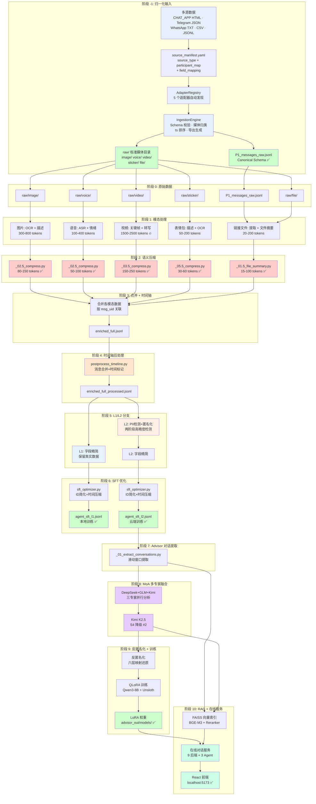

# Lens_opensource — CHAT_APP多模态数据集与关系顾问流水线

> 将CHAT_APP聊天记录转化为高质量多模态数据集，用于大语言模型微调，并集成 AI 关系顾问系统。

[](LICENSE)
[](https://www.python.org/)

[English](README.md) | 中文 | [贡献指南](CONTRIBUTING.md) | [安全政策](SECURITY.md)

## 概述

CHAT_APP_DHA 是一个端到端的数据处理流水线，将CHATAPP聊天导出的原始数据（文本、图片、语音、视频、表情包、链接和文件）转化为结构化、隐私安全的 JSONL 数据集，适用于大语言模型的监督微调（SFT）。系统采用**本地-云端协同处理架构**：在本地完成多模态信息解析并加上多维度匿名处理后交由云端大模型标注（本地模型标注也可以），将人工和agent审核的标注文件反匿名处理后回到本地进行真实信息训练，并最终可以在本地用真实信息对话讨论。在数据流水线之上，还包含一个基于处理后数据训练的四层检索动态RAG全栈 AI 关系顾问系统，可与网页端直接交互。多模态在本地支持NSFW成人、暴力、跨文化和敏感内容的准确解析（无未成年人内容解析能力），不会数据泄漏。

### 核心能力

- **本地-云端协同处理**：本地多模态解析+匿名化，云端大模型标注，反匿名化后本地真实信息训练
- **多模态处理**：五条专用子流水线分别处理图片、语音、视频、表情包和链接/文件消息
- **隐私优先设计**：两级匿名化（L1 可逆 / L2 不可逆），两阶段 PII 检测（规则引擎 + LLM 验证）
- **安全内容解析**：本地支持 NSFW 成人、暴力、跨文化和敏感内容准确解析，零数据泄漏
- **通用数据接入**：插件式适配器架构，支持Wechat、Telegram、WhatsApp 及通用 CSV/JSONL 导入
- **智能分析**：OCR 路由、VLM 描述生成、ASR 转写、情绪检测、语义压缩，覆盖所有模态
- **专家模型路由**：内容感知的分诊系统，将 NSFW、暴力和文档图片路由到专用的无审查模型
- **关系顾问 Agent**：MoA（多模型融合）分析、QLoRA 微调、Hybrid RAG 实时对话，支持 3 种 Agent 人格
- **Web 仪表盘**：React + Vite 前端，支持流水线控制、实时对话、人工审核和模型管理和检测

详细架构和实现细节请参考 [modality_fields_and_models.md](docs/modality_fields_and_models.md)。

---

## 端到端架构概览



---

## 系统架构

```
┌─────────────────────────────────────────────────────────────────────────────┐
│                           Lens_opensource 流水线                              │
│                                                                             │
│  ┌─────────────┐   ┌──────────────────────────────────────────────────┐    │
│  │  通用数据    │   │           多模态处理流水线                       │    │
│  │  接入引擎    │──▶│  图片 │ 语音 │ 视频 │ 表情包 │ 链接/文件       │    │
│  │  (5种适配器) │   └────────────────────┬───────────────────────────┘    │
│  └─────────────┘                         │                                │
│                                          ▼                                │
│                              ┌──────────────────────┐                     │
│                              │  统一时间轴            │                     │
│                              │  enriched_full.jsonl   │                     │
│                              └──────────┬───────────┘                     │
│                                         │                                 │
│                          ┌──────────────┼──────────────┐                  │
│                          ▼              ▼              ▼                  │
│                   ┌────────────┐ ┌────────────┐ ┌────────────┐           │
│                   │ Agent SFT  │ │ 关系顾问   │ │ Web        │           │
│                   │ 数据流水线  │ │ 流水线     │ │ 仪表盘     │           │
│                   │ L1/L2 数据 │ │ MoA+QLoRA  │ │ React+Vite │           │
│                   └────────────┘ └────────────┘ └────────────┘           │
└─────────────────────────────────────────────────────────────────────────────┘
```

---

## 数据归一化流水线

在进入多模态处理之前，系统通过通用数据接入引擎将不同来源的聊天记录归一化为标准格式。

### 通用数据接入（Universal Ingestion）

支持 5 种主流聊天数据来源的统一接入：

| 来源类型 | 标识 | 输入格式 | 适配器 |
|---------|------|---------|--------|
| CHAT_APP | `CHAT_APP_html` | HTML + CSV 导出文件 | `CHAT_APPAdapter` |
| Telegram | `telegram_json` | JSON 导出文件 | `TelegramAdapter` |
| WhatsApp | `whatsapp_txt` | TXT 导出文件 | `WhatsAppAdapter` |
| 通用 CSV | `generic_csv` | 任意 CSV（需字段映射） | `GenericCSVAdapter` |
| 通用 JSONL | `generic_jsonl` | 任意 JSONL（需字段映射） | `GenericJSONLAdapter` |

### 工作空间初始化流程

#### 方式一：全新工作空间（推荐）

使用 `init_workspace.py` 一步完成目录创建 + 数据导入：

```bash
# 1. 将原始素材文件夹放到项目目录下
cp -r ~/chat_data /path/to/project/chat_workspace

# 2. 从模板工作空间复制脚本
cp -r /path/to/project/template/scripts /path/to/project/chat_workspace/scripts

# 3. 运行初始化（自动检测来源类型）
cd /path/to/project/chat_workspace
python scripts/workspace/init_workspace.py --contact-name "联系人名"

# 预览模式（不执行实际操作）
python scripts/workspace/init_workspace.py --dry-run --contact-name "联系人名"
```

**初始化自动执行：**
1. **创建标准目录结构** - `raw/`, `artifacts/`, `timeline_out/` 等
2. **迁移原始文件** - HTML/CSV → `raw/export/`，媒体 → `raw/image/` 等
3. **复制配置文件** - 从模板工作空间复制脚本和配置
4. **生成 source_manifest.yaml** - 定义数据来源和转换规则
5. **运行归一化转换** - 生成 `raw/P1_messages_raw.jsonl`
6. **清理旧目录** - 删除根目录下的原始文件夹

#### 方式二：已有工作空间重新导入

使用 `run_ingest.py` 独立运行数据转换：

```bash
# 1. 编辑 raw/source_manifest.yaml 配置文件
# 2. 预检转换
python scripts/workspace/run_ingest.py --workspace workspace_name --dry-run

# 3. 执行转换
python scripts/workspace/run_ingest.py --workspace workspace_name
```

### 标准化 Schema

所有数据源最终归一化为统一的 JSONL 格式，核心字段：

| 字段 | 类型 | 说明 | 示例 |
|------|------|------|------|
| `ts` | int | Unix 时间戳（秒） | 1704067200 |
| `speaker` | str | 发送者标识（ME/OTHER） | "ME" |
| `type` | int | 消息类型码 | 1 |
| `modality` | str | 模态类型 | "text/image/voice/video/sticker" |
| `text_raw` | str | 原始文本内容 | "你好世界" |
| `local_path` | str | 本地文件路径 | "./raw/image/img_001.jpg" |

### 配置管理

#### source_manifest.yaml 配置

```yaml
# 数据来源类型
source_type: CHAT_APP_html

# 输入文件路径（相对于 raw/ 目录）
input_paths:
  - ./export/联系人.html

# 参与者映射
participant_map:
  "我的昵称": "ME"
  "对方昵称": "OTHER"

# 时区设置
timezone: Asia/Shanghai

# 媒体文件基础目录（可选）
media_base_dir: ./media
```

#### 字段映射语法（通用适配器）

| 语法 | 说明 | 示例 |
|------|------|------|
| `source: target` | 直接字段映射 | `timestamp: ts` |
| `_const:value: target` | 常量值 | `_const:text: modality` |
| `_default:value: target` | 默认值 | `_default:0: sub_type` |

### 转换后操作

归一化完成后，`raw/P1_messages_raw.jsonl` 已生成，可以直接运行多模态处理流水线：

```bash
# 一键运行所有模态流水线
python run_all_pipelines.py

# 或按模态分步运行
python run_all_pipelines.py --only image
python run_all_pipelines.py --only voice
python run_all_pipelines.py --only video sticker
```

---

## 多模态处理流水线

每个模态都有专用的子流水线，位于 `scripts/<模态>/run_all/`。所有流水线遵循相同模式：**提取 → 分析 → 压缩（可选）→ 合并 → 更新时间轴**。

### 图片流水线（4 步）

| 步骤 | 脚本 | 描述 | 模型 |
|------|------|------|------|
| 1. OCR | `_01_run_ocr.py` | 智能路由（文本密集/照片/混合）+ PaddleOCR PP-OCRv4，检测框复用加速 30-40% | PaddleOCR v4 |
| 2. 描述 | `_02_run_caption.py` | 分诊分类（NSFW/暴力/普通/文档）→ 专家路由分发到专用模型 | Qwen2.5-VL-7B, MiniCPM-V 4.5, Pixtral 12B |
| 2.5. 压缩 | `_02.5_run_compress.py` | 语义压缩（4-5 倍压缩比） | Qwen2.5-7B |
| 3. 合并 | `_03_merge_engine.py` | 合并 OCR + 描述结果 | — |
| 4. 时间轴 | `_04_update_timeline.py` | 回写主时间轴 | — |

**专家模型路由：**
- `TYPE_C_NORMAL` → Qwen2.5-VL-7B-Instruct（主力描述模型）
- `TYPE_A_NSFW` → 双模型融合：MiniCPM-V 4.5 Abliterated (int8) + qwen2.5-vl-7b-nsfw-caption-v3
- `TYPE_B_GORE` → Qwen2.5-VL Abliterated (4-bit)，添加警告标记
- `TYPE_D_DOC` → Pixtral 12B GGUF (Q5_K_M)，用于文档/截图分析

### 语音流水线（4 步）

| 步骤 | 脚本 | 描述 | 模型 |
|------|------|------|------|
| 1. ASR | `_01_run_funasr.py` | FunASR（paraformer-zh + VAD + 标点），支持热词增强；可选 Whisper 备用 | FunASR, Whisper |
| 2. 情绪 | `_02_run_emotion.py` | 四阶段：SenseVoice 快速检测 → 关键词分诊 → Qwen2-Audio 深度分析 → 人工审核文件 | SenseVoice, Qwen2-Audio-7B |
| 2.5. 压缩 | `_02.5_run_compress.py` | 压缩冗余情感分析，保留转写文本 | Qwen2.5-7B |
| 3. 合并 | `_03_merge_engine.py` | 合并 FunASR + Whisper + 情绪结果 | — |
| 4. 时间轴 | `_04_update_timeline.py` | 回写主时间轴 | — |

**情绪分类体系：** 6 大类、20+ 种细粒度标签（有毒、亲密、痛苦、掩饰、基础、认知）。

### 视频流水线（5 步）

| 步骤 | 脚本 | 描述 | 模型 |
|------|------|------|------|
| 1. 提取 | `_01_run_extract.py` | 自适应关键帧提取，使用光流运动检测 + 场景变化分析 | ffmpeg, OpenCV |
| 2. 转写 | `_02_run_transcribe.py` | 音频转写 + 情绪检测（复用语音流水线） | FunASR, SenseVoice |
| 3. 描述 | `_03_run_caption.py` | 逐帧分诊 + 专家路由；模型拒绝时自动切换 LLaVA-NeXT-Video | Qwen2.5-VL-7B, LLaVA-NeXT-Video-7B |
| 3.5. 压缩 | `_03.5_run_compress.py` | 多帧描述压缩（10 倍压缩比） | Qwen2.5-7B |
| 4. 合并 | `_04_merge_engine.py` | 合并提取 + 转写 + 描述结果 | — |
| 5. 时间轴 | `_05_update_timeline.py` | 回写主时间轴 | — |

### 表情包流水线（8 步）

| 步骤 | 脚本 | 描述 |
|------|------|------|
| 1. 下载 | `_01_run_download.py` | 从 URL 下载表情包，SHA256 去重 |
| 2. 嗅探 | `_02_run_sniff.py` | Magic Bytes 格式检测（GIF/WebP/PNG/JPEG），Pillow 解码验证 |
| 3. 处理 | `_03_run_process.py` | 动图/静图分类，自适应帧采样（4-16 帧），Contact Sheet 生成 |
| 4. 分诊 | `_04_run_triage.py` | 逐帧 NSFW/暴力检测，取最高分聚合 |
| 5. 描述 | `_05_run_caption.py` | VLM 描述生成，敏感内容使用专家路由 |
| 5.5. 压缩 | `_05.5_run_compress.py` | 意图映射 + 字典化压缩（重复表情包最高 15 倍压缩） |
| 6. 合并 | `_06_merge_engine.py` | 合并所有阶段结果，SHA256 去重 |
| 7. 时间轴 | `_07_update_timeline.py` | 回写主时间轴 |
| 8. 清理 | `_08_cleanup_frames.py` | 删除临时帧文件 |

### 链接/文件流水线（3 步，纯 CPU）

| 步骤 | 脚本 | 描述 |
|------|------|------|
| 1. 提取 | `_01_extract_and_anonymize.py` | 策略模式路由：引用 / 链接 / 文件 / 小程序 / 视频号 / 聊天记录 |
| 1.5. 摘要 | `_01.5_run_file_summary.py` | 生成文件内容摘要 |
| 2. 合并 | `_02_merge_engine.py` | 统一 Schema 合并 |
| 3. 时间轴 | `_03_update_timeline.py` | 回写主时间轴 |

---

## 共享工具库（`scripts/_common/`）

所有模态流水线共享一组通用工具模块，处理跨模态的公共逻辑：

### 文本归一化（`text_normalize.py`）

专为 ASR 转写后处理和跨模态文本清洗设计的多阶段文本归一化流水线：

```
原始文本 → to_simplified() → strip_punc() → ct-punc → dedup_punc() → apply_patches() → fix_false_question()
```

#### 核心处理阶段

| 函数 | 功能 | 示例 | 使用场景 |
|------|------|------|----------|
| `to_simplified()` | 繁体中文转简体中文（OpenCC `t2s`） | `雲頂之弈` → `云顶之弈` | 跨模态文本标准化 |
| `strip_punc()` | ct-punc 前移除现有标点符号 | `你好，世界！` → `你好 世界` | ct-punc 预处理 |
| `dedup_punc()` | ct-punc 后去重重复标点符号 | `你好，，世界。。` → `你好，世界。` | 后处理清理 |
| `apply_patches()` | ASR 专名错误可控纠错 | `云顶之翼` → `云顶之弈`（带审计日志） | ASR 错误修正 |
| `fix_false_question()` | 保守式误判问号修复 | `什么的？` → `什么的。`（仅特定模式） | ASR 标点修正 |
| `prepare_for_punc()` | 一键流水线助手：简化+去标点 | 准备 ct-punc 输入 | 流水线集成 |

#### 高级特性

**错误纠正系统：**
- **专名纠正**：修正 ASR 常见游戏名、品牌名、技术术语错误
- **同音错纠正**：处理频繁误识别的同音异义词
- **审计日志**：记录所有修正操作，便于质量控制

**保守式标点修复：**
- **模式匹配**：仅修复特定非疑问语气的句末问号
- **安全优先**：保留真实疑问句，修正误判问号
- **窄范围**：针对常见 ASR 标点错误，避免过度修正

**流水线集成：**
- **模块化设计**：每个阶段可独立使用或组合使用
- **降级处理**：可选依赖（OpenCC）不可用时优雅降级
- **性能优化**：高效正则表达式，最小内存占用

#### 使用示例

```python
# ASR 转写后处理完整流水线
from scripts._common.text_normalize import prepare_for_punc, dedup_punc, apply_patches, fix_false_question

# 步骤 1: 准备文本用于 ct-punc
clean_text, meta = prepare_for_punc(raw_asr_output)
# 结果: "云顶之弈 真好玩"

# 步骤 2: 应用 ct-punc（外部服务）
punctuated = ct_punc_service(clean_text)
# 结果: "云顶之弈，真好玩！"

# 步骤 3: 后处理
final_text = dedup_punc(punctuated)
final_text, patch_logs = apply_patches(final_text)
final_text, fix_logs = fix_false_question(final_text)
# 结果: "云顶之弈，真好玩。"
```

**配置选项：**
- **补丁映射**：`DEFAULT_PATCH_MAP` 中可自定义错误纠正词典
- **模式规则**：`_SHENME_DE_PATTERNS` 中可扩展误判问号模式
- **依赖管理**：可选 OpenCC，自动降级处理

### 匿名化工具（`anonymizer.py`）

统一的姓名匿名化处理，4 种策略：

| 函数 | 作用范围 | 示例 |
|------|----------|------|
| `anonymize_speaker_prefix()` | 引用消息说话人前缀 | `UserB：是考在职吗` → `OTHER: 是考在职吗` |
| `anonymize_text()` | 通用文本姓名替换 | `UserB recalled a message` → `OTHER recalled a message` |
| `anonymize_recalled_message()` | 撤回消息模式 | `"UserB 某大学" recalled a message` → `OTHER recalled a message` |
| `anonymize_message_text()` | 统一入口（按 msg_type 自动选择策略） | 自动路由到合适的函数 |

通过 `configs/anonymization.yaml` 配置 `me_names` / `other_names` 列表。未知说话人默认为 `OTHER`（隐私安全）。

### 媒体质量过滤（`media_filter.py`）

4 级质量过滤系统，覆盖图片、视频和表情包：

| 级别 | 决策 | 描述 |
|------|------|------|
| `PROCESS` | 正常处理 | 满足所有质量阈值 |
| `SKIP_LOW_QUALITY` | 跳过并标记 | 低于最低分辨率/时长/大小 |
| `SKIP_DOWNLOAD_FAILED` | 跳过并标记 | 媒体文件下载或解码失败 |
| `SKIP_DECODE_FAILED` | 跳过并标记 | 媒体文件无法解码 |

每个模态有独立的过滤函数（`filter_image()`、`filter_video()`、`filter_sticker()`），阈值通过 `configs/media_filter.yaml` 配置。

### 其他共享模块

| 模块 | 功能 |
|------|------|
| `schema_utils.py` | 统一 `merged_v2` Schema 构建器、字段排序、旧版记录迁移 |
| `jsonl_utils.py` | JSONL 读写：`load_jsonl_by_key()`（字典模式）、`load_jsonl_list()`、`write_jsonl()`、`update_jsonl_in_place()`（原子操作+自动备份） |
| `path_utils.py` | 集中式路径管理：加载 `configs/paths.yaml`，提供 `get_path()`，各模态目录 getter |
| `check_paths.py` | 工作空间路径验证 |
| `download_models.py` | 一键模型下载器，下载所有必需模型 |

---

## Agent SFT 数据流水线

多模态处理完成后，Agent SFT 流水线通过压缩、匿名化和优化等多个阶段将富化时间轴转化为训练数据：

```
enriched_full.jsonl
       │
       ▼
  时间轴后处理（消息合并、时间间隔标记）
       │
       ├──── L1 分支（本地训练）────┐
       │     字段精简 → SFT 优化    │──▶ agent_sft_l1.jsonl
       │                            │
       ├──── L2 分支（云端训练）────┐│
       │     两阶段 PII 匿名化     ││
       │     → 字段精简             ││──▶ agent_sft_l2.jsonl
       │     → SFT 优化            │
       │                            │
       └──── 质量验证 ──────────────┘
```

### 时间轴后处理 (`scripts/timeline/`)

| 脚本 | 描述 | 核心功能 |
|------|------|----------|
| `postprocess_timeline.py` | 消息合并和时间间隔标记 | 合并连续消息，插入时间间隔标记 |
| `run_anonymization.py` | L2 匿名化运行器 | 协调两阶段 PII 检测和替换 |
| `timeline_postprocessor.py` | 核心时间轴处理逻辑 | 处理消息合并、说话人连续性、时间间隔检测 |

### 压缩与优化 (`scripts/compression/`)

压缩模块为训练效率提供语义压缩和数据优化：

| 脚本 | 描述 | 功能 |
|------|-------------|----------|
| `engine.py` | 语义压缩引擎 | 基于 LLM 的文本摘要核心压缩逻辑 |
| `sft_optimizer.py` | SFT 数据优化 | ID 简化、时间戳压缩、消息类型标准化 |
| `sft_trimmer.py` | L1/L2 字段精简 | 移除技术元数据，保留语义字段 |
| `quality_validator.py` | 数据质量验证 | 验证压缩数据质量和完整性 |

### 模态专用压缩器

| 脚本 | 目标模态 | 压缩策略 |
|------|----------------|----------------------|
| `image_compressor.py` | 图片描述 | 4-5倍压缩率，保留关键视觉信息 |
| `voice_compressor.py` | 语音转录 | 保留核心内容，压缩冗长情绪分析 |
| `video_compressor.py` | 视频描述 | 10倍压缩率，合并多帧描述 |
| `sticker_compressor.py` | 表情包描述 | 意图映射+字典压缩（重复表情包最高15倍） |

### 两阶段 PII 检测 (`scripts/compression/two_stage_pii/`)

高精度 PII 检测系统：

| 脚本 | 描述 | 作用 |
|------|-------------|------|
| `scanner.py` | 两阶段 PII 扫描器 | 协调候选词提取和 LLM 验证 |
| `candidate_extractor.py` | 候选词提取 | 基于规则的潜在 PII 术语提取 |
| `llm_validator.py` | LLM 验证 | 使用 Qwen2.5-7B 验证和分类 PII 候选词 |
| `name_replacer.py` | 高精度替换 | 基于确认名单的精确字符串匹配 |
| `models.py` | 数据模型 | PII 检测工作流的 Pydantic 模型 |

### 隐私与安全工具

| 脚本 | 描述 | 用途 |
|------|-------------|---------|
| `pii_detector.py` | 基于规则的 PII 检测 | 快速正则表达式检测常见 PII 模式 |
| `privacy_shield.py` | 隐私保护层 | 全面的 PII 检测和替换系统 |
| `llm_pii_scanner.py` | LLM 增强 PII 扫描 | 使用 LLM 进行复杂 PII 模式识别 |
| `run_full_anonymization.py` | 完整匿名化运行器 | 执行完整的 L2 匿名化流水线 |

### 工具与分析

| 脚本 | 描述 | 使用场景 |
|------|-------------|----------|
| `generate_report.py` | 压缩报告 | 生成详细的压缩统计和报告 |
| `sample_comparison.py` | 前后对比 | 比较原始数据与压缩数据质量 |
| `scan_pii.py` | PII 扫描工具 | 独立 PII 检测和分析 |
| `validate_sft_quality.py` | SFT 数据验证 | 验证最终 SFT 数据集质量 |

**L1（本地）**：可逆匿名化，真实姓名保留在本地保险库中。用于设备端训练。

**L2（云端）**：不可逆匿名化，两阶段 PII 检测（正则表达式 + LLM 验证）、时间戳偏移、位置替换。安全用于云端训练。

运行方式：
```bash
./run_agent_sft_pipeline.sh              # L1 和 L2 都生成
./run_agent_sft_pipeline.sh --only l1    # 仅 L1
./run_agent_sft_pipeline.sh --only l2    # 仅 L2
```

---

## 关系顾问系统

基于处理后聊天数据构建的全栈 AI 关系顾问：

### 离线流水线（10+ 阶段，16 个脚本）

| 阶段 | 脚本 | 描述 | 模型 / 工具 |
|------|------|------|-------------|
| 0 | `_00_verify_environment.py` | 验证 Python 依赖（torch、transformers、peft、bitsandbytes、trl、datasets、accelerate）、CUDA/GPU、基座模型文件、测试 4-bit 量化加载+推理 | Qwen3-8B-Instruct (NF4) |
| 1 | `_01_extract_conversations.py` | 从 SFT 数据（L1/L2）滑动窗口提取对话片段。窗口 20 条，步长 10，最少 10 条。自动分类：冲突/甜蜜/普通 | — |
| 2a | `_02_generate_analysis.py` | 单后端 LLM 分析。支持 5 种后端（DeepSeek、Kimi、Qwen、deepseek、GLM）。断点续跑 | 5 种 LLM 后端任选 |
| 2b | `_02b_model_comparison.py` | 多后端并排对比，在代表性片段上生成 Markdown 对比报告 | 多后端 |
| 2c | `_02c_fusion_pipeline.py` | **MoA（多模型融合）流水线** — 核心分析引擎（详见下方） | DeepSeek + GLM + Kimi + Qwen |
| 2c' | `_02c_rerun_moa.py` | 对失败/低质量片段重新运行 MoA 融合 | 同 2c |
| 3a | `_03_export_for_review.py` | 导出分析结果供人工审核 | — |
| 3b | `_03b_ai_review.py` | AI 辅助质量审核，逐维度评分。弱维度自动补齐 | Qwen / Kimi |
| 4 | `_04_import_reviewed.py` | 导入人工审核通过的分析结果 | — |
| 5a | `_05_format_training_data.py` | 转换为 SFT 格式（JSONL 或 Alpaca）。数据源优先级：MoA > 审核后 > 原始。自动剥离冗余字段（DeepSeek_raw、GLM_raw） | — |
| 5b | `_05b_filter_split_training.py` | 质量过滤（最少 13 个【】字段）+ OTHERHER bug 修正 + 按关系状态分层采样划分 train/val/test（80/10/10） | — |
| 5c | `_05c_deanonymize_training.py` | 反匿名化：ME/OTHER → 真实姓名，Day N → 真实日期，时间范围提取 | — |
| 6 | `_06_train_model.py` | QLoRA 微调（4-bit NF4，LoRA r=16 α=32）。支持 HuggingFace 标准和 Unsloth（快 2 倍）两种后端。断点续训，val_loss 监控 | Qwen3-8B-Instruct |
| 7a | `_07_run_inference.py` | 交互/单条/批量推理。自动检测最佳 LoRA（Unsloth deanon > HF deanon > 旧版） | Qwen3-8B + LoRA |
| 7b | `_07b_eval_compare.py` | 评估：ROUGE-L F1、字段完整性、基座 vs 微调对比 | — |
| 8 | `_08_run_dialogue.py` | 实时终端对话，listen/consult 双模式，流式输出，GraphRAG 上下文检索 | Ollama（本地）/ DeepSeek（云端） |
| 9 | `_09_build_graph.py` | 构建 FAISS 向量索引（BGE-M3 嵌入 + BGE-Reranker-V2-M3 重排）。全量/增量模式。生成用户档案（反复话题、冲突模式、关系趋势） | BGE-M3, BGE-Reranker-V2-M3 |
| 10 | `_10_augment_data.py` | 多教师蒸馏，从外部数据集（PsyCLIENT-CP、CPsDD、AuraDial）导入。逻辑教师（DeepSeek Reasoner）+ 风格教师（DeepSeek V3.2）双教师架构。质量过滤 | DeepSeek Reasoner, DeepSeek V3.2 |

### MoA 融合流水线（阶段 2c）— 详解

MoA（Mixture of Agents）融合流水线是核心分析引擎，编排多个前沿 LLM 进行 4 阶段处理：

```
                    ┌─────────────────────────────────────────────┐
                    │           MoA 融合流水线                     │
                    │                                             │
  对话片段 ──────▶  │  S1: 并行专家分析                            │
                    │    ├── DeepSeek V3.2 → 结构化分析              │
                    │    ├── GLM → 结构化分析                      │
                    │    └── Kimi → 结构化分析（仅多模态片段）    │
                    │                         │                   │
                    │  S2: MoA 聚合           ▼                   │
                    │    └── Qwen 融合所有专家输出                  │
                    │         为统一 JSON（6+ 字段）               │
                    │                         │                   │
                    │  S3: 质量审核           ▼                   │
                    │    └── Qwen 逐维度评分（1-10 分）            │
                    │         通过 / 需修改 / 不合格               │
                    │                         │                   │
                    │  S4: 补齐循环           ▼                   │
                    │    └── 定向补齐 ≤7 分的维度                  │
                    │         最多 3 轮，每轮重新审核              │
                    │         降级链: Qwen → Kimi → Kimi         │
                    └─────────────────────────────────────────────┘
```

**核心特性：**
- **多模型降级链**：DeepSeek（主线）→ DeepSeek 备用 → DeepSeek 降级（Sonnet）；Qwen（主线）→ Qwen 备用 → Kimi → Kimi
- **多模态感知**：Kimi 仅在片段包含多模态内容（图片、语音、视频描述）时调用
- **Thinking 模型截断检测**：检测 `<think>` 标签截断，自动切换到非 thinking 备用
- **Cloudflare HTML 错误检测**：代理返回 HTML 时自动等待 30s 重试
- **Key Pool 轮换**：多 Key 轮询，支持单 Key 黑名单、紧急模式、全局 RPM 限制（≤19）
- **流水线模式**：异步 4 级流水线，可配置 S1 并发和 Qwen 并发（`--pipeline --max-s1 2 --max-Qwen 3`）
- **断点续跑**：扫描输出文件已完成的 chunk_id，跳过已处理片段

```bash
# 标准 MoA 融合（串行）
python scripts/advisor/run_all/_02c_fusion_pipeline.py --moa --agent-type neutral

# 流水线模式（并发）
python scripts/advisor/run_all/_02c_fusion_pipeline.py --pipeline --max-s1 2 --max-Qwen 3

# 多 Worker + Key Pool
python scripts/advisor/run_all/_02c_fusion_pipeline.py --moa --workers 3 --key-pool local_secrets/key_pool.yaml

# 切换 MoA 聚合器到 Kimi（Qwen 不稳定时）
python scripts/advisor/run_all/_02c_fusion_pipeline.py --moa --Qwen-backend kimi
```

### 三种 Agent 人格 × 两种模式

| Agent | 方法 | 理论框架 |
|-------|------|----------|
| 中立顾问 | 客观多维分析 | 沟通模式、依附风格、NVC、权力动态 |
| 支持性顾问 | 无条件站在用户一方 | 情感验证、保护性建议、边界设立 |
| 精神分析顾问 | 无意识层面深度分析 | 客体关系、拉康三界、防御机制、移情 |

| 模式 | 回复风格 |
|------|----------|
| 倾听 | 5-7 句，共情为主，开放性问题引导 |
| 咨询 | 完整结构化分析（500-2500 字），多维度 |

### 在线服务

- **后端：** FastAPI（端口 8787），SSE 流式响应，多轮会话管理，对话历史压缩
- **前端：** React 19 + Vite + Tailwind CSS 仪表盘，支持对话、流水线控制、人工审核、模型管理、API Key 检测
- **RAG：** 三层检索 — 日期精确查找（Day Index）+ FAISS 语义搜索（BGE-M3）+ 关键词回退 + FAQ 知识库
- **LLM 后端：** 5 种后端统一 OpenAI 兼容接口（DeepSeek、Kimi、Qwen、deepseek、GLM、本地 Ollama）
- **安全：** SafetyLayer P0、GlobalRateLimiter（RPM≤19）、后端自动故障转移、Ollama 看门狗自动重启
- **会话管理：** 持久化会话，支持 Agent 类型/模式切换、记忆事实提取、历史截断

---

## 通用数据接入

插件式适配器架构，支持从多个平台导入聊天数据：

| 适配器 | 数据源 | 格式 |
|--------|--------|------|
| `wechat_html` | CHAT_APP桌面版导出 | HTML + CSV |
| `telegram_json` | Telegram 桌面版导出 | result.json |
| `whatsapp_txt` | WhatsApp 导出 | *.txt（8 种日期格式） |
| `generic_csv` | 任意 CSV | field_mapping DSL |
| `generic_jsonl` | 任意 JSONL | field_mapping DSL |

所有适配器输出统一的 Canonical Schema（`P1_messages_raw.jsonl`），直接进入下游模态处理流水线。

```bash
# 自动检测数据源类型并接入
python scripts/workspace/run_ingest.py --workspace /path/to/workspace

# 指定数据源类型
python scripts/workspace/run_ingest.py --workspace /path/to/workspace --source-type telegram_json

# 预检模式（预览不写入）
python scripts/workspace/run_ingest.py --dry-run
```

---

## 隐私与匿名化

### 两级系统

| 级别 | 用途 | 可逆 | PII 处理 |
|------|------|------|----------|
| **L1** | 本地训练 | 是（本地保险库） | 姓名 → ME/OTHER，时间戳保留 |
| **L2** | 云端训练 | 否 | 完全 PII 清洗，时间戳偏移，地名替换 |

### 两阶段 PII 检测

1. **阶段一（离线扫描）：** 规则候选词提取 → LLM 验证（Qwen2.5-7B-AWQ）→ 人工审核 → 确认人名列表
2. **阶段二（运行时）：** 基于确认列表的精确字符串匹配 — 零漏检，高性能

### 配置

```yaml
# configs/anonymization.yaml
me_names:
  - "你的真实姓名"
  - "你的昵称"
other_names:
  - "对方真实姓名"
  - "对方昵称"
me_alias: "ME"
other_alias: "OTHER"

# 地名映射（仅 L2）
location_mapping:
  "北京": "天津"
  "上海": "杭州"

# 排除列表（公众人物等）
exclude_patterns:
  - "毛泽东"
  - "李白"
```

---

## 快速开始

### 环境要求

- Python 3.10+
- NVIDIA GPU，16GB+ 显存（推荐 RTX 4070 Ti / 5070 Ti 及以上）
- CUDA 12.x
- Conda

### 安装

```bash
git clone https://github.com/your-repo/CHAT_APP_DHA.git
cd CHAT_APP_DHA

# 创建 conda 环境
conda create -n CHAT_APP_DHA python=3.10
conda activate CHAT_APP_DHA

# 安装依赖
pip install -r requirements.txt

# 下载所需模型（PaddleOCR、FunASR、Qwen2.5-VL 等）
python scripts/_common/download_models.py
```

### 工作空间初始化

```bash
# 初始化新工作空间
python scripts/workspace/init_workspace.py \
    --template demo \
    --contact-name "对方姓名"
```

将导出的CHAT_APP数据放入工作空间的 `raw/` 目录。

### 配置

1. 编辑 `configs/anonymization.yaml` 设置身份映射
2. 编辑 `configs/paths.yaml` 设置工作空间名称
3. （可选）编辑 `configs/` 下的各模态配置文件

### 运行流水线

```bash
# 运行所有模态流水线（图片 → 语音 → 视频 → 表情包 → 链接/文件）
python run_all_pipelines.py

# 运行指定模态
python run_all_pipelines.py --only voice video

# 跳过压缩步骤（更快）
python run_all_pipelines.py --skip-compression

# 预览模式（不实际执行）
python run_all_pipelines.py --dry-run

# 遇到错误继续执行
python run_all_pipelines.py --continue-on-error
```

### 生成 SFT 训练数据

```bash
./run_agent_sft_pipeline.sh
```

### 启动顾问服务

```bash
# 加载 API Key
source local_secrets/.env.advisor

# 启动后端
conda run -n CHAT_APP_DHA uvicorn scripts.advisor.api.server:app --reload --port 8787

# 启动前端（另一个终端）
cd frontend && npm run dev
```

---

## 硬件要求

| 组件 | 最低 | 推荐 |
|------|------|------|
| GPU | 8GB 显存 | 16GB 显存（RTX 4070 Ti / 5070 Ti） |
| 内存 | 16GB | 32GB |
| 存储 | 50GB | 200GB+（取决于媒体量） |
| CUDA | 12.0 | 12.8+ |

**显存管理：** 所有模型串行加载（同一时间只加载一个），切换时显式清理显存。流水线设计在 16GB 显存约束下运行。

---

## 使用的模型

| 模型 | 用途 | 显存 | 量化 |
|------|------|------|------|
| PaddleOCR PP-OCRv4 | 中文 OCR | ~2GB | — |
| Qwen2.5-VL-7B-Instruct | 主力 VLM 描述 | ~8GB | bfloat16 |
| MiniCPM-V 4.5 Abliterated | NSFW 内容分析 | ~10GB | int8 |
| Pixtral 12B | 文档分析 | ~8.3GB | GGUF Q5_K_M |
| FunASR (paraformer-zh) | 中文 ASR | ~2GB | — |
| SenseVoice Small | 语音情绪检测 | ~1GB | — |
| Qwen2-Audio-7B | 深度语音情绪分析 | ~8GB | float16 |
| LLaVA-NeXT-Video-7B | 视频理解备用 | ~8GB | — |
| Qwen2.5-7B-Instruct-AWQ | 语义压缩 & PII | ~4GB | AWQ 4-bit |
| BGE-M3 | 语义嵌入（RAG） | ~2GB | — |

---

## 测试

项目使用 [Hypothesis](https://hypothesis.readthedocs.io/) 进行属性测试，配合标准单元测试：

```bash
# 运行所有测试
conda run -n CHAT_APP_DHA python -m pytest tests/ -v

# 运行特定测试文件
conda run -n CHAT_APP_DHA python -m pytest tests/test_advisor_analyzers_properties.py -v
```

---

## 文档

各子系统的详细文档位于 `docs/` 目录：

- [完整流水线参考](docs/pipeline.md)
- [图片流水线设计](docs/image_pipeline_overview.md)
- [语音流水线设计](docs/voice_pipeline_overview.md)
- [视频流水线设计](docs/video_pipeline_overview.md)
- [表情包流水线设计](docs/sticker_pipeline_overview.md)
- [链接/文件流水线设计](docs/linkfile_pipeline_overview.md)
- [通用数据接入](docs/ingestion_pipeline_overview.md)
- [Agent SFT 流水线](docs/agent_sft_pipeline_overview.md)
- [顾问系统](docs/advisor_pipeline_overview.md)
- [隐私与 PII 指南](docs/pii_detection_guide.md)
- [隐私映射](docs/privacy_mapping.md)

---

## 隐私声明

本项目严格分离代码与数据：

- **代码**（`scripts/`、`configs/`、`frontend/`）：可安全公开分享
- **数据**（`raw/`、`artifacts/`、`timeline_out/`）：包含个人聊天记录 — **绝不提交**
- **密钥**（`local_secrets/`）：包含 API Key 和身份保险库 — **绝不提交**

`.gitignore` 已配置排除所有数据和密钥目录。

---

## 许可证

[Apache License 2.0](LICENSE)

---

## 致谢

本项目基于以下开源模型和工具构建：

- [PaddleOCR](https://github.com/PaddlePaddle/PaddleOCR) — OCR 引擎
- [FunASR](https://github.com/modelscope/FunASR) — 中文 ASR
- [SenseVoice](https://github.com/FunAudioLLM/SenseVoice) — 语音情绪检测
- [Qwen2.5-VL](https://github.com/QwenLM/Qwen2.5-VL) — 视觉语言模型
- [Qwen2-Audio](https://github.com/QwenLM/Qwen2-Audio) — 音频理解
- [LLaVA-NeXT](https://github.com/LLaVA-VL/LLaVA-NeXT) — 视频理解
- [Pixtral](https://mistral.ai/) — 文档分析
- [BGE-M3](https://github.com/FlagOpen/FlagEmbedding) — 多语言嵌入
- [Hypothesis](https://hypothesis.readthedocs.io/) — 属性测试
