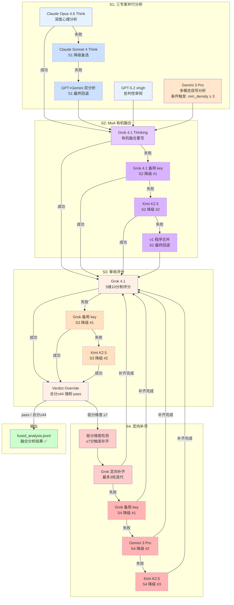

# MoA 多专家融合与流水线标注架构

> 📌 **本文档定位**：这是 [多模态处理流水线文档](modality_fields_and_models.md) Sections 10-12 的详细设计文档，专注于 MoA 多专家融合分析、CPU 流水线并行标注架构、以及审核补齐与多级降级容错机制。

## 1. 设计理念

### 1.1 核心目标

关系顾问流水线需要对大量对话 chunk 进行深度心理分析。单一 LLM 存在视角偏差和盲区，因此采用 **Mixture of Agents (MoA)** 架构——多个顶级模型独立分析后由聚合模型有机融合：

| 挑战 | 解决方案 |
|------|----------|
| 单模型视角偏差 | 三专家独立分析（心理/批判/多模态） |
| 简单拼接丢失洞察 | Grok 有机融合重写（非拼接） |
| API 限流瓶颈 | CPU 流水线并行 + KeyRotator 多 key 轮换 |
| LLM 输出格式不稳定 | 五策略 JSON 提取 + Thinking 截断检测 |
| 质量参差不齐 | 五维评分 + Verdict Override + 定向补齐 |

### 1.2 设计原则

```
┌─────────────────────────────────────────────────────────────────┐
│                      设计原则                                    │
├─────────────────────────────────────────────────────────────────┤
│  1. 多视角融合：3 个独立专家 + 1 个聚合器，避免单一模型偏见     │
│  2. 有机融合：Grok 基于原始对话和多方分析重写，而非机械拼接      │
│  3. 流水线并行：S1 和 S2-S4 使用不同 API，天然不竞争            │
│  4. 多级降级：每个环节都有 2-3 层 fallback，保证不中断           │
│  5. 断点续传：进度持久化，崩溃后可从上次位置继续                 │
└─────────────────────────────────────────────────────────────────┘
```

---

## 2. MoA 四阶段融合架构

### 2.1 整体流程图



### 2.2 各阶段详解

| 阶段 | 模型 | API Provider | 并行策略 | 说明 |
|------|------|-------------|----------|------|
| **S1 多专家分析** | Claude Opus 4.6 Think + GPT-5.2 xhigh + Gemini 3 Pro | 第三方 API 代理（3 个不同 key pool） | `ThreadPoolExecutor(3)` 真并行 | 不同 API key 避免共享限流 |
| **S2 有机融合** | Grok 4.1 Thinking | 第三方 API 代理 | 顺序（依赖 S1） | MoA prompt 指导"有机融合，非简单拼接" |
| **S3 审核评分** | Grok 4.1 | 第三方 API 代理 | 顺序 | 5 维 10 分制（准确性/深度/多模态/结构/流畅度），满分 50 |
| **S4 维度补齐** | Grok 4.1 | 第三方 API 代理 | 按需（仅 ≤7 分维度） | 最多 3 轮迭代，每轮只补齐低分维度 |

---

## 3. 三专家角色分工

### 3.1 专家配置

**核心文件**: `scripts/advisor/run_all/_02c_fusion_pipeline.py`

| 专家 | 模型 | 角色 | 分析重点 | 触发条件 |
|------|------|------|----------|----------|
| **Claude** | Opus 4.6 Think | 主分析师 | 依附风格、人格动态、深层心理洞察 | 全部 chunk |
| **GPT** | 5.2 xhigh | 独立审视 | 批判性审查、权力动态、沟通模式 | 全部 chunk |
| **Gemini** | 3 Pro | 多模态专家 | 语音情绪、表情包含义、图片上下文 | `mm_density ≥ 3` 时触发 |

### 3.2 多模态触发逻辑

```python
# _02c_fusion_pipeline.py
MULTIMODAL_TRIGGERS = ["[图片:", "[语音:", "[表情:", "情绪:"]
MULTIMODAL_THRESHOLD = 3

def _is_multimodal(conversation: str, mm_density: dict | None = None) -> bool:
    """判断对话是否包含足够的多模态信号（D1: 优先使用 mm_density 元数据）"""
    if mm_density and mm_density.get('total_multimodal', 0) > 0:
        return mm_density['total_multimodal'] >= MULTIMODAL_THRESHOLD
    count = sum(conversation.count(tag) for tag in MULTIMODAL_TRIGGERS)
    return count >= MULTIMODAL_THRESHOLD
```

优先使用 Phase 7 提取时计算的 `mm_density` 元数据字段（D1 增强），回退到正则计数。

### 3.3 S2 有机融合策略

`moa_merge_analyses()` 函数实现 MoA 有机融合：

| 场景 | 处理策略 | 融合质量标记 |
|------|----------|-------------|
| Claude + GPT 均成功 | Grok 有机融合重写 | `moa_full` |
| 仅 Claude 成功 | 直接使用 Claude 结果 | `partial` |
| 仅 GPT 成功 | 直接使用 GPT 结果 | `partial` |
| 均失败 | 返回空 | `failed` |

**MoA 聚合器 Prompt 要点**:
- 要求 Grok "有机融合"而非"简单拼接"
- 提供原始对话前 4000 字作为交叉验证
- Gemini 多模态分析作为可选补充节
- 输出格式与上游 13 字段 schema 完全对齐

**Fallback 链**: `Grok(主线) → Grok(备用 key) → Kimi → v1 程序合并`

---

## 4. CPU 流水线式并行标注架构

### 4.1 流水线设计灵感

**核心文件**: `scripts/advisor/pipeline_executor.py`

借鉴 CPU 指令流水线思想：S1（Analysis）使用 Claude/GPT/Gemini API，S2-S4（MoA/Review/Remediation）使用 Grok API。两组 API 天然不竞争，因此当 chunk[i] 进入 S2 时，chunk[i+1] 可立即开始 S1。

```
时间轴 →
chunk_0: [===S1===][==S2==][=S3=][S4]
chunk_1:          [===S1===][==S2==][=S3=][S4]
chunk_2:                   [===S1===][==S2==][=S3=][S4]
                  ↑ 并行区域 ↑
```

### 4.2 核心类

#### `PipelineExecutor`

```python
class PipelineExecutor:
    """CPU 指令流水线式并行执行器"""
    
    def __init__(self, generators, agent_type, ...):
        self._s1_sem = asyncio.Semaphore(max_concurrent_s1)  # S1 并发度（默认 2）
        self._grok_sem = asyncio.Semaphore(max_concurrent_grok)  # S2-S4 并发度（默认 3）
        self._thread_pool = ThreadPoolExecutor(max_workers=...)
    
    async def run(self, chunks, output_path) -> list[dict]:
        """运行四级流水线处理所有 chunks"""
        # 每个 chunk 作为独立 async task
        tasks = [process_chunk(i, chunk) for i, chunk in enumerate(chunks)]
        await asyncio.gather(*tasks)
```

#### `ChunkState`

追踪每个 chunk 在流水线中的状态：

```python
class ChunkState:
    def __init__(self, chunk_id, idx):
        self.stages = {
            "s1_analysis": StageStatus.PENDING,
            "s2_moa": StageStatus.PENDING,
            "s3_review": StageStatus.PENDING,
            "s4_remediation": StageStatus.PENDING,
        }
        self.timings = {}   # stage → elapsed seconds
        self.details = {}   # stage → detail string
```

#### `PipelineVisualizer`

基于 `rich.live` 的四级流水线终端实时可视化：

```
🔧 四级流水线 🚀 Pipeline 45/N (1800s, 1.5/min)
┌────────────┬──────────┬──────────┬──────────┬──────────┬───────┐
│ Chunk      │ S1:Analy │ S2:MoA   │ S3:Review│ S4:Remed │ Total │
├────────────┼──────────┼──────────┼──────────┼──────────┼───────┤
│ chunk_0042 │ ✅ 180s  │ ✅ 45s   │ ✅ pass  │ ⏭️ all≥8 │ 230s  │
│ chunk_0043 │ ✅ 160s  │ 🔄 ...   │ ⬜       │ ⬜       │ 165s  │
│ chunk_0044 │ 🔄 ...   │ ⬜       │ ⬜       │ ⬜       │  30s  │
└────────────┴──────────┴──────────┴──────────┴──────────┴───────┘
```

### 4.3 并发控制

| 组件 | 机制 | 配置 |
|------|------|------|
| **S1 Semaphore** | `asyncio.Semaphore(2)` | 最多 2 个 chunk 同时做 S1（6 个并行 API 调用） |
| **Grok Semaphore** | `asyncio.Semaphore(3)` | S2/S3/S4 最多 3 个并发 Grok 请求 |
| **ThreadPool** | `ThreadPoolExecutor(7)` | sync API → async 桥接 |

### 4.4 KeyRotator 与 GlobalRateLimiter

**核心文件**: `scripts/advisor/key_rotator.py`

```yaml
# local_secrets/key_pool.yaml 配置示例
platforms:
  OpenAI-compatible proxy:
    base_url: "https://api.proxy.example/v1"
    keys:
      - sk-key1  # Claude
      - sk-key2  # GPT
      - sk-key3  # Gemini
      - sk-key4  # Grok
    rpm_per_key: 6
    global_rpm: 19
```

| 组件 | 功能 | 策略 |
|------|------|------|
| **KeyRotator** | 每后端 3+ 个 key 轮换 | 故障标记 + 冷却期 + 自动恢复 |
| **GlobalRateLimiter** | 全账户 RPM ≤ 19 | 滑动窗口计数，跨所有 KeyRotator 共享 |

### 4.5 断点续传

```python
def _save_progress(self, output_path, total):
    """每 5 个 chunk 持久化进度到 pipeline_progress.json"""
    progress = {
        "done": done, "total": total, "pct": ...,
        "success": ..., "failed": ...,
        "moa_full": ..., "moa_fallback": ...,
        "throughput_per_min": ...,
    }
```

结果以 append-only JSONL 写入，崩溃后重启时自动跳过已完成的 chunk。

---

## 5. 审核评分与 Verdict Override

### 5.1 五维评分体系

**核心函数**: `run_grok_review()`

| 维度 | 分值 | 评分标准 |
|------|------|----------|
| **准确性 (accuracy)** | 1-10 | 分析是否准确反映对话内容 |
| **深度 (depth)** | 1-10 | 是否有深层心理洞察 |
| **多模态 (multimodal)** | 1-10 | 是否正确解读语音/表情/图片信号 |
| **结构 (structure)** | 1-10 | JSON 字段是否齐全、格式规范 |
| **流畅度 (fluency)** | 1-10 | 中文表达是否自然流畅 |

### 5.2 Verdict Override 机制

Grok 审核 verdict 偏严（总分 44 仍判 `needs_revision`），因此引入分数覆盖：

```python
# _02c_fusion_pipeline.py, run_grok_review()
if total >= 44 and review.get("verdict") != "pass":
    logger.debug(f"[审核覆盖] 总分 {total} ≥44，verdict {review['verdict']} → pass")
    review["verdict"] = "pass"
```

| 总分范围 | Verdict | 说明 |
|---------|---------|------|
| ≥ 44 | **pass** (覆盖) | 高分强制通过 |
| 36-43 | 依赖模型判断 | Grok 原始 verdict |
| 20-35 | needs_revision | 需要补齐 |
| < 20 | fail | 严重质量问题 |

### 5.3 定向补齐机制

**核心函数**: `run_grok_remediation()`

```python
def run_grok_remediation(grok_gen, fused_features, review_scores, conversation, ...):
    """
    定向补齐: 单项 ≤ REMEDIATION_THRESHOLD(7) 的维度
    Fallback 链: Grok(主线) → Grok(备用 key) → Gemini → Kimi
    最多 3 轮迭代
    """
    for round_num in range(1, MAX_REMEDIATION_ROUNDS + 1):
        low_dims = {dim: score for dim, score in review_scores.items()
                    if isinstance(score, (int, float)) and score <= REMEDIATION_THRESHOLD}
        if not low_dims:
            break
        # 保存补齐前版本（防止截断覆盖）
        pre_remediation = current.copy()
        # ... 调用 API 补齐 ...
        # 检查字段数是否合理（防止截断）
        if len(updated) < len(pre_remediation) * 0.5:
            current = pre_remediation  # 回滚
            break
```

**安全保护**:
- 补齐前保存完整版本，截断/字段不足时自动回滚
- Thinking 模型截断检测：`</think>` 后实际内容 < 100 字符则判定截断
- HTML 错误页面检测：Cloudflare 502/503 自动等待 30s 重试

---

## 6. JSON 健壮提取（五策略）

### 6.1 问题背景

LLM 输出的 JSON 经常存在格式问题：
- 被 `<think>` 标签包裹
- 被 markdown 代码块包裹
- 尾部被 `max_tokens` 截断
- 包含非法字符或注释

### 6.2 五级提取策略

**核心函数**: `_extract_json_robust()`

| 策略 | 方法 | 适用场景 |
|------|------|----------|
| **策略 1** | `json.loads()` 直接解析 | 标准 JSON 输出 |
| **策略 2** | 提取 \`\`\`json 代码块 | Markdown 包裹 |
| **策略 3** | 正则提取 `{...}` 最大块 | 混合文本 + JSON |
| **策略 4** | 截断修复（补齐括号） | `max_tokens` 截断 |
| **策略 5** | 正则逐字段提取 | 严重损坏的 JSON |

```python
def _extract_json_robust(text: str) -> dict | None:
    """五策略 JSON 提取，从严格到宽松依次尝试"""
    # 策略 1: 直接解析
    # 策略 2: 代码块提取
    # 策略 3: 正则最大 {} 块
    # 策略 4: 截断修复
    # 策略 5: 逐字段正则
```

### 6.3 Thinking 标签处理

```python
def _strip_thinking_tags(raw: str) -> str:
    """剥离 thinking 模型的 <think>...</think> 标签"""
    if '</think>' in raw:
        return raw[raw.index('</think>') + len('</think>'):]
    return raw
```

**截断检测**: 如果 `</think>` 后的实际内容 < 80 字符，判定为 thinking 模型输出被截断，直接切换备用非 thinking 模型。

---

## 7. 多级降级容错链

### 7.1 降级拓扑

```mermaid
graph TB
    subgraph "S1 Analysis 降级"
        CA[Claude Opus 4.6 Think] -->|失败| CB[Claude Sonnet 4 Think]
        CB -->|失败| CC[GPT+Gemini 双分析]
    end

    subgraph "S2 MoA 融合降级"
        GA[Grok 4.1 主线] -->|失败| GB[Grok 4.1 备用 key]
        GB -->|失败| GC[Kimi K2.5]
        GC -->|失败| GD[v1 程序合并]
    end

    subgraph "S3 审核降级"
        RA[Grok 4.1 主线] -->|失败| RB[Grok 4.1 备用]
        RB -->|失败| RC[Kimi K2.5]
    end

    subgraph "S4 补齐降级"
        DA[Grok 主线] -->|失败| DB[Grok 备用]
        DB -->|失败| DC[Gemini]
        DC -->|失败| DD[Kimi]
    end

    style CA fill:#e6f3ff
    style GA fill:#e6ccff
    style RA fill:#fff0e6
    style DA fill:#ffcccc
```



### 7.2 降级统计（实际数据）

| 指标 | 值 |
|------|-----|
| 融合成功率 | **100%** |
| MoA 完整融合 | ~97% |
| MoA 回退到 v1 | ~0.6% |
| Claude 降级到 Sonnet | ~1.6% |
| Claude 降级到 GPT+Gemini | ~0.4% |
| 补齐触发 | ~31% |
| 首次审核通过率 | ≥ 85% |
| 补齐后最终通过率 | ≥ 97% |

---

## 8. 函数参考

### 8.1 `_02c_fusion_pipeline.py` 核心函数

| 函数 | 参数 | 返回值 | 说明 |
|------|------|--------|------|
| `process_single_chunk()` | chunk, agent_type, generators, ... | dict | 单 chunk 完整融合流程 |
| `moa_merge_analyses()` | grok_gen, claude/gpt/gemini_result, ... | dict | MoA 有机融合 |
| `merge_analyses()` | claude/gpt/gemini_result | dict | v1 程序合并（回退） |
| `run_grok_review()` | gen, conversation, analysis_text, ... | dict | 五维审核评分 |
| `run_grok_remediation()` | grok_gen, features, scores, ... | (dict, int) | 定向补齐循环 |
| `_extract_json_robust()` | text | dict \| None | 五策略 JSON 提取 |
| `_is_multimodal()` | conversation, mm_density | bool | 多模态触发判断 |
| `_is_html_error()` | response | bool | Cloudflare HTML 检测 |
| `_strip_thinking_tags()` | raw | str | 剥离 thinking 标签 |

### 8.2 `pipeline_executor.py` 核心类

| 类 | 方法 | 说明 |
|------|------|------|
| `PipelineExecutor` | `run(chunks, output_path)` | 四级流水线主入口（async） |
| `PipelineExecutor` | `_save_progress()` | 每 5 个 chunk 持久化进度 |
| `ChunkState` | `set_stage(stage, status)` | 更新 chunk 阶段状态 |
| `PipelineVisualizer` | `start() / update() / stop()` | rich.live 终端可视化 |
| `StageStatus` | PENDING/RUNNING/SUCCESS/... | 阶段状态枚举 |

### 8.3 `_03b_ai_review.py` 核心函数

| 函数 | 参数 | 返回值 | 说明 |
|------|------|--------|------|
| `review_single()` | reviewer, item | dict | 单条分析 AI 审核 |
| `_try_repair_json()` | raw | dict \| None | 截断 JSON 修复 |

---

## 9. 吞吐量与性能

| 指标 | 值 |
|------|-----|
| 单 chunk 平均耗时 | ~240s (4 min) |
| 流水线吞吐 | ~1.5 chunk/min |
| S1 瓶颈 | GPT-5.2 xhigh (~180s) |
| S2 MoA 融合 | ~45s |
| S3 审核 | ~30s |
| S4 补齐 | ~60s (触发时) |
| 全量 chunks 总耗时 | ~2 小时（含修复重跑） |
| 全局 RPM 限制 | ≤ 19 (跨所有 key) |

---

**文档版本**: v1.0
**创建时间**: 2026-02-15
**关联主文档**: [modality_fields_and_models.md](modality_fields_and_models.md) Sections 10-12
**核心脚本**: `_02c_fusion_pipeline.py`, `pipeline_executor.py`, `_03b_ai_review.py`
