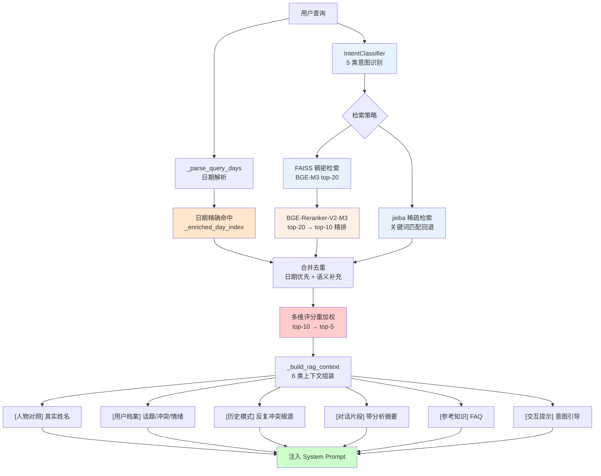

# 多维度 Hybrid RAG 索引与混合检索

> 📌 **本文档定位**：这是 [多模态处理流水线文档](modality_fields_and_models.md) Section 15 的详细设计文档，专注于关系咨询场景下的 Hybrid RAG 系统——包括稀疏+稠密混合检索、日期精确索引、多维评分、意图分类和增量更新机制。

## 1. 设计理念

### 1.1 核心目标

关系咨询场景对 RAG 的需求与通用问答显著不同：

| 挑战 | 通用 RAG 做法 | 本系统解决方案 |
|------|-------------|---------------|
| 时间敏感查询 | 纯语义检索 | 日期倒排索引 + 精确命中 |
| 情感关联 ≠ 语义相似 | cosine 相似度 | 多维评分（语义+时间+情感） |
| 跨天冲突模式 | 单次检索 | 跨天关联检测 + 历史模式注入 |
| 多源信息融合 | 单一文档块 | 6 类上下文块（档案/模式/片段/FAQ/提示） |
| 动态数据增长 | 全量重建索引 | 增量更新（无需重建） |

### 1.2 设计原则

```
┌─────────────────────────────────────────────────────────────────┐
│                      设计原则                                    │
├─────────────────────────────────────────────────────────────────┤
│  1. 混合检索：稠密向量（FAISS）+ 稀疏关键词（jieba）双通道     │
│  2. 精确优先：日期查询走倒排索引 O(1)，语义作为补充             │
│  3. 多维评分：语义×0.5 + 时间×0.2 + 情感×0.3 加权重排          │
│  4. 意图驱动：5 类意图自动识别，动态调整检索策略                │
│  5. 增量友好：FAISS 追加 + 元数据合并，无需全量重建             │
└─────────────────────────────────────────────────────────────────┘
```

---

## 2. 系统架构

### 2.1 四层检索架构

**核心文件**: `scripts/advisor/chunk_based_rag.py`, `scripts/advisor/graph_rag.py`



### 2.2 四层详解

| 层级 | 组件 | 模型/方法 | 输入 → 输出 | 说明 |
|------|------|-----------|------------|------|
| **Layer 1** | FAISS 稠密召回 | BGE-M3 (`/data/models/bge-m3`) | query → top-20 | 1024 维向量，FlatIP 索引 |
| **Layer 1b** | jieba 稀疏回退 | jieba 分词 + 关键词匹配 | query → 候选集 | FAISS 为空或结果不足时启用 |
| **Layer 2** | 交叉编码器精排 | BGE-Reranker-V2-M3 | top-20 → top-10 | 跨编码器 query-passage 打分 |
| **Layer 3** | 多维评分重加权 | 规则引擎 | top-10 → top-5 | `语义×0.5 + 时间×0.2 + 情感×0.3` |
| **Layer 4** | 上下文组装 | 模板引擎 | top-5 → structured context | 6 类上下文块拼接注入 |

### 2.3 稀疏+稠密混合检索

本系统采用 **Hybrid Retrieval** 策略：

- **稠密检索 (Dense)**: BGE-M3 编码 → FAISS IndexFlatIP 向量余弦相似度召回
- **稀疏检索 (Sparse)**: jieba 分词关键词匹配，作为向量检索不足时的回退通道
- **日期精确索引**: `_enriched_day_index` 倒排索引，O(1) 精确命中

三者通过 **合并去重 + 多维评分重加权** 融合为最终结果。

---

## 3. 类继承结构

```
GraphRAGManager (graph_rag.py)
├── BGE-M3 编码 + FAISS 索引
├── BGE-Reranker 重排
├── 用户档案构建
├── query_related() — 标准检索
├── query_fast() — 快速检索（无重排）
└── 增量更新

    └── ChunkAwareRAG (chunk_based_rag.py) [继承]
        ├── 分析增强元数据索引
        ├── 日期倒排索引 (_enriched_day_index)
        ├── 多维评分 (_apply_multidim_scoring)
        ├── 意图分类 (IntentClassifier)
        ├── query_enhanced() — 多维增强检索
        ├── query_by_day() — 精确日期检索
        ├── assemble_context() — 6 类上下文组装
        └── add_chunks_incremental() — 增量更新
```

### 3.1 `GraphRAGManager` 基类

**核心文件**: `scripts/advisor/graph_rag.py`

```python
class GraphRAGManager:
    """BGE-M3 + FAISS + Reranker 基础设施"""
    
    def __init__(self, config=None):
        self.embedding_model_name = config.get('embedding_model', '/data/models/bge-m3')
        self.reranker_model_name = config.get('reranker_model', '/data/models/bge-reranker-v2-m3')
        self.top_k_retrieval = config.get('top_k_retrieval', 20)  # FAISS 粗召回
        self.top_k_rerank = config.get('top_k_rerank', 5)         # Reranker 精排后
    
    def query_related(self, query_text, top_k=None, use_reranker=True):
        """向量检索 + 重排"""
        candidates = self._vector_search(query_text, top_k=self.top_k_retrieval)
        if use_reranker:
            candidates = self._rerank(query_text, candidates, top_k=top_k or self.top_k_rerank)
        return candidates
    
    def query_fast(self, query_text, top_k=5):
        """快速检索（无重排），供 listen 模式使用"""
        return self._vector_search(query_text, top_k=top_k)
```

### 3.2 `ChunkAwareRAG` 子类

**核心文件**: `scripts/advisor/chunk_based_rag.py`

```python
class ChunkAwareRAG(GraphRAGManager):
    """分析增强的多维 RAG 系统"""
    
    def query_enhanced(self, query_text, top_k=5, ...):
        """多维增强检索: FAISS top-20 → Reranker top-10 → 多维评分 top-5"""
        query_days = self._extract_query_days(query_text)
        query_emotion = self._detect_query_emotion(query_text)
        
        # 日期精确查询优先
        if query_days and len(query_days) <= 3:
            day_results = [self.query_by_day(d) for d in query_days]
            semantic = self._get_base_results(query_text, use_reranker=True, recall_k=10)
            # 合并: 日期优先 + 语义补充
            return self._apply_multidim_scoring(merged, query_days, query_emotion, top_k)
        
        # 常规路径
        base = self._get_base_results(query_text, use_reranker=True, recall_k=20)
        return self._apply_multidim_scoring(base, query_days, query_emotion, top_k)
```

---

## 4. 日期索引与精确检索

### 4.1 倒排索引

`_enriched_day_index` 是一个 `dict[int, list[int]]`，key 为 day 编号，value 为该天所有 chunk 在 FAISS 索引中的位置列表。

```python
# 构建倒排索引
self._day_to_indices: dict[int, list[int]] = {}
for idx, meta in enumerate(enriched_metadata):
    if meta.day_num:
        self._day_to_indices.setdefault(meta.day_num, []).append(idx)
```

### 4.2 日期解析

**核心函数**: `_extract_query_days()` + `_parse_query_days()`

支持 6 种日期格式：

| 类型 | 示例 | 正则 | 转换 |
|------|------|------|------|
| 单日（天数） | 第108天 | `r'(?:第)?(\d+)天'` | day_num = 108 |
| 单日（月日） | 10月8日 | `r'(\d{1,2})月(\d{1,2})日'` | → day_num via 基准日 |
| 单日（ISO） | 2025-10-08 | `r'(\d{4})-(\d{1,2})-(\d{1,2})'` | → day_num via 基准日 |
| 范围（天数） | 第108天到第110天 | `r'第(\d+)天[到至\-]第?(\d+)天'` | range(108, 111) |
| 范围（月日） | 9月22日到25日 | `r'(\d+)月(\d+)日[到至](\d+)日'` | 展开为 day 列表 |
| 相对 | 最近一周/上个月/最近三天 | 关键词匹配 | 当前 max_day - N |

**日期↔天数转换**:

```python
BASE_DATE = datetime(2025, 6, 7)  # Day 1
# 月日 → day_num
def _date_to_day_num(month, day, year=2025):
    target = datetime(year, month, day)
    return (target - BASE_DATE).days + 1
# day_num → 日期
def _day_to_date(day_num):
    return BASE_DATE + timedelta(days=day_num - 1)
```

### 4.3 混合检索策略

日期命中结果**优先排前** + 语义结果**补充去重**：

```python
# query_enhanced() 中的混合逻辑
if query_days:
    day_results = []
    for day in query_days:
        day_results.extend(self.query_by_day(day))
    
    # 语义补充（不替换日期结果）
    semantic = self._get_base_results(query_text, use_reranker=True, recall_k=10)
    seen = {r.chunk_id for r in day_results}
    for sr in semantic:
        if sr.conversation_id not in seen:
            day_results.append(self._base_to_enhanced(sr))
    
    return self._apply_multidim_scoring(day_results, ...)
```

---

## 5. 多维评分与跨天关联

### 5.1 三维加权评分

```python
def _apply_multidim_scoring(self, results, query_days, query_emotion, ...):
    for r in results:
        r.final_score = (
            r.semantic_score * 0.5 +
            r.temporal_score * 0.2 +
            r.emotional_score * 0.3
        )
    results.sort(key=lambda r: r.final_score, reverse=True)
    return results[:top_k]
```

| 维度 | 权重 | 计算方法 | 说明 |
|------|------|----------|------|
| **语义相似度** | 0.5 | BGE-M3 余弦 → Reranker 交叉编码器分数 | 核心召回信号 |
| **时间相关性** | 0.2 | query 日期与 chunk 日期的距离衰减 | 越近越相关 |
| **情感匹配度** | 0.3 | query 情绪关键词与 chunk 情感标签重叠度 | 悲伤/愤怒/焦虑等 |

### 5.2 情感检测

```python
@staticmethod
def _detect_query_emotion(query: str) -> str:
    mapping = {
        'conflict': ['吵架', '生气', '烦', '冲突', '分手', '不理', '吵', '闹'],
        'sweet': ['甜蜜', '开心', '幸福', '浪漫', '爱', '想你', '高兴'],
        'sad': ['难过', '伤心', '哭', '委屈', '失望', '心痛'],
        'anxious': ['担心', '焦虑', '不安', '害怕', '紧张'],
    }
    for emo, kws in mapping.items():
        if any(kw in query for kw in kws):
            return emo
    return ''
```

### 5.3 跨天关联检测

当检测到多个不同天的 chunk 包含相似冲突模式（如"回避沟通"、"冷暴力"），自动将它们关联为 **历史模式**，注入 `[历史模式]` 上下文块。

---

## 6. 意图分类与动态策略

### 6.1 五类意图

**核心文件**: `scripts/advisor/intent_classifier.py`

| 意图类型 | 示例 | 检索策略 | top_k 调整 |
|----------|------|----------|-----------|
| **时间查询** | "第108天发生了什么" | 日期索引优先 | 保留全部命中 |
| **情感倾诉** | "我今天很难过" | 语义召回 + 情感匹配 | top-5 |
| **建议请求** | "我该怎么办" | 高分析质量 chunk 优先 | top-5 |
| **模式分析** | "我们总是因为钱吵架" | 跨天关联 + 历史模式 | top-7 |
| **闲聊** | "你好" | 不触发 RAG | 0 |

### 6.2 意图注入

意图分类结果会影响 `_build_rag_context()` 中的 `[交互提示]` 块：

```python
INTENT_HINTS = {
    "time_query": "用户在询问特定时间的事件，请准确引用检索到的对话内容。",
    "emotional": "用户正在倾诉情感，请优先共情，然后引用相关历史。",
    "advice": "用户在寻求建议，请基于检索到的模式提供结构化分析。",
    "pattern": "用户在分析关系模式，请关注反复出现的冲突主题。",
    "chat": "",  # 闲聊不注入
}
```

---

## 7. 上下文组装（6 类信息块）

### 7.1 组装函数

**核心函数**: `_build_rag_context()`

```python
def _build_rag_context(self, results, intent, query_text):
    context_blocks = []
    
    # 1. 人物对照
    context_blocks.append(f"[人物对照]\n{self._format_name_mapping()}")
    
    # 2. 用户档案
    if self._user_profile:
        context_blocks.append(f"[用户档案]\n{self._format_profile()}")
    
    # 3. 历史模式
    patterns = self._detect_recurring_patterns(results)
    if patterns:
        context_blocks.append(f"[历史模式]\n{patterns}")
    
    # 4. 对话片段（top-5 检索结果）
    for r in results[:5]:
        context_blocks.append(
            f"[对话片段 Day {r.metadata.day_num}]\n"
            f"{r.conversation_text[:500]}\n"
            f"分析摘要: {r.analysis_summary}"
        )
    
    # 5. FAQ 知识
    faq = self._search_faq(query_text)
    if faq:
        context_blocks.append(f"[参考知识]\n{faq}")
    
    # 6. 交互提示
    hint = INTENT_HINTS.get(intent, "")
    if hint:
        context_blocks.append(f"[交互提示]\n{hint}")
    
    return "\n\n".join(context_blocks)
```

### 7.2 各信息块详解

| 信息块 | 内容 | 注入位置 | 大小控制 |
|--------|------|----------|----------|
| **[人物对照]** | 真实姓名对照表（ME/OTHER→真名映射） | System Prompt 头部 | 固定 ~50 字 |
| **[用户档案]** | 高频话题、冲突模式、情绪基线 | System Prompt | ~200 字 |
| **[历史模式]** | 反复出现的冲突根源和修复尝试 | System Prompt | ~300 字 |
| **[对话片段]** | 命中 chunk 原文 + 分析摘要 | System Prompt | 每条 ≤ 500 字 × 5 |
| **[参考知识]** | FAQ 知识库匹配条目 | System Prompt | ≤ 200 字 |
| **[交互提示]** | 基于意图的引导语 | System Prompt | ~50 字 |

---

## 8. 增量更新

### 8.1 接口

**核心函数**: `ChunkAwareRAG.add_chunks_incremental()`
**API 端点**: `POST /api/rag/incremental-update`

### 8.2 流程

```
POST /api/rag/incremental-update
  {"chunks_path": "advisor_out/chunks/new_chunks.jsonl"}
    │
    ├── 1. 加载新 chunks，跳过已存在的 chunk_id
    ├── 2. BGE-M3 编码新 chunks → 向量
    ├── 3. FAISS index.add() 追加向量
    ├── 4. metadata.json + enriched_metadata.json 追加
    ├── 5. _enriched_day_index 更新新 day 映射
    ├── 6. 保存索引到磁盘
    └── 7. 刷新服务端缓存 (_reload_enriched_data)
```

```python
def add_chunks_incremental(self, new_chunks, analysis_data=None):
    """增量添加 chunks，无需全量重建"""
    existing_ids = {c.get('conversation_id') for c in self._conversations}
    to_add = [c for c in new_chunks if c.get('conversation_id') not in existing_ids]
    
    if not to_add:
        return 0
    
    # 编码 + 追加
    texts = [c.get('conversation_text', '') for c in to_add]
    embeddings = self._encode_texts(texts)
    faiss.normalize_L2(embeddings)
    self._faiss_index.add(embeddings)
    
    # 更新元数据
    self._conversations.extend(to_add)
    # 更新日期索引
    for idx, chunk in enumerate(to_add, start=len(self._conversations) - len(to_add)):
        day = chunk.get('day_num')
        if day:
            self._day_to_indices.setdefault(day, []).append(idx)
    
    return len(to_add)
```

---

## 9. 索引构建与参数

### 9.1 构建脚本

**核心脚本**: `scripts/advisor/run_all/_09_build_graph.py`

```bash
conda run -n wechatDHA python scripts/advisor/run_all/_09_build_graph.py
```

### 9.2 当前索引参数

| 参数 | 值 |
|------|-----|
| 向量模型 | BGE-M3 (`/data/models/bge-m3`) |
| 向量维度 | 1024 |
| 索引类型 | FAISS FlatIP (cosine via L2-normalized) |
| 索引大小 | N 向量（与 chunks 数等同） |
| 覆盖天数 | 覆盖全部对话日期范围 |
| Reranker | BGE-Reranker-V2-M3 (`/data/models/bge-reranker-v2-m3`) |
| 粗召回 top-k | 20 |
| 精排 top-k | 10 |
| 最终使用 top-k | **5** (注入对话上下文) |

### 9.3 输出文件

```
advisor_out/faiss_index/
├── index.faiss              # FAISS 向量索引
├── metadata.json            # chunk 元数据
├── enriched_metadata.json   # 分析摘要 + 日期索引
└── user_profile.json        # 用户关系档案
```

---

## 10. 函数参考

### 10.1 `chunk_based_rag.py`

| 函数/方法 | 参数 | 返回值 | 说明 |
|-----------|------|--------|------|
| `query_enhanced()` | query_text, top_k=5, filters... | list[EnhancedRetrievalResult] | 多维增强检索主入口 |
| `query_by_day()` | day_num | list[EnhancedRetrievalResult] | 精确日期检索 |
| `assemble_context()` | results, intent, query | str | 6 类上下文组装 |
| `add_chunks_incremental()` | new_chunks, analysis_data | int | 增量更新 |
| `build_enriched_index()` | chunks_file, analysis_file | None | 全量索引构建 |
| `_extract_query_days()` | query_text | list[int] | 日期解析 |
| `_detect_query_emotion()` | query | str | 情感检测 |
| `_apply_multidim_scoring()` | results, days, emotion, ... | list | 多维评分重排 |
| `_get_base_results()` | query, use_reranker, recall_k | list[RetrievalResult] | Layer 1+2 基础检索 |

### 10.2 `graph_rag.py`

| 函数/方法 | 参数 | 返回值 | 说明 |
|-----------|------|--------|------|
| `query_related()` | query_text, top_k, use_reranker | list[RetrievalResult] | 标准检索 |
| `query_fast()` | query_text, top_k=5 | list[RetrievalResult] | 快速检索（无重排） |
| `_vector_search()` | query_text, top_k=20 | list[RetrievalResult] | FAISS 向量检索 |
| `_rerank()` | query_text, candidates, top_k=5 | list[RetrievalResult] | Reranker 重排 |
| `_build_user_profile()` | conversations | UserProfile | 用户档案构建 |

### 10.3 `intent_classifier.py`

| 函数 | 参数 | 返回值 | 说明 |
|------|------|--------|------|
| `classify()` | query_text | str | 意图分类（5 类） |

---

**文档版本**: v1.1
**创建时间**: 2026-02-15
**最后更新**: 2026-03-06（use_rag 前端开关生效、ME/OTHER 标记在输出前替换为真名、聚焦指令防重复）
**关联主文档**: [modality_fields_and_models.md](modality_fields_and_models.md) Section 15
**核心脚本**: `chunk_based_rag.py`, `graph_rag.py`, `intent_classifier.py`, `_09_build_graph.py`
