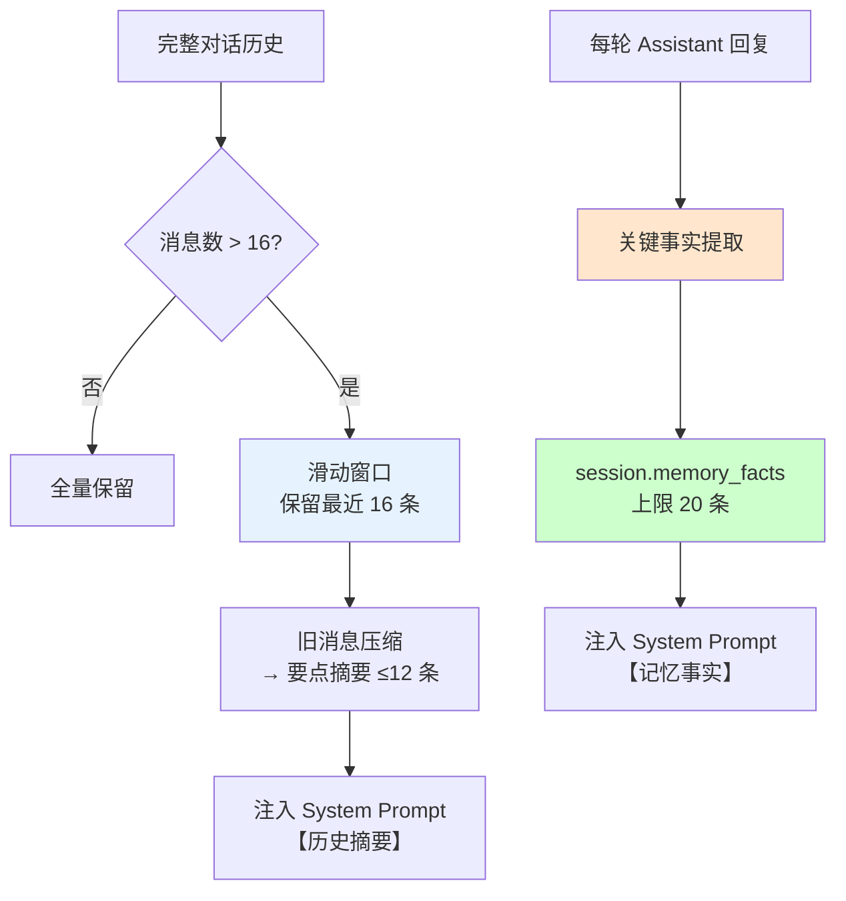

# 在线对话服务与前端交互系统

> 📌 **本文档定位**：这是 [多模态处理流水线文档](modality_fields_and_models.md) Sections 16-17 的详细设计文档，专注于在线对话服务（API 兼容层、长对话记忆、流式输出）和 React 前端交互系统。

## 1. 设计理念

### 1.1 核心目标

提供一个支持 9 种后端、3 种 Agent 类型、2 种交互模式的统一对话服务，并通过 React 前端实现完整的用户交互体验。

| 挑战 | 解决方案 |
|------|----------|
| 9 种后端 API 格式不统一 | 统一兼容层 + 消息预处理 |
| GPT-5.2 Response API 特殊性 | 四轮迭代修复，单轮格式稳定 |
| 深度对话遗忘/编造 | 三层记忆压缩（滑动窗口+摘要+事实） |
| 连续同角色消息报错 | 自动合并 + 截断 |
| 思考过程展示 | Thinking UI 分离显示 |
| 模型选择灵活性 | 前端 ModelSelector + 持久化偏好 |

### 1.2 设计原则

```
┌─────────────────────────────────────────────────────────────────┐
│                      设计原则                                    │
├─────────────────────────────────────────────────────────────────┤
│  1. 统一接口：所有后端通过相同 SSE 格式流式输出                 │
│  2. 防御性消息处理：合并/截断/格式化后再发送                    │
│  3. 三层记忆：滑动窗口 + 历史摘要 + 关键事实提取               │
│  4. Key 安全：零硬编码，platforms.yaml 集中管理                 │
│  5. 渐进增强：listen 模式轻量级，consult 模式深度分析           │
└─────────────────────────────────────────────────────────────────┘
```

---

## 2. 三种 Agent × 两种模式

### 2.1 六个独立 System Prompt

3 种 Agent 类型 × 2 种交互模式 = 6 个独立 System Prompt，覆盖不同咨询场景：

| Agent | 倾听模式（5-7 句） | 咨询模式（1000-2000 字） |
|-------|----------|----------|
| **中立顾问** | 共情 + 开放性问题 | 沟通模式 · 依附风格 · NVC 分析 · 权力动态 · 家庭系统 |
| **支持性顾问** | 无条件情感验证 | 用户视角分析 · 保护性建议 · 边界设立 |
| **精神分析顾问** | 均匀悬浮注意力 · 防御机制识别 | 客体关系 · 拉康三界 · 欲望结构 · 移情分析 |

所有 prompt 均包含以下机制：
- "如果有历史对话上下文"引导语，确保 RAG 注入时 Agent 正确引用检索到的历史对话
- **聚焦指令**：要求围绕当前提问展开新分析，不大段重复之前已讨论过的内容
- **ME/OTHER 禁令**：明确指示"绝不要输出 ME、OTHER 标记，始终使用真实姓名"

### 2.2 Prompt 存储

```python
# scripts/advisor/api/server.py
CHAT_SYSTEM_PROMPTS = {
    ("neutral", "listen"): "你是一位中立的关系顾问...",
    ("neutral", "consult"): "你是一位专业的关系心理顾问...",
    ("supportive", "listen"): "你是一位支持性的关系顾问...",
    ("supportive", "consult"): "你是一位支持性的关系心理顾问...",
    ("psychoanalytic", "listen"): "你是一位精神分析取向的关系顾问...",
    ("psychoanalytic", "consult"): "你是一位精神分析取向的关系心理顾问...",
}
```

---

## 3. API 兼容层

### 3.1 后端类型与格式

| 后端类型 | API 格式 | 兼容策略 |
|---------|----------|----------|
| **GPT-5.2** | `/v1/responses` (Response API) | 单轮 system+user input，历史扁平化到 system 末尾 |
| **Claude/Gemini/Grok/Kimi/DeepSeek/Qwen/GLM** | `/v1/chat/completions` | 标准多轮，max_tokens ≤ 16384 |
| **本地 Ollama** | `/v1/chat/completions` | qwen3:8b，无 token 限制 |

### 3.2 GPT-5.2 四轮修复历程

GPT-5.2 的 Response API 与标准 Chat Completions API 差异巨大，经历了四轮迭代才稳定：

| 轮次 | 问题 | 根因 | 修复 |
|------|------|------|------|
| **第一轮** | `input` 含 system role → 400 | Response API 不接受 system 角色 | 改用 `instructions` 参数传系统提示 |
| **第二轮** | 代理不支持多轮 `input` 数组 → 400 | 第三方 API 代理转发限制 | 扁平化：history 注入 `instructions`，`input` 仅当前消息 |
| **第三轮** | 代理静默忽略 `instructions` → 无视 RAG | 底层实现不传 `instructions` | 放弃 `instructions`，system 回到 `input[0]` |
| **最终方案** | 稳定 | — | `input[0]=system(含 RAG+历史)`, `input[1]=user(当前消息)` |

### 3.3 消息预处理

**核心函数**: `_preprocess_messages()`

```python
def _preprocess_messages(messages: list[dict]) -> list[dict]:
    """消息预处理：合并 + 截断 + 格式化"""
    processed = []
    for msg in messages:
        # 1. 连续同角色合并
        if processed and processed[-1]["role"] == msg["role"]:
            processed[-1]["content"] += "\n" + msg["content"]
            continue
        # 2. 过长消息截断
        if len(msg["content"]) > 3000:
            msg["content"] = msg["content"][:3000] + "...[截断]"
        processed.append(msg)
    return processed
```

| 处理 | 说明 | 解决的问题 |
|------|------|------------|
| **连续同角色合并** | 多条连续 user/assistant 消息合并为一条 | 用户重试积累导致 Claude/OpenAI 400 |
| **过长消息截断** | 单条 ≤ 2500 字 | 防止 context window 溢出，同时保留核心分析内容 |
| **max_tokens 统一上限** | 所有后端 ≤ 16384 | 第三方 API 代理对 131072 返回 400 |

---

## 4. 三层长对话记忆压缩

### 4.1 架构



### 4.2 三层详解

| 层级 | 机制 | 持久化 | 触发条件 | 说明 |
|------|------|--------|----------|------|
| **L1 滑动窗口** | 保留最近 16 条完整消息（约 8 轮问答） | session JSON | 消息数 > 16 | 超出部分进入 L2 |
| **L2 历史摘要** | 旧消息压缩为要点列表（上限 12 条） | session JSON | 有旧消息溢出 | 注入 system prompt `【历史摘要】` |
| **L3 关键事实** | 自动提取日期事件 · 关系状态 | `session.memory_facts` | 每轮对话后 | 跨轮次累积（上限 20 条），注入 `【记忆事实】` |

### 4.3 事实提取规则

```python
FACT_PATTERNS = [
    # 日期+事件对
    r'(\d{4}[-/]\d{1,2}[-/]\d{1,2}|第\d+天)\s*[,，:：]\s*(.+)',
    # 关系状态判断
    r'(核心问题|主要矛盾|关系状态)[：:]\s*(.+)',
    # 用户自述关键信息
    r'(我们在一起|认识了|结婚|分居|复合)\s*(\d+[年月天])',
]
```

提取的事实累积存储在 `session.memory_facts`（上限 30 条），每次对话时注入 system prompt。

---

## 5. Key 管理与限流

### 5.1 架构

**核心文件**: `scripts/advisor/key_rotator.py`

| 组件 | 功能 | 配置 |
|------|------|------|
| **KeyRotator** | 每后端 3 个 key 轮换，故障自动降级 | `local_secrets/key_pool.yaml` |
| **GlobalRateLimiter** | 全账户 RPM ≤ 19 硬限制 | 滑动窗口，跨所有 KeyRotator |
| **platforms.yaml** | 7 平台定义，所有 API key 集中管理 | `local_secrets/platforms.yaml` |

### 5.2 Key 轮换策略

```python
class KeyRotator:
    def get_key(self) -> str:
        """获取可用 key，自动跳过故障 key"""
        for _ in range(len(self.keys)):
            key = self.keys[self._current_idx]
            if not self._is_cooling(key):
                return key
            self._current_idx = (self._current_idx + 1) % len(self.keys)
        # 全部冷却中，返回最早恢复的
        return self._earliest_recovery()
    
    def mark_failed(self, key: str):
        """标记 key 故障，进入冷却期"""
        self._cooldown[key] = time.time() + self.cooldown_seconds
```

---

## 6. 流式输出与 Thinking UI

### 6.1 SSE 流式格式

所有后端统一为 SSE (Server-Sent Events) 格式：

```python
# server.py
@app.post("/api/chat")
async def chat(request: ChatRequest):
    return StreamingResponse(
        _stream_chat(request),
        media_type="text/event-stream",
    )

async def _stream_chat(request):
    async for chunk in backend.stream(messages):
        yield f"data: {json.dumps(chunk)}\n\n"
    yield "data: [DONE]\n\n"
```

### 6.2 Thinking 内容分离

不同后端的思考过程以不同方式返回：

| 后端 | Thinking 格式 | 提取方式 |
|------|-------------|----------|
| Claude | `reasoning_content` 字段 | 直接读取 |
| Grok | `reasoning_content` 字段 + `<think>` 标签 | 双通道：字段优先，标签回退 |
| DeepSeek | `reasoning_content` 字段 + `<think>` 标签 | 双通道 |
| Qwen3 (本地/云) | `<think>...</think>` 标签 | 正则提取 |
| GLM | `<think>...</think>` 标签 | 正则提取 |

`_THINK_TAG_BACKENDS = {"qwen_cloud", "qwen_local", "deepseek", "glm", "grok"}` — 所有 thinking 模型在**倾听**和**咨询**两种模式下均支持前端展开/收缩思考过程。

```python
# Qwen3 空 think 标签清理
def _clean_qwen3_thinking(text: str) -> str:
    """移除 Qwen3 always-think 模式的空残留标签"""
    return re.sub(r'<think>\s*</think>\s*', '', text)
```

### 6.3 同步→异步桥接

GLM/DeepSeek 使用同步 SDK，需要桥接到 async generator：

```python
async def _stream_sync_backend(messages, backend):
    """将同步 SDK 的流式输出桥接到 async generator"""
    loop = asyncio.get_event_loop()
    queue = asyncio.Queue()
    
    def _sync_stream():
        for chunk in backend.stream(messages):
            loop.call_soon_threadsafe(queue.put_nowait, chunk)
        loop.call_soon_threadsafe(queue.put_nowait, None)  # sentinel
    
    await loop.run_in_executor(None, _sync_stream)
    while True:
        chunk = await queue.get()
        if chunk is None:
            break
        yield chunk
```

---

## 7. 前端交互系统

### 7.1 技术栈

| 组件 | 技术 | 版本 |
|------|------|------|
| 框架 | React + TypeScript | 18 |
| 构建 | Vite | 5.x |
| UI | TailwindCSS + 自定义组件 | v4 |
| 状态管理 | React hooks (useState/useEffect) | — |
| HTTP | fetch + SSE 手动解析 | — |
| 端口 | `localhost:5173` | — |

### 7.2 核心组件

**目录**: `frontend/src/`

| 组件 | 文件 | 功能 |
|------|------|------|
| **ChatPanel** | `ChatPanel.tsx` | 主对话界面，SSE 流式渲染，Thinking 折叠展示，自动滚动 |
| **ModelSelector** | `ModelSelector.tsx` | 按角色（分析/审核/对话）选择模型，持久化到 `model_preferences.json` |
| **PipelineStatus** | `PipelineStatus.tsx` | 流水线执行状态可视化（Phase 2/3 进度条、chunk 计数） |
| **Settings** | Settings 页面 | Agent 类型切换、模式切换（listen/consult）、模型偏好 |

### 7.3 ChatPanel SSE 处理

```typescript
// ChatPanel.tsx 核心逻辑
const response = await fetch('/api/chat', {
  method: 'POST',
  headers: { 'Content-Type': 'application/json' },
  body: JSON.stringify({ messages, backend, agent_type, mode }),
});

const reader = response.body!.getReader();
const decoder = new TextDecoder();

while (true) {
  const { done, value } = await reader.read();
  if (done) break;
  
  const text = decoder.decode(value);
  for (const line of text.split('\n')) {
    if (line.startsWith('data: ')) {
      const data = line.slice(6);
      if (data === '[DONE]') break;
      
      const chunk = JSON.parse(data);
      if (chunk.thinking) {
        setThinkingContent(prev => prev + chunk.thinking);
      } else if (chunk.content) {
        setAssistantMessage(prev => prev + chunk.content);
      }
    }
  }
}
```

### 7.4 ModelSelector 持久化

```typescript
// api.ts
export async function getModelPreferences(): Promise<ModelPreferences> {
  const res = await fetch('/api/models/preferences');
  return res.json();
}

export async function saveModelPreferences(prefs: ModelPreferences) {
  await fetch('/api/models/preferences', {
    method: 'POST',
    headers: { 'Content-Type': 'application/json' },
    body: JSON.stringify(prefs),
  });
}

// ModelPreferences 类型
interface ModelPreferences {
  analysis_backend: string;  // 用于 Phase 2 分析
  review_backend: string;    // 用于 Phase 3 审核
  chat_backend: string;      // 用于在线对话
}
```

---

## 8. API 端点清单

### 8.1 对话相关

| 端点 | 方法 | 功能 | 请求体 |
|------|------|------|--------|
| `/api/chat` | POST | 流式对话（SSE） | `{message, backend, agent_type, mode, session_id?, use_rag?, stream?}` |
| `/api/chat/sessions` | GET | 会话列表 | — |
| `/api/chat/sessions/search` | POST | 搜索会话 | `{query, limit?}` |
| `/api/chat/sessions/{id}` | GET | 会话详情 | — |
| `/api/chat/sessions/{id}` | DELETE | 删除会话 | — |

### 8.2 RAG 相关

| 端点 | 方法 | 功能 | 请求体 |
|------|------|------|--------|
| `/api/rag/search` | POST | RAG 检索测试 | `{query, top_k}` |
| `/api/rag/feedback` | POST | 用户反馈收集 | `{session_id, message_id, rating, comment}` |
| `/api/rag/incremental-update` | POST | 增量更新索引 | `{chunks_path}` |

### 8.3 模型管理

| 端点 | 方法 | 功能 | 请求体 |
|------|------|------|--------|
| `/api/models/available` | GET | 可用模型列表 | — |
| `/api/models/preferences` | GET | 读取模型偏好 | — |
| `/api/models/preferences` | POST | 保存模型偏好 | `{analysis_backend, review_backend, chat_backend}` |
| `/api/models/test` | POST | 测试模型连通性 | `{backend}` |

### 8.4 流水线管理

| 端点 | 方法 | 功能 | 请求体 |
|------|------|------|--------|
| `/api/pipeline/run` | POST | 触发流水线执行 | `{phase, options}` |
| `/api/pipeline/status` | GET | 流水线状态 | — |
| `/api/health` | GET | 健康检查 | — |
| `/api/data/stats` | GET | 数据统计 | — |

---

## 9. 运行命令

```bash
# 1. 启动后端服务
source local_secrets/.env.advisor
conda run -n wechatDHA uvicorn scripts.advisor.api.server:app --reload --port 8787 --host 0.0.0.0

# 2. 启动前端
cd frontend && npm run dev    # → http://localhost:5173

# 3. 启动本地 LLM（可选）
ollama run qwen3:8b           # → http://localhost:11434

# 4. 测试模型连通性
curl http://localhost:8787/api/models/test -X POST -H 'Content-Type: application/json' \
  -d '{"backend": "claude"}'
```

---

## 10. 函数参考

### 10.1 `server.py` 核心函数

| 函数 | 说明 |
|------|------|
| `chat()` | POST /api/chat 入口，返回 StreamingResponse |
| `_stream_chat()` | 异步生成器，处理消息预处理 + RAG 注入 + 后端调用 |
| `_preprocess_messages()` | 消息合并/截断/格式化 |
| `_build_rag_context()` | RAG 上下文组装（调用 ChunkAwareRAG） |
| `_reload_enriched_data()` | 刷新服务端缓存（增量更新后） |

### 10.2 `streaming.py`

| 函数 | 说明 |
|------|------|
| `stream_ollama()` | Ollama 本地推理流式输出 |
| `stream_cloud()` | 云端后端流式输出 |
| `_clean_qwen3_thinking()` | Qwen3 空 think 标签清理 |

### 10.3 `key_rotator.py`

| 类 | 方法 | 说明 |
|----|------|------|
| `KeyRotator` | `get_key()` | 获取可用 key |
| `KeyRotator` | `mark_failed(key)` | 标记 key 故障 |
| `GlobalRateLimiter` | `acquire()` | 获取全局限流令牌 |
| `load_key_pool()` | — | 从 YAML 加载 key pool |

---

**文档版本**: v1.1
**创建时间**: 2026-02-15
**最后更新**: 2026-03-06（use_rag 开关、ME/OTHER 替换、thinking 扩展、参数调优）
**关联主文档**: [modality_fields_and_models.md](modality_fields_and_models.md) Sections 16-17
**核心脚本**: `api/server.py`, `streaming.py`, `key_rotator.py`
**前端目录**: `frontend/src/`
