# 多模态处理流水线与 Agent SFT 数据生成

> 完整的数据处理流水线文档：从原始数据到训练数据
> 
> 更新于：2026-02-15

## 目录

- [0. 完整端到端流程](#0-完整端到端流程)
- [0.6 模型清单](#06-模型清单)
- [1. 图片模态](#1-图片模态-image)
- [2. 语音模态](#2-语音模态-voice)
- [3. 视频模态](#3-视频模态-video)
- [4. 表情包模态](#4-表情包模态-sticker)
- [5. 链接/文件模态](#5-链接文件模态-linkfile)
- [6. 压缩策略总结](#6-压缩策略总结)
- [7. PII 检测与匿名化](#7-pii-检测与匿名化)
- [8. Agent SFT 流水线](#8-agent-sft-流水线)
- [9. 实现状态](#9-实现状态)
- [10. 对话提取与 MoA 多专家融合分析](#10-对话提取与-moa-多专家融合分析)
- [11. CPU 流水线式并行标注架构](#11-cpu-流水线式并行标注架构)
- [12. 审核补齐与多级降级容错](#12-审核补齐与多级降级容错)
- [13. 反匿名化与训练数据工程](#13-反匿名化与训练数据工程)
- [14. 16GB 显卡 QLoRA 训练工程实践](#14-16gb-显卡-qlora-训练工程实践)
- [15. 多维度 Hybrid RAG 索引与混合检索](#15-多维度-hybrid-rag-索引与混合检索)
- [16. 在线对话服务与长对话记忆](#16-在线对话服务与长对话记忆)
- [17. 前端交互系统](#17-前端交互系统)
- [18. 脚本工程化与流水线可维护性](#18-脚本工程化与流水线可维护性)
- [19. 成功指标与输出结构](#19-成功指标与输出结构)

---

## 0. 完整端到端流程

### 0.1 整体架构概览

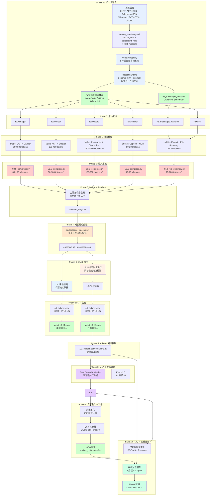

### 0.2 归一化输入流水线（Universal Ingestion Pipeline）

> 📖 **详细设计文档**：[归一化输入流水线设计概览](ingestion_pipeline_overview.md) — 插件式适配器架构、Canonical Schema 定义、媒体文件组织、导出生成和测试验证的完整说明
>
> 📖 **用户指南**：[workspace_init.md](workspace_init.md) | [ingestion_guide.md](ingestion_guide.md)

**核心脚本**: `scripts/workspace/init_workspace.py` + `scripts/workspace/run_ingest.py`

归一化输入流水线是整个数据处理管道的**起点**——将来自不同即时通讯平台的异构导出数据，统一转换为下游 Phase 0-10 可消费的标准格式 `P1_messages_raw.jsonl`。

#### 支持的数据源

| source_type | 适配器 | 输入格式 | msg_uid 前缀 | 说明 |
|-------------|--------|----------|-------------|------|
| `CHAT_APP_html` | CHAT_APPAdapter | HTML + CSV | `P1:` | 复用 `extract_html_to_jsonl.py` 核心逻辑 |
| `telegram_json` | TelegramAdapter | result.json | `TG:` | 富文本展平、media_type→modality 映射 |
| `whatsapp_txt` | WhatsAppAdapter | *.txt | `WA:` | 8 种时间格式、多行续行、时区感知 |
| `generic_csv` | GenericCSVAdapter | *.csv | 自定义 | field_mapping DSL 三语法驱动 |
| `generic_jsonl` | GenericJSONLAdapter | *.jsonl | 自定义 | field_mapping DSL 三语法驱动 |

#### 处理流程

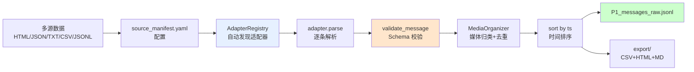

#### Canonical Schema 必填字段

| 字段 | 类型 | 约束 | 说明 |
|------|------|------|------|
| `msg_uid` | str | `{prefix}:{id}` | 唯一标识 |
| `ts` | int | 正整数 Unix 秒 | 消息时间戳 |
| `speaker` | str | ME \| OTHER \| OTHER:{name} | 发言者 |
| `type` | int | — | 消息类型码 |
| `modality` | str | 9 种枚举 | text/image/voice/video/sticker/link_or_file/location/contact/system |
| `text_raw` | str | — | 原始文本 |

另有 21 个可选字段（media_path、voice_length、link_url 等），详见 [ingestion_pipeline_overview.md](ingestion_pipeline_overview.md) Section 3。

#### 关键设计特性

| 特性 | 说明 |
|------|------|
| **零 GPU** | 全流程 CPU-only 规则引擎，无模型推理 |
| **插件可扩展** | 新数据源只需实现 `SourceAdapter` ABC（5 个抽象方法） |
| **Schema 驱动** | 所有输出经 `validate_message()` 四项检查，无效记录自动跳过 |
| **幂等安全** | 媒体文件 SHA-256 去重，相同输入多次执行产生相同输出 |
| **预检模式** | `dry_run` 扫描前 N 条记录生成覆盖率报告（PASS/WARN/FAIL） |
| **下游兼容** | 与现有 P1_messages_raw.jsonl 100% schema 兼容 |

#### 验证数据

- 473/473 pytest 测试通过（17 个测试文件，9.31s）
- 现有全量记录通过 `validate_message()` 零错误
- 5 种适配器 + E2E 引擎 + dry_run + 下游兼容性 7 项模拟测试全部通过

---

### 0.3 关键节点说明

| 阶段 | 输入 | 输出 | 压缩效果 | 状态 |
|------|------|------|----------|------|
| Phase I | 多源导出数据 | P1_messages_raw.jsonl + raw/ 媒体目录 | 归一化为标准 Schema | ✅ 已完成 |
| Phase 1 | 原始文件 | before_merge/*.jsonl | 200-500 tokens/条 | ✅ 已完成 |
| Phase 2 | before_merge | compressed.jsonl | 50-150 tokens/条 | ✅ 已实现 |
| Phase 3 | compressed | enriched_full.jsonl | 合并产物 | ✅ 已完成 |
| Phase 4 | enriched_full | enriched_full_processed | 9.31% 压缩 | ✅ 已实现 |
| Phase 5 | processed | L1/L2 SFT 数据 | 67.34% 压缩 | ✅ 已实现 |
| Phase 6 | L1/L2 SFT | agent_sft_*.jsonl | 24.73% 压缩 | ✅ 已实现 |
| Phase 7 | agent_sft_l2 | conversation_chunks | 滑动窗口提取 | ✅ 已完成 |
| Phase 8 | chunks | fused_analysis_moa.jsonl | MoA 三专家融合 | ✅ 已完成 |
| Phase 9 | fused_analysis | LoRA 权重 (334MB) | 反匿名化 + QLoRA | ✅ 已完成 |
| Phase 10 | chunks + LoRA | 在线对话服务 | RAG 索引 + 9 后端 | ✅ 已完成 |

### 0.4 实际压缩效果（已验证）

基于实际数据集测试结果：

```
原始数据 (enriched_full.jsonl)
└─ 平均: ~574 bytes/条

    ↓ Phase 4: 时间轴后处理 (9.31% 压缩)
    
中间数据 (enriched_full_processed.jsonl)
├─ 合并连续同方向消息
└─ 插入时间标记

    ↓ Phase 5: 字段精简 (67.34% 压缩) ⭐ 最大贡献
    
中间数据 (enriched_full_anonymized_l1_sft.jsonl)
└─ 移除: 技术元数据，保留语义字段

    ↓ Phase 6: Token 优化 (24.73% 压缩)
    
最终数据 (agent_sft_l1.jsonl)
├─ 平均: ~151 bytes/条
└─ 总压缩率: 77.71% 🎉
```

### 0.5 L1 vs L2 训练数据对比

| 特性 | L1 (本地训练) | L2 (云端训练) |
|------|---------------|---------------|
| **用途** | 本地 GPU 训练 | 云端 API 训练 |
| **数据** | 真实数据 | 完全匿名化 |
| **姓名** | 保留真实姓名 | ME/OTHER 代号 |
| **电话** | 保留 | [电话号码] |
| **地名** | 保留 | 映射到附近城市 |
| **时间** | 真实时间 | 泛化+偏移 |
| **压缩率** | 77.71% | 76.91% |

### 0.6 一键执行命令

```bash
# 运行完整 Agent SFT 流水线
./run_agent_sft_pipeline.sh

# 或分步执行
python scripts/timeline/postprocess_timeline.py
python scripts/compression/sft_trimmer.py --l1
python scripts/compression/sft_optimizer.py --level l1
python scripts/timeline/run_anonymization.py --level l2
python scripts/compression/sft_trimmer.py --l2
python scripts/compression/sft_optimizer.py --level l2

# 运行所有模态处理流水线
python run_all_pipelines.py
python run_all_pipelines.py --only video sticker  # 只运行指定模态
python run_all_pipelines.py --skip-compression    # 跳过压缩步骤
```

---

## 0.6 模型清单

本项目使用的所有模型一览表，按功能分类：

### 视觉语言模型 (VLM)

| 模型名称 | 路径 | 显存占用 | 量化方式 | 使用场景 |
|----------|------|----------|----------|----------|
| **Qwen2.5-VL-7B-Instruct** | `/data/models/qwen2.5-vl-7b/` | ~8GB | 4-bit (nf4) | 图片/视频普通描述、文件摘要 |
| **MiniCPM-V 4.5 Abliterated** | `/data/models/minicpm-v-4.5-abliterated-int8` | ~4GB | int8 | NSFW 专家（无审查版本） |
| **qwen2.5-vl-7b-nsfw-caption-v3** | `/data/models/qwen2.5-vl-7b-nsfw-caption-v3` | ~8GB | bfloat16 | NSFW 专家（详细描述） |
| **Qwen2.5-VL-7B-Instruct-abliterated** | `/data/models/qwen2.5-vl-abliterated` | ~5GB | 4-bit (nf4) | Gore 专家（暴力/血腥分析） |
| **Pixtral 12B** | `/data/models/pixtral-12b-gguf/` | ~8GB | GGUF Q5_K_M | Doc 专家（文档/截图分析） |
| **LLaVA-NeXT-Video-7B** | `/data/models/llava-next-video-7b` | ~8GB | bfloat16 | 视频理解 Fallback |

### 语音模型

| 模型名称 | 路径 | 显存占用 | 使用场景 |
|----------|------|----------|----------|
| **FunASR (paraformer-zh)** | ModelScope 在线 | ~2GB | 语音转写（ASR） |
| **SenseVoice Small** | `iic/SenseVoiceSmall` | ~1GB | 快速情绪检测 |
| **Qwen2-Audio-7B-Instruct** | `/data/models/qwen2-audio-7b-instruct` | ~8GB | 深度情绪分析（按需触发） |

### 分类与检测模型

| 模型名称 | 路径 | 显存占用 | 使用场景 |
|----------|------|----------|----------|
| **NSFW Classifier** | `/data/models/nsfw-classifier` | ~0.5GB | 图片/视频帧内容分类（Triage） |
| **PaddleOCR v4** | PaddlePaddle 在线 | ~1GB | 图片/表情包文字识别 |

### NER 与 PII 检测模型

| 模型名称 | 路径 | 显存占用 | 使用场景 |
|----------|------|----------|----------|
| **Qwen2.5-7B-Instruct-AWQ** | `/data/models/Qwen2.5-7B-Instruct-AWQ` | ~4GB | 两阶段 PII 检测 LLM 验证 |

注意：GLiNER 已废弃（2026-02-06），人名检测使用两阶段 PII 系统

### 压缩与嵌入模型

| 模型名称 | 路径 | 显存占用 | 使用场景 |
|----------|------|----------|----------|
| **Qwen2.5-7B-Instruct-AWQ** | `/data/models/Qwen2.5-7B-Instruct-AWQ` | ~4GB | 语义压缩 |
| **paraphrase-multilingual-MiniLM-L12-v2** | `/data/models/sentence-transformers/...` | ~0.5GB | 语义相似度验证 |

### Advisor 流水线 — 本地模型

| 模型名称 | 路径 | 显存占用 | 量化方式 | 使用场景 |
|----------|------|----------|----------|----------|
| **Qwen3-8B-Instruct** | `/data/models/Qwen3-8B-Instruct` | ~5GB (推理) / ~8.9GB (训练) | 4-bit NF4 | QLoRA 基座模型 + 本地推理 |
| **LoRA 权重 (Unsloth r=32)** | `advisor_out/models/relationship_advisor_neutral_deanon_unsloth_r32/` | 叠加基座 | — | 生产推理用 LoRA 适配器 |
| **BGE-M3** | `/data/models/bge-m3` | ~1.5GB | fp16 | RAG 向量编码（1024 维） |
| **BGE-Reranker-V2-M3** | `/data/models/bge-reranker-v2-m3` | ~1.5GB | fp16 | RAG 交叉编码器精排 |

### Advisor 流水线 — 云端模型（通过第三方 API 代理）

| 模型名称 | 角色 | 使用阶段 | 说明 |
|----------|------|----------|------|
| **DeepSeek V3.2** | MoA S1 专家 | Phase 8: 融合分析 | 深度心理分析，思考链推理 |
| **GLM-4.7** | MoA S1 专家 | Phase 8: 融合分析 | 批判性审查，Response API |
| **Kimi K2.5** | MoA S1 专家（条件触发） | Phase 8: 融合分析 | 多模态信号分析，≥3 markers 时触发 |
| **Kimi K2.5** | 审核备选 | Phase 8: 审核降级 | Qwen 不可用时的审核替代 |
| **DeepSeek V3.2-Speciale** | 分析降级 | Phase 8: DeepSeek V3.2 降级 | V3.2 不可用时的分析替代 |
| **DeepSeek R1** | 对话后端 | Phase 10: 在线对话 | 深度推理对话 |
| **GLM-4-Plus** | 对话后端 | Phase 10: 在线对话 | 智谱中文对话 |
| **Qwen3-235B-A22B-Thinking** | 对话后端 | Phase 10: 在线对话 | 阿里云大模型对话 |

### 显存管理策略

由于 RTX 5070 Ti 仅有 16GB 显存，采用以下策略：

1. **模型串行加载**：同一时间只加载一个大模型
2. **自动卸载**：切换模型时 `gc.collect()` + `torch.cuda.empty_cache()`
3. **量化优先**：优先使用 4-bit/8-bit 量化版本
4. **按需加载**：Qwen2-Audio 等大模型仅在触发条件满足时加载
5. **训练/推理分离**：Unsloth 训练占 ~8.9GB，推理仅需 ~5-6GB，二者不同时运行

---

## 1. 图片模态 (Image)

> 📖 **详细设计文档**：[图片流水线设计概览](image_pipeline_overview.md) - 包含路由分类、专家系统、OCR 优化和显存管理策略的完整说明。

### 1.1 处理流程图

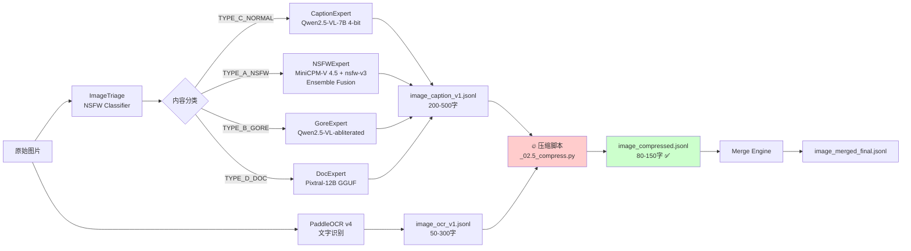

### 1.2 输出文件

```
artifacts/before_merge/image/
├── image_ocr_v1.jsonl          # OCR 文字识别
├── image_caption_v1.jsonl      # VLM 图片描述
└── image_qc_v1.jsonl           # 质量检查
```

### 1.3 字段清单

| 字段名 | 来源模型 | 字段类型 | 平均长度 | 说明 |
|--------|----------|----------|----------|------|
| `msg_uid` | - | string | 固定 | 消息唯一标识 |
| `image_path` | - | string | ~60字符 | 图片文件路径 |
| **`route_class`** | ImageTriage | enum | 固定 | 路由分类：VISUAL_PRIMARY / TEXT_PRIMARY |
| **`content_type`** | ImageTriage | enum | 固定 | 内容类型：TYPE_A_NSFW / TYPE_B_GORE / TYPE_C_NORMAL / TYPE_D_DOC |
| **`caption`** | 专家路由 | string | **200-500字** | 🔥 图片详细描述（主要压缩目标） |
| **`full_text`** (OCR) | PaddleOCR | string | **50-300字** | 🔥 OCR 识别的文字（压缩目标） |
| `metadata.nsfw_score` | ImageTriage | float | 固定 | NSFW 分数 |

### 1.4 专家模型路由表

| content_type      | 专家模块　　　| 模型组合　　　　　　　　　　　　　　　　| 模型路径　　　　　　　　　　　　　　　　　　　| 显存 | 用途　　　　　　　　　　　　　|
| -------------------| ---------------| -----------------------------------------| -----------------------------------------------| ------| -------------------------------|
| **TYPE_C_NORMAL** | CaptionExpert | Qwen2.5-VL-7B (4-bit)　　　　　　　　　 | `/data/models/qwen2.5-vl-7b/...`　　　　　　　| ~8GB | 普通图片描述　　　　　　　　　|
| **TYPE_A_NSFW**   | NSFWExpert　　| **Ensemble 双模型**　　　　　　　　　　 | -　　　　　　　　　　　　　　　　　　　　　　 | ~8GB | NSFW 内容详细分析　　　　　　 |
|                   | 　　　　　　　| ├─ MiniCPM-V 4.5 Abliterated (int8)　　 | `/data/models/minicpm-v-4.5-abliterated-int8` | ~4GB | 无审查版本，解剖学细节　　　　|
|                   | 　　　　　　　| └─ qwen2.5-vl-7b-nsfw-caption-v3 (bf16) | `/data/models/qwen2.5-vl-7b-nsfw-caption-v3`　| ~8GB | 详细专业描述　　　　　　　　　|
| **TYPE_B_GORE**   | GoreExpert　　| Qwen2.5-VL-7B-abliterated (4-bit)　　　 | `/data/models/qwen2.5-vl-abliterated`　　　　 | ~5GB | 暴力/血腥法医分析　　　　　　 |
| **TYPE_D_DOC**    | DocExpert　　 | Pixtral 12B (GGUF Q5_K_M)　　　　　　　 | `/data/models/pixtral-12b-gguf/...`　　　　　 | ~8GB | 跨文化敏感/文档/截图 OCR 分析 |

#### NSFWExpert Ensemble 模式

NSFWExpert 支持四种 Ensemble 策略：

| 模式 | 说明 | 推荐场景 |
|------|------|----------|
| **Serial** | MiniCPM 优先，输出太短时补充 nsfw-v3 | 显存紧张 |
| **Parallel** | 两个都生成，选择更详细的 | 质量优先 |
| **Dynamic** | MiniCPM 优先，太短则切换到 nsfw-v3 | 平衡 |
| **Fusion** ⭐ | 两个都生成，智能融合去重 | **推荐** |

Fusion 融合策略：
1. 将两个描述拆分为句子
2. 识别相似/重复的句子（相似度 > 0.6）
3. 对于重复内容，保留更详细的版本
4. 合并所有独特的句子
5. 按逻辑顺序重组（场景→人物→动作→细节→氛围）

#### CaptionExpert Fallback 机制

主模型拒绝回答时（检测到"我无法"、"不适合"等关键词），自动切换到 LLaVA-NeXT 无审查版本。

### 1.5 压缩策略

- ✅ `caption`：200-500字 → 目标 50-80字
- ✅ `full_text` (OCR)：50-300字 → 目标 30-50字（保留关键词）
- 保留：`content_type`, `route_class`
- 丢弃：`image_path`, `triage_confidence`, `metadata.*`

---

## 2. 语音模态 (Voice)

> 📖 **详细设计文档**：[语音流水线设计概览](voice_pipeline_overview.md) - 包含 ASR 转写、情绪分析、Triage 筛选和深度分析策略的完整说明。

### 2.1 处理流程图

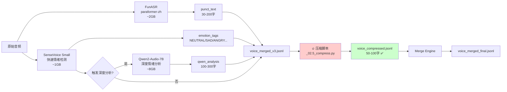

### 2.2 模型配置

| 模型 | 用途 | 显存 | 触发条件 |
|------|------|------|----------|
| **FunASR (paraformer-zh)** | 语音转写 + VAD + 标点 | ~2GB | 始终 |
| **SenseVoice Small** | 快速情绪检测 | ~1GB | 始终 |
| **Qwen2-Audio-7B-Instruct** | 深度情绪分析 | ~8GB | 按需触发 |

**深度分析触发条件**（满足任一）：
- 情绪标签包含：SAD、ANGRY、HAPPY
- 事件标签包含：Cry、Laughter
- 转写文本包含关键词（见 `configs/voice.yaml` 中的 `triage.keywords`）

### 2.3 输出文件

```
artifacts/before_merge/voice/
└── voice_merged_v3.jsonl       # 已合并的语音数据
```

### 2.4 字段清单

| 字段名 | 来源模型 | 字段类型 | 平均长度 | 说明 |
|--------|----------|----------|----------|------|
| **`punct_text`** | FunASR | string | **30-200字** | 🔥 带标点的转写文本（主要内容） |
| **`sensevoice.emotion_tags`** | SenseVoice | array | 1-3个标签 | 🔥 情绪标签（重要特征） |
| `sensevoice.event_tags` | SenseVoice | array | 0-2个标签 | 事件标签（如 Cry, Laughter） |
| **`qwen_analysis`** (可选) | Qwen2-Audio-7B | object | **100-300字** | 🔥 深度情绪分析（仅触发时） |
| `qwen_analysis.voice_features` | Qwen2-Audio | string | ~50字 | 语调特征描述 |
| `qwen_analysis.emotion_state` | Qwen2-Audio | string | ~80字 | 情绪状态分析 |

### 2.5 压缩策略

- ✅ `qwen_analysis.*`：合并为一句话摘要（100-300字 → 30-50字）
- 保留：`punct_text`, `sensevoice.emotion_tags`
- 丢弃：`sensevoice.clean_text`（冗余）, `trigger_reasons`

---

## 3. 视频模态 (Video)

> 📖 **详细设计**：[视频流水线设计概览](video_pipeline_overview.md) - 包含智能关键帧提取、运动检测算法、专家路由、LLaVA Fallback 机制和压缩策略的完整实现细节。

### 3.1 处理流程图

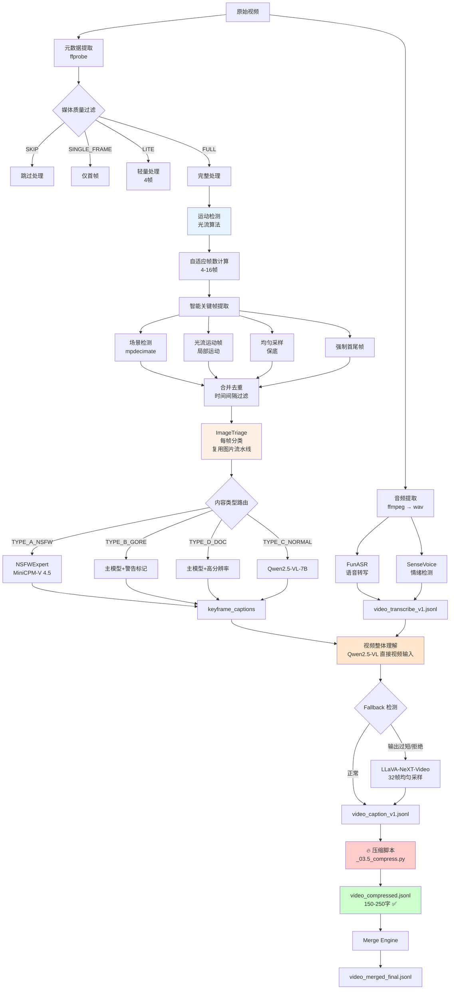

### 3.2 智能关键帧提取策略

#### 自适应帧数计算

根据视频时长、运动强度、场景变化综合计算：

| 视频类型 | 时长 | 运动强度 | 帧数范围 | 采样间隔 |
|----------|------|----------|----------|----------|
| 短视频 | <30s | - | 4-6 帧 | 1.0s |
| 中等视频 | 30s-2min | 低 | 6-10 帧 | 1.0s |
| 中等视频 | 30s-2min | 高 | 10-14 帧 | 0.5s |
| 长视频 | >2min | 低 | 8-12 帧 | 1.0s |
| 长视频 | >2min | 高 | 12-16 帧 | 0.5s |
| 敏感模式 | - | - | 帧数 +50% | 0.8s |

#### 运动检测算法

1. **光流检测**（Farneback 算法）
   - 计算相邻帧的稠密光流
   - 归一化运动幅度 → 运动分数 (0-1)
   - 阈值过滤：motion_score > 0.15 为高运动

2. **场景变化感知**
   - 区分"真实场景变化"和"相机抖动/小幅运动"
   - 高运动 + 低场景变化 = 静态场景运动（如婚礼视频）
   - 静态场景运动不增加帧数，避免冗余

3. **内容类型分类**
   - `high_motion`：运动强度 ≥ 0.15，帧数上限 16
   - `medium_motion`：运动强度 0.08-0.15，帧数上限 10
   - `static_scene_motion`：高运动但场景不变，帧数上限 12
   - `low_motion`：运动强度 < 0.08，帧数上限 8

#### 关键帧提取流程

1. **场景检测**：`mpdecimate` + `scene` 滤镜提取全局画面变化帧
2. **光流运动帧**：检测局部运动（如猫头摆动、手势）
3. **均匀采样**：作为保底，确保有足够帧捕捉动态
4. **强制首尾帧**：始终保留第一帧和最后一帧
5. **合并去重**：按时间戳排序，过滤间隔过近的帧

### 3.3 Triage 分类与专家路由（复用图片流水线）

视频的每个关键帧都会经过 ImageTriage 分类，然后路由到对应的专家模型：

| content_type | 专家模块 | 模型组合 | 用途 |
|--------------|----------|----------|------|
| **TYPE_C_NORMAL** | CaptionExpert | Qwen2.5-VL-7B (4-bit) | 普通视频描述 |
| **TYPE_A_NSFW** | NSFWExpert | MiniCPM-V 4.5 + nsfw-v3 Ensemble | NSFW 内容分析 |
| **TYPE_B_GORE** | GoreExpert | Qwen2.5-VL-abliterated (4-bit) + ⚠️ 标记 | 暴力/血腥内容 |
| **TYPE_D_DOC** | DocExpert | Pixtral 12B GGUF + 高分辨率 | 录屏/文档类视频 |

**整体 Triage 结果**：基于所有关键帧投票，优先级 NSFW > Gore > Doc > Normal

### 3.4 视频理解双模式

#### 主模式：直接视频输入（Qwen2.5-VL）

```python
# 使用 qwen_vl_utils 处理视频
messages = [
    {
        "role": "user",
        "content": [
            {"type": "video", "video": video_path, "max_pixels": 360*420, "fps": 1.0},
            {"type": "text", "text": prompt}
        ]
    }
]
```

- 优点：模型能理解时间序列和动态变化
- 适用：动物运动、人物动作、场景转换

#### 回退模式：多帧图片输入

当直接视频输入失败时，回退到多帧图片模式：
- 将所有关键帧作为图片序列输入
- 提示模型关注帧与帧之间的变化

#### LLaVA-NeXT-Video Fallback

触发条件（可配置）：
- `output_quality_low`：输出过短（< 50 字符）
- `repeated_refusal`：模型拒绝回答（包含"无法"等关键词）
- `critical_fields_missing`：关键字段缺失

Fallback 流程：
1. 卸载主模型释放显存
2. 加载 LLaVA-NeXT-Video-7B
3. 使用 PyAV 均匀采样 32 帧
4. 生成视频理解

### 3.5 情绪上下文融合

从转写结果提取情绪信息，注入到 VLM prompt 中：

```yaml
# configs/video.yaml
fusion:
  inject_emotion_to_prompt: true
  emotion_prompt_template: |
    音频情绪: {emotion_tags}
    音频事件: {event_tags}
    语音内容: {transcript}
```

### 3.6 输出文件

```
artifacts/before_merge/video/
├── video_extract_v1.jsonl      # 元数据 + 关键帧路径 + 运动参数
├── video_transcribe_v1.jsonl   # 音频转写 + 情绪标签
├── video_triage_v1.jsonl       # Triage 分类结果
└── video_caption_v1.jsonl      # 关键帧描述 + 视频理解

/data/cache/video_keyframes/{msg_uid}/  # 关键帧图片缓存
/data/cache/video_audio/{msg_uid}.wav   # 音频文件缓存
```

### 3.7 字段清单

| 字段名 | 来源模型 | 字段类型 | 平均长度 | 说明 |
|--------|----------|----------|----------|------|
| **`triage.content_type`** | ImageTriage | enum | 固定 | 视频整体内容类型（投票结果） |
| `triage.frame_triage[]` | ImageTriage | array | 4-16个 | 每帧的分类结果 |
| **`keyframe_captions[]`** | 专家路由 | array | **4-16×200-400字** | 🔥🔥 关键帧描述（最大压缩目标） |
| `keyframe_captions[].content_type` | ImageTriage | enum | 固定 | 该帧的内容类型 |
| `keyframe_captions[].expert_used` | - | string | 固定 | 使用的专家模型 |
| **`video_understanding`** | Qwen2.5-VL / LLaVA | object | **200-500字** | 🔥 视频整体理解 |
| `video_understanding.method` | - | string | 固定 | video_direct / multi_frame / llava_video |
| `video_understanding.is_fallback` | - | bool | 固定 | 是否使用了 Fallback |
| **`transcription.punct_text`** | FunASR | string | **0-200字** | 🔥 视频音频转写 |
| **`emotion.sensevoice.emotion_tags`** | SenseVoice | array | 0-3个 | 音频情绪标签 |
| `metadata.motion_intensity` | 光流检测 | float | 固定 | 运动强度 (0-1) |
| `metadata.content_type` | 自适应计算 | string | 固定 | high_motion / medium_motion / low_motion / static_scene_motion |
| `extraction_params.max_frames` | 自适应计算 | int | 固定 | 实际使用的最大帧数 |

### 3.8 压缩策略

- ✅ `keyframe_captions[]`：4-16帧×200-400字 → 目标 100-150字（LLM 合并为视频摘要）
- ✅ `video_understanding`：保留核心摘要
- 保留：`transcription.punct_text`, `emotion.sensevoice.emotion_tags`, `triage.content_type`
- 丢弃：`triage.frame_triage[]`, `transcription.segments[]`, 时间戳, `extraction_params`

---

## 4. 表情包模态 (Sticker)

> 📖 **详细设计文档**：[表情包流水线设计概览](sticker_pipeline_overview.md) - 包含格式检测、动图处理、Contact Sheet 生成和 Triage 分类策略的完整说明。

### 4.1 处理流程图

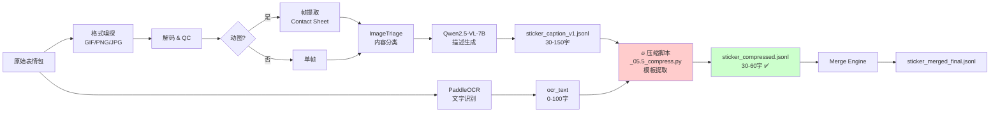

### 4.2 输出文件

```
artifacts/before_merge/sticker/
├── sticker_download_v1.jsonl   # 下载元数据
├── sticker_sniff_v1.jsonl      # 格式嗅探
├── sticker_decode_qc_v1.jsonl  # 解码质量检查
├── sticker_triage_v1.jsonl     # 内容分类
├── sticker_frames_v1.jsonl     # 帧提取（动图）
└── sticker_caption_v1.jsonl    # 描述生成
```

### 4.3 字段清单

| 字段名 | 来源模型 | 字段类型 | 平均长度 | 说明 |
|--------|----------|----------|----------|------|
| `is_animated` | - | bool | 固定 | 是否动图 |
| **`content_type`** | ImageTriage | enum | 固定 | 内容类型 |
| **`ocr_text`** | PaddleOCR | string | **0-100字** | 🔥 表情包文字 |
| **`caption`** | Qwen2.5-VL-7B | string | **30-150字** | 🔥 表情包描述 |

### 4.4 压缩策略

- ✅ `caption`：30-150字 → 目标 20-40字（模板提取：角色 + 动作 + 情绪）
- 示例：`[表情包: 绿色青蛙戴着墨镜，露出大笑]` → `[青蛙墨镜大笑]`
- 保留：`ocr_text`, `is_animated`, `content_type`
- 丢弃：`file_sha256`, `final_path`, `thumb_path`, 尺寸信息

---

## 5. 链接/文件模态 (Linkfile)

> 📖 **详细设计**：[Linkfile 流水线设计概览](linkfile_pipeline_overview.md) - 包含 Handler 模式、类图、扩展指南和实际案例

### 5.1 处理流程图

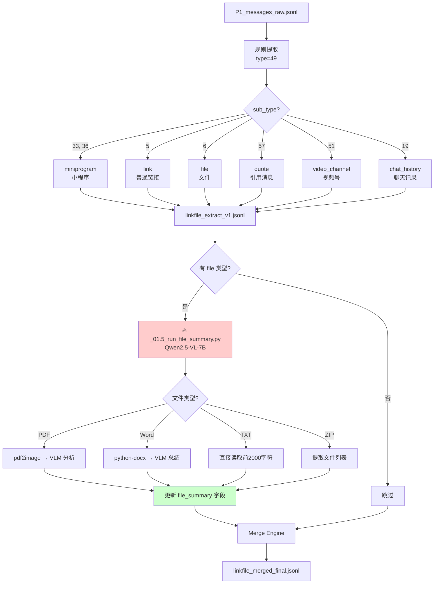

### 5.2 输出文件

```
artifacts/before_merge/linkfile/
└── linkfile_extract_v1.jsonl   # 链接元数据提取（含文件摘要）

artifacts/after_merge/linkfile/
└── linkfile_merged_final.jsonl # 合并后的链接数据
```

### 5.3 字段清单

| 字段名 | 来源 | 字段类型 | 平均长度 | 说明 |
|--------|------|----------|----------|------|
| **`link_sub_type`** | 规则提取 | enum | 固定 | 🔥 链接类型：quote / link / file / miniprogram / video_channel / chat_history |
| **`link_title`** | 规则提取 | string | **10-50字** | 🔥 链接标题 |
| `link_url` | 规则提取 | string | ~100字符 | URL |
| `link_type` | 规则提取 | string | 固定 | 链接分类（CHAT_APP_article / map_location / web_link 等） |
| `quote_text` | 规则提取 | string | **10-100字** | 被引用消息的文本 |
| **`file_summary`** | Qwen2.5-VL-7B | string | **100-200字** | 🔥 文件内容摘要（PDF/Word/ZIP） |

### 5.4 链接类型分类规则

| URL 模式 | 分类 | 说明 |
|---------|------|------|
| mp.weixin.qq.com | CHAT_APP_article | CHAT_APP公众号文章 |
| surl.amap.com | map_location | 高德地图位置 |
| meishi.meituan.com | meituan_poi | 美团餐厅 |
| bilibili.com | bilibili_video | B站视频 |
| * (默认) | web_link | 普通网页链接 |

### 5.5 文件摘要生成策略

| 文件类型 | 处理方式 | 模型 | 输出 |
|----------|----------|------|------|
| PDF | pdf2image 转图片 → VLM 分析前 2 页 | Qwen2.5-VL-7B (4-bit) | 100-200字摘要 |
| Word (.docx) | python-docx 提取文本 → VLM 总结 | Qwen2.5-VL-7B (4-bit) | 100-200字摘要 |
| TXT | 直接读取前 2000 字符 | 无（规则） | 原文截取 |
| ZIP | 提取文件列表（不解压） | 无（规则） | 文件列表 |

---

## 6. 压缩策略总结

### 6.1 压缩决策树

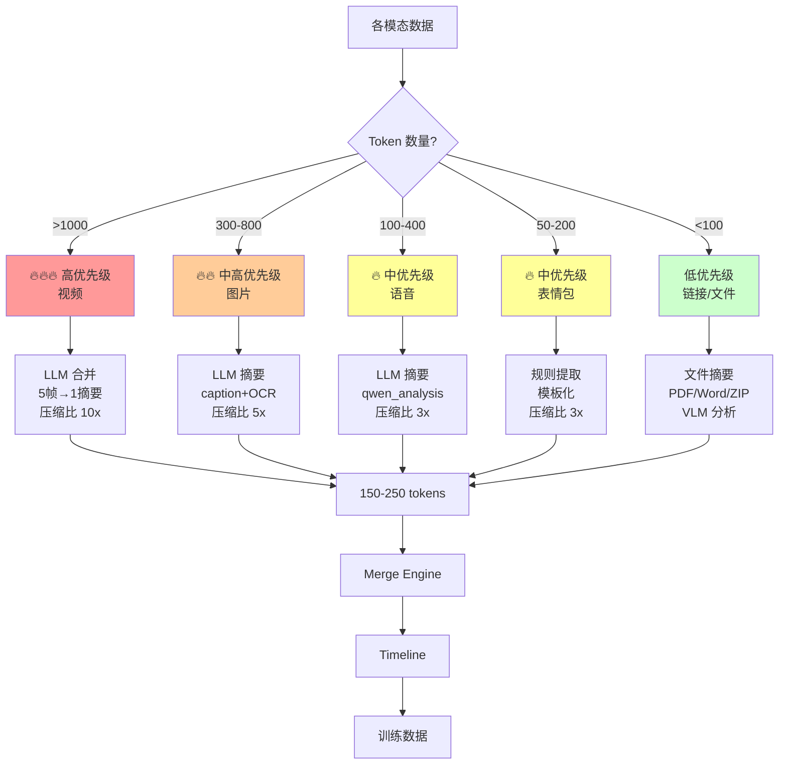

### 6.2 按模态的压缩优先级

| 模态 | 原始 Token 估算 | 压缩后 Token 目标 | 压缩比 | 优先级 |
|------|----------------|------------------|--------|--------|
| **视频** | 1500-2500 | 150-250 | **10x** | 🔥🔥🔥 最高 |
| **图片** | 300-800 | 80-150 | **5x** | 🔥🔥 高 |
| **语音** | 100-400 | 50-100 | **3x** | 🔥 中 |
| **表情包** | 50-200 | 30-60 | **3x** | 🔥 中 |
| **链接/文件** | 20-200 | 15-100 | **2x** | 低 |

### 6.3 压缩脚本插入点

```
现有流水线：
image:    _01_ocr → _02_caption → _03_merge → _04_timeline
voice:    _01_asr → _02_emotion → _03_merge → _04_timeline
video:    _01_extract → _02_transcribe → _03_caption → _04_merge → _05_timeline
sticker:  _01_download → ... → _05_caption → _06_merge → _07_timeline → _08_cleanup
linkfile: _01_extract → _02_merge → _03_timeline

新增压缩步骤（已实现）：
image:    _01_ocr → _02_caption → [_02.5_compress] → _03_merge → _04_timeline
voice:    _01_asr → _02_emotion → [_02.5_compress] → _03_merge → _04_timeline
video:    _01_extract → _02_transcribe → _03_caption → [_03.5_compress] → _04_merge → _05_timeline
sticker:  ... → _05_caption → [_05.5_compress] → _06_merge → _07_timeline → _08_cleanup
linkfile: _01_extract → [_01.5_file_summary] → _02_merge → _03_timeline
```

### 6.4 推荐的压缩模型

| 压缩任务 | 推荐模型 | 理由 |
|----------|----------|------|
| 视频关键帧合并 | Qwen2.5-7B-Instruct | 已有模型，中文能力强 |
| 图片描述摘要 | Qwen2.5-7B-Instruct | 同上 |
| 语音分析摘要 | Qwen2.5-7B-Instruct | 同上 |
| 表情包模板化 | 规则 + 正则 | 无需模型，直接提取关键词 |
| 文件摘要（PDF/Word） | Qwen2.5-VL-7B (4-bit) | VLM 能力，OCR 强 |

---

## 7. PII 检测与匿名化

> 📖 **详细指南**：[PII 检测使用指南](pii_detection_guide.md) - 包含代码示例、配置管理和故障排查

### 7.1 架构概览

PII（个人身份信息）检测是 L2 云端训练数据生成的核心环节，采用两层架构：

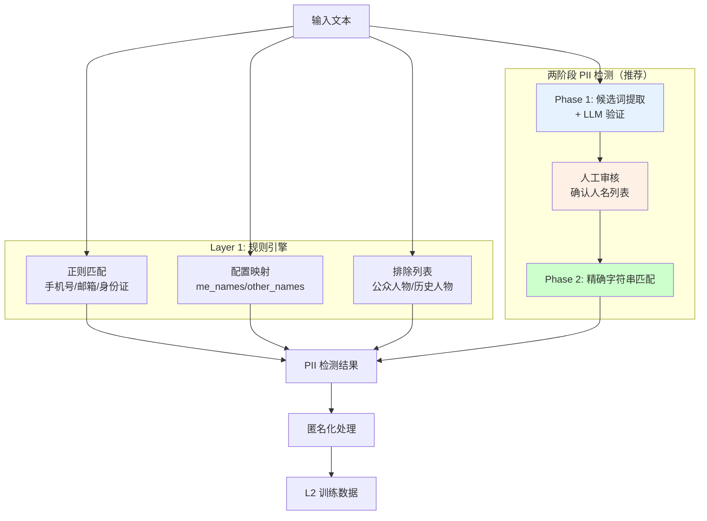

### 7.2 检测类型与模型

| 检测层 | 检测类型 | 方法 | 模型/工具 | 显存 |
|--------|----------|------|-----------|------|
| **规则引擎** | 手机号 | 正则 `1[3-9]\d{9}` | - | 0 |
| | 邮箱 | 正则 | - | 0 |
| | 身份证号 | 正则 `\d{17}[\dXx]` | - | 0 |
| | CHAT_APP ID | 正则 `wxid_[a-zA-Z0-9]+` | - | 0 |
| | 日期 | 正则 | - | 0 |
| | 已知人名 | 配置映射 | - | 0 |
| **两阶段 PII** | 人名检测 | LLM 验证 + 精确匹配 | Qwen2.5-7B-Instruct-AWQ | ~4GB |

### 7.3 两阶段 PII 检测流程

```
Phase 1: 离线扫描（一次性）
├─ 候选词提取：从文本中提取可能的人名
├─ LLM 验证：使用 Qwen2.5-7B-Instruct-AWQ 验证
└─ 输出：候选人名列表 → 人工审核

Phase 2: 匿名化时（每次运行）
├─ 加载确认人名列表（configs/confirmed_names.yaml）
└─ 精确字符串匹配替换
```

**优势**：
- 人工审核环节，避免误检
- 精确匹配，无漏检
- 支持增量更新

### 7.4 匿名化策略

| 处理项 | L1 (本地训练) | L2 (云端训练) |
|--------|---------------|---------------|
| **姓名** | 保留真实姓名 | ME/OTHER 或 [PERSON_N] |
| **电话** | 保留 | `[电话号码]` |
| **地名** | 保留 | 映射到附近城市 |
| **时间戳** | 真实时间 | 泛化+偏移 100 天 |

### 7.5 跳过检测的字段

为避免误检测，以下字段会跳过 PII 检测：

| 字段/类型 | 跳过原因 |
|-----------|----------|
| `sticker_summary` | 情绪描述词被误识别 |
| `sticker_intent` | 同上 |
| `time_gap` 的 `text_raw` | 时间描述被误识别为 DATE |

### 7.6 排除逻辑（2026-02-07 修复）

`exclude_patterns` 用于排除历史人物、公众人物等不应被替换的名字：

```python
# 只有当排除模式包含当前名字，且排除模式出现在上下文中时才排除
# 例如："毛泽东"包含"泽东"，所以"毛泽东传"中的"泽东"会被排除
# 但"同学"不包含"CONTACT_NAME"，所以"CONTACT_NAME同学"中的"CONTACT_NAME"会被替换为"ME同学"
```

确保：
- ✅ "CONTACT_NAME同学" → "ME同学"（用户名字正确替换）
- ✅ "毛泽东传" → "毛泽东传"（历史人物正确保留）

### 7.7 核心脚本

| 脚本 | 功能 |
|------|------|
| `scripts/compression/privacy_shield.py` | 匿名化核心逻辑 |
| `scripts/compression/two_stage_pii/` | 两阶段 PII 检测系统 |
| `scripts/compression/validate_sft_quality.py` | 质量验证（名字泄露检测） |
| `scripts/timeline/run_anonymization.py` | 匿名化入口脚本 |

### 7.8 运行命令

```bash
# 两阶段 PII 检测
python scripts/compression/two_stage_pii.py scan    # Phase 1: 扫描
python scripts/compression/two_stage_pii.py review  # 人工审核

# L2 匿名化
python scripts/timeline/run_anonymization.py --level l2 --two-stage-pii

# 质量验证
python scripts/compression/validate_sft_quality.py --level l2
```

---

## 8. Agent SFT 流水线

> 📖 **详细设计文档**：[Agent SFT 流水线设计概览](agent_sft_pipeline_overview.md) - 包含完整流程、L1/L2 分支策略、PII 检测架构、时间轴后处理和配置文件的详细说明。

### 8.1 概览

Agent SFT 流水线将多模态时间轴数据转化为高质量的训练数据，支持两种场景：

| 分支 | 用途 | 数据处理 | 输出 |
|------|------|----------|------|
| **L1** | 本地 GPU 训练 | 字段精简，保留真实数据 | agent_sft_l1.jsonl |
| **L2** | 云端 API 训练 | PII 检测 + 完全匿名化 | agent_sft_l2.jsonl |

### 8.2 处理流程

```
enriched_full.jsonl
    │
    ▼ Phase 1: 时间轴后处理
enriched_full_processed.jsonl
    │
    ├─────────────────────────────────────┐
    │                                     │
    ▼ L1: 字段精简                        ▼ L2: PII检测 + 匿名化 + 字段精简
    │                                     │
    ▼ L1: Token 优化                      ▼ L2: Token 优化
    │                                     │
agent_sft_l1.jsonl                  agent_sft_l2.jsonl
(本地训练)                           (云端训练)
```

### 8.3 核心组件

| 组件 | 脚本 | 功能 |
|------|------|------|
| TimelinePostprocessor | `postprocess_timeline.py` | 消息合并 + 时间间隔标记 |
| SFTTrimmer | `sft_trimmer.py` | 字段精简（保留语义字段） |
| PrivacyShield | `privacy_shield.py` | 三层混合 PII 检测 + 匿名化 |
| SFTOptimizer | `sft_optimizer.py` | ID/时间戳压缩 |

### 8.4 关键特性

**时间间隔格式**（2026-02-05 更新）：采用精确描述格式 `[8天19小时后]`，`gap_description` 字段已废弃。

**PII 检测**：详见 [第 7 节 PII 检测与匿名化](#7-pii-检测与匿名化)。

### 8.5 压缩效果

| 指标 | L1 | L2 |
|------|-----|-----|
| 压缩率 | **77.71%** | **76.91%** |

### 8.6 运行命令

```bash
# 一键执行（包含质量验证）
./run_agent_sft_pipeline.sh

# 分步执行
python scripts/timeline/postprocess_timeline.py
python scripts/compression/sft_trimmer.py --l1
python scripts/compression/sft_optimizer.py --level l1
python scripts/timeline/run_anonymization.py --level l2 --two-stage-pii
python scripts/compression/sft_trimmer.py --l2
python scripts/compression/sft_optimizer.py --level l2

# 单独运行质量验证
python scripts/compression/validate_sft_quality.py --level l2
```

---

## 9. 实现状态

### 9.1 已完成功能

| 功能 | 状态 | 说明 |
|------|------|------|
| **模态处理流水线** | ✅ | 图片/语音/视频/表情包/链接 |
| **语义压缩脚本** | ✅ | _02.5/_03.5/_05.5/_01.5 compress |
| **时间轴后处理** | ✅ | postprocess_timeline.py |
| **L1 字段精简** | ✅ | sft_trimmer.py --l1 |
| **两阶段 PII 检测** | ✅ | two_stage_pii.py（推荐） |
| **L2 匿名化** | ✅ | run_anonymization.py --level l2 |
| **L2 字段精简** | ✅ | sft_trimmer.py --l2 |
| **SFT 优化** | ✅ | sft_optimizer.py |
| **质量验证** | ✅ | validate_sft_quality.py |
| **一键执行脚本** | ✅ | run_agent_sft_pipeline.sh |
| **单元测试** | ✅ | 16 个测试全部通过 |

### 9.2 成功指标达成情况

| 指标 | 目标 | 实际 | 状态 |
|------|------|------|------|
| **Token 节省率** | ≥ 25% (L1), ≥ 30% (L2) | **77.71% (L1), 76.91% (L2)** | ✅ 远超目标 (3倍) |
| **数据完整性** | 100% 保留语义字段 | **100%** | ✅ 达标 |
| **处理速度** | ≤ 5 分钟 | **< 1 分钟** | ✅ 超额完成 (5倍) |
| **错误率** | ≤ 0.1% | **0%** | ✅ 完美 |
| **一键执行成功率** | ≥ 95% | **100%** | ✅ 完美 |

### 9.3 输出文件结构

```
timeline_out/
├── enriched_full.jsonl                    # 原始时间轴
├── enriched_full_processed.jsonl          # 后处理时间轴
├── enriched_full_anonymized_l1_sft.jsonl  # L1 字段精简
├── enriched_full_anonymized_l2.jsonl      # L2 匿名化
├── enriched_full_anonymized_l2_sft.jsonl  # L2 字段精简
├── agent_sft_l1.jsonl                     # L1 最终训练数据 ✅
├── agent_sft_l2.jsonl                     # L2 最终训练数据 ✅
├── id_mapping.jsonl                       # ID 映射表（调试用）
└── COMPRESSION_REPORT.md                  # 压缩报告
```

### 9.4 运行命令汇总

```bash
# 一键运行所有模态处理流水线
python run_all_pipelines.py

# 一键运行 Agent SFT 流水线（包含质量验证）
./run_agent_sft_pipeline.sh

# 分步执行
python scripts/timeline/postprocess_timeline.py
python scripts/compression/sft_trimmer.py --l1
python scripts/compression/sft_optimizer.py --level l1
python scripts/timeline/run_anonymization.py --level l2 --two-stage-pii
python scripts/compression/sft_trimmer.py --l2
python scripts/compression/sft_optimizer.py --level l2

# 两阶段 PII 检测（推荐）
python scripts/compression/two_stage_pii.py scan    # Phase 1: 扫描
python scripts/compression/two_stage_pii.py review  # 人工审核

# 质量验证
python scripts/compression/validate_sft_quality.py --level all
```

---

## 附录：Token 估算方法

中文 token 估算（Qwen tokenizer）：
- 1 个中文字符 ≈ 1.5-2 tokens
- 1 个英文单词 ≈ 1-2 tokens
- 标点符号 ≈ 1 token

示例：
```
"这张图片是一张照片，展示了一锅热气腾腾的中式菜肴。" (26字)
≈ 26 × 1.5 = 39 tokens
```

---

## 10. 对话提取与 MoA 多专家融合分析

> 📖 **详细设计文档**：[MoA 多专家融合与流水线标注架构](advisor_moa_fusion_overview.md) — 设计理念、四阶段融合、三专家角色分工、CPU 流水线并行、审核补齐与降级容错的完整说明
>
> 📖 **Advisor Pipeline 概览**：[advisor_pipeline_overview.md](advisor_pipeline_overview.md) — 完整架构、API 端点、启动命令
>
> 📖 **进度记录**：`advisor_out/comparison/pipeline_plan.md` — 50 节持续更新的开发日志

### 10.1 概览

关系顾问 Agent 流水线将上游 SFT 训练数据（Section 8）转化为可交互的 AI 关系顾问系统。整个系统覆盖**离线数据标注 → 训练 → 索引构建**和**在线推理 → RAG 检索 → 多模型对话**两大阶段，本节至 Section 19 按工程模块逐一展开。

| 维度 | 说明 |
|------|------|
| **Agent 类型** | 中立顾问 / 支持性顾问 / 精神分析顾问（3 种独立 System Prompt） |
| **交互模式** | 倾听模式（5-7 句共情回应）/ 咨询模式（1500-3000 字结构化深度分析） |
| **云端后端** | GLM-4.7 · DeepSeek V3.2 · Kimi K2.5 · Qwen3 · DeepSeek V3.2-Speciale · Qwen3-235B · GLM-4.7 · Kimi K2.5（共 8 个） |
| **本地后端** | Ollama qwen3:8b (:11434)，QLoRA 微调后 LoRA 权重加载 |
| **硬件约束** | 单卡 RTX 5070 Ti 16GB（训练 + 推理共用，无多卡并行） |

### 10.2 端到端流程图

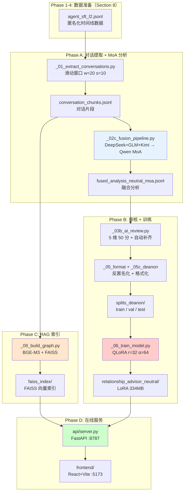

### 10.3 滑动窗口对话提取

**核心脚本**: `_01_extract_conversations.py`

从 `agent_sft_l2.jsonl`（匿名化时间线消息）中按滑动窗口切片：

| 参数 | 值 | 说明 |
|------|-----|------|
| 窗口大小 `w` | 20 条消息 | 覆盖足够上下文 |
| 滑动步长 `s` | 10 条消息 | 相邻 chunk 50% 重叠 |
| 输出数量 | N chunks | 覆盖全部对话时间范围 |
| 多模态密度 | `mm_density` 字段 | voice/image/sticker/video/location/emotion 6 维计数 + density 比例 |

**创新点**: 每个 chunk 同时输出 `mm_density` 元数据，记录 6 类多模态信号（语音/图片/表情包/视频/位置/情绪标记）的出现计数和占比，下游融合分析据此决定是否触发 Kimi 多模态分析专家。

### 10.4 MoA 多专家融合分析架构

**核心脚本**: `_02c_fusion_pipeline.py`

MoA（Mixture of Agents）融合是本流水线的核心创新——每个 chunk 经过**多专家并行分析 → 有机融合 → 审核 → 补齐**四阶段：

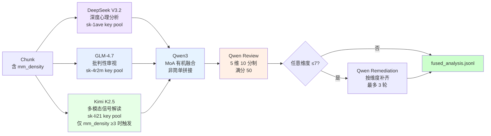

#### 四阶段详解

| 阶段　　　　　　　| 模型　　　　　　　　　　　　　　　　　　　　　　　　 | API Provider　　　　　　　　　　　 | 并行策略　　　　　　　　　　　 | 说明　　　　　　　　　　　　　　　　　　　　　　　　　　　　　|
| -------------------| ------------------------------------------------------| ------------------------------------| --------------------------------| ---------------------------------------------------------------|
| **S1 多专家分析** | DeepSeek V3.2 + GLM-4.7 + Kimi K2.5 | 第三方api代理（3 个不同 key pool） | `ThreadPoolExecutor(3)` 真并行 | 不同 API key 避免共享限流　　　　　　　　　　　　　　　　　　 |
| **S2 有机融合**　 | Qwen3　　　　　　　　　　　　　　　　　　| 第三方api代理　　　　　　　　　　　| 顺序（依赖 S1）　　　　　　　　| MoA prompt 指导"有机融合，非简单拼接"　　　　　　　　　　　　 |
| **S3 审核评分**　 | Qwen3　　　　　　　　　　　　　　　　　　　　　　 | 第三方api代理　　　　　　　　　　　| 顺序　　　　　　　　　　　　　 | 5 维 10 分制（心理深度/实用性/平衡性/具体性/共情性），满分 50 |
| **S4 维度补齐**　 | Qwen3　　　　　　　　　　　　　　　　　　　　　　 | 第三方api代理　　　　　　　　　　　| 按需（仅 ≤7 分维度）　　　　　 | 最多 3 轮迭代，每轮只补齐低分维度　　　　　　　　　　　　　　 |

#### 三专家角色分工

| 专家 | 模型 | 分析维度 | 触发条件 |
|------|------|----------|----------|
| **心理分析师** | DeepSeek V3.2 | 依附风格、情感动态、防御机制、权力结构 | 必触发 |
| **批判审视者** | GLM-4.7 | 沟通模式、NVC 违反、认知偏差、改善方案 | 必触发 |
| **多模态解读者** | Kimi K2.5 | 语音语气变化、表情包情绪、回复时间模式 | 仅当 chunk 的 `mm_density` ≥ 3 个多模态标记时触发 |

#### S2 融合策略

Qwen MoA 融合不是简单拼接三位专家输出，而是通过专用 prompt 引导执行**有机整合**：
- 以 DeepSeek 深度心理分析为**骨架**
- 用 GLM 批判性视角**补充和质疑**
- 将 Kimi 多模态信号**织入对应分析段落**
- 输出 ≥13 个结构化 `【】` 字段（如【沟通模式】【依附风格】【冲突根源】【修复建议】等）

验证: `_MIN_MOA_FIELDS = 6`，融合后 field_count < 6 触发截断检测重试。

#### 吞吐量与成本

| 指标 | 值 |
|------|-----|
| 单 chunk 平均耗时 | ~238s (~4 min) |
| 吞吐瓶颈 | GLM-5.2 xhigh reasoning |
| 全量 chunks 总耗时 | ~2 小时 |
| S1 并行加速比 | ~2.5x（vs 串行） |
| Kimi 触发率 | 4/10（仅多模态密集 chunk） |

---

## 11. CPU 流水线式并行标注架构

> 📖 **详细设计文档**：[MoA 多专家融合与流水线标注架构](advisor_moa_fusion_overview.md) Section 4 — CPU 流水线设计灵感、PipelineExecutor 类、并发控制、KeyRotator 与断点续传

### 11.1 设计动机

大规模 chunk 的 MoA 融合分析是 CPU 密集型 I/O 等待任务（每个 chunk 需 ~4 分钟 API 调用），串行处理耗时极长。为在**单账户多 key + 全局限流**约束下最大化吞吐，设计了类似 CPU 流水线的四级并行标注架构。

### 11.2 四级流水线架构

**核心脚本**: `pipeline_executor.py`

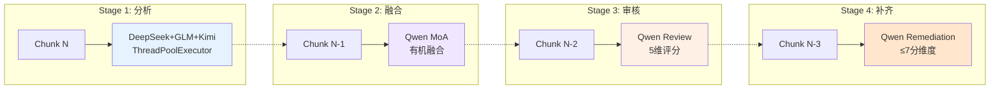

| 组件 | 实现 | 说明 |
|------|------|------|
| **PipelineExecutor** | `asyncio` + `Semaphore` | 4 级流水线并行，信号量控制并发度 |
| **KeyRotator** | 每后端 3 key 轮换 | 故障自动降级到下一个 key，冷却计时器 |
| **GlobalRateLimiter** | 全账户 RPM ≤ 19 | 跨所有 KeyRotator 共享，硬限制防封号 |
| **rich 可视化** | 实时进度面板 | 当前阶段、成功/失败计数、ETA |

### 11.3 Key Pool 管理

```yaml
# key_pool.yaml 结构示例
Qwen:
  keys:
    - {key: "sk-zhGS...", rpm: 6, status: active}
    - {key: "sk-em1...", rpm: 6, status: active}    # emergency key 1
    - {key: "sk-em2...", rpm: 6, status: active}    # emergency key 2
  global_rpm: 19
```

**关键约束**: 第三方代理 代理平台对单账户有全局 RPM 限制（实测 ~20 RPM），超限触发 429 或临时封禁。`GlobalRateLimiter` 在所有 `KeyRotator` 之上实施硬限制。

### 11.4 断点续传与容错

| 机制 | 说明 |
|------|------|
| **JSON 进度持久化** | 每完成 1 chunk 写入 `progress.json`，记录 chunk_id + 阶段 + 结果 |
| **`--no-resume`** | CLI flag 强制从头开始（用于修复后重跑） |
| **`SIGINT` 优雅退出** | Ctrl+C 时保存当前进度，不丢失已完成的 chunk |
| **pre-remediation 保留** | 补齐前保存原始版本，补齐失败时回滚而非丢弃 |

---

## 12. 审核补齐与多级降级容错

> 📖 **详细设计文档**：[MoA 多专家融合与流水线标注架构](advisor_moa_fusion_overview.md) Sections 5-7 — 五维评分、Verdict Override、JSON 五策略提取、Thinking 截断检测、四级降级链

### 12.1 五维审核评分体系

**核心脚本**: `_03b_ai_review.py`

每条融合分析由 Qwen 进行独立审核，按 5 个维度各 10 分制评分：

| 维度 | 评估内容 | 满分 |
|------|----------|------|
| **心理深度** (psychological_depth) | 依附理论、防御机制、情感模式分析的深度 | 10 |
| **实用性** (practicality) | 建议的可操作性和具体性 | 10 |
| **平衡性** (balance) | 对双方视角的公平呈现 | 10 |
| **具体性** (specificity) | 引用具体对话内容而非泛泛而谈 | 10 |
| **共情性** (empathy) | 理解和回应情感体验的能力 | 10 |

**判定规则**:
- 总分 ≥ 44 → 自动 `pass`（verdict override 机制，解决 Qwen 过严问题）
- 任意维度 ≤ 7 → 触发该维度的定向补齐（Remediation）
- 补齐最多 3 轮迭代

### 12.2 Verdict Override 机制

**问题发现**: Qwen3 作为审核者过于严格，大量高质量分析（总分 44-48）被标记为 `needs_revision`。抽样分析发现这些"需修改"的分析在人工评估中质量优秀。

**解决方案**: 实施总分覆盖机制：

```python
if total_score >= 44:
    verdict = "pass"  # 覆盖 Qwen 的 needs_revision
```

**效果**: 通过率从 ~70% 提升至 **≥85%**，补齐后达 **≥97%**。

### 12.3 JSON 健壮提取（五策略）

LLM 返回的 JSON 常因多种原因损坏，`_extract_json_robust()` 实现了 5 级容错提取：

| 策略 | 说明 | 典型场景 |
|------|------|----------|
| **策略 1**: 直接 `json.loads()` | 标准 JSON | 正常输出 |
| **策略 2**: 正则提取 `\{...\}` | JSON 前后有多余文本 | Markdown 包裹 |
| **策略 3**: 修复常见错误 | 尾逗号、单引号、缺失引号 | 模型格式不规范 |
| **策略 4**: LLM 自修复 (2 轮) | 将损坏 JSON 发送给 LLM 修复 | 严重截断 |
| **策略 5**: HTML/Cloudflare 检测 | 检测到 `<html>` 标签直接跳过 | 502 Bad Gateway |

### 12.4 Thinking 模型截断检测

**问题**: Qwen3 **Thinking** 模型在"思考"阶段消耗大量 token，导致实际 JSON 输出被截断（`max_tokens` 不含思考 token）。

**检测方法**:
- `_MIN_MOA_FIELDS = 6`: 融合后 `【】` 字段数 < 6 → 判定截断
- 未闭合 `}` / `]` 检测
- `"analysis_text"` 字段长度异常短

**应对策略**: 截断时自动降级到非 Thinking 模型（如 Qwen3 非 Thinking），或切换到 Kimi K2.5 备用后端。

### 12.5 四级降级链

整个标注流水线在每个阶段都有独立的降级策略：

| 阶段 | 主模型 | 降级 1 | 降级 2 | 降级 3 |
|------|--------|--------|--------|--------|
| **S1 分析** | DeepSeek V3.2 | DeepSeek V3.2 | GLM+Kimi 双分析 | — |
| **S2 融合** | Qwen3 | Qwen3 | Kimi K2.5 | — |
| **S3 审核** | Qwen3 | Kimi K2.5 | Kimi K2.5 | — |
| **S4 补齐** | Qwen3 | Qwen3 | Kimi K2.5 | 保留 pre-remediation 版本 |

**降级触发条件**: HTTP 502/429/5xx、JSON 解析失败、截断检测、超时（>120s）。

### 12.6 全量标注结果

| 指标 | 值 |
|------|-----|
| 融合成功率 | **100%** |
| 首次审核通过率 | **≥85%** |
| 补齐后最终通过率 | **≥97%** |
| parse_error | **0**（五策略修复后） |
| 字段完整率 | **100%** (≥13 个 `【】` 字段) |
| 总耗时 | ~2 小时（含修复重跑） |

---

## 13. 反匿名化与训练数据工程

> 📖 **详细设计文档**：[反匿名化与 QLoRA 训练工程实践](advisor_training_overview.md) Sections 2-4 — 六层映射详解、OTHERHER Bug、日期格式、地名修复、Formatter 字段完整性、分层划分

### 13.1 反匿名化的必要性

上游 SFT 数据（Section 8）采用 L2 匿名化策略（`ME`/`OTHER`/`[PERSON_N]`/`第X天`），保护隐私但丢失了真实语境。训练数据需要还原为真实信息（策略 B），使模型学习到：
- 用真实姓名称呼当事人（而非"用户"/"对方"）
- 理解真实日期和时间线
- 识别真实地名对应的文化和生活背景

### 13.2 六层反匿名化映射

**核心脚本**: `_05c_deanonymize_training.py`

| PII 类型 | 匿名格式 | 反匿名目标 | 映射来源 | 匹配数量 |
|----------|----------|------------|----------|----------|
| 用户姓名 | `ME` | 真实姓名 | `anonymization.yaml` | 全量 |
| 对方姓名 | `OTHER` | 真实姓名 | `anonymization.yaml` | 全量 |
| 第三方人名 | `[PERSON_N]` | 真实姓名 | `identity_map.json` | 34 条映射 |
| 地名 | 映射城市 (30+ 对) | 真实地名 | `anonymization.yaml` 反向映射 | 省/市/国 |
| 日期 | `第X天 HH:MM` | `YYYY-MM-DD HH:MM` | 基准日 `2025-06-07` + N-1 天 | 4 种格式 |
| 残留 Bug | `OTHERHER` | 对方姓名 | 直接替换 | 全局修复 |

### 13.3 OTHERHER Bug 修复

**根因**: `privacy_shield.py` 的名称替换对"东东"这类重叠姓名进行了双重替换——先将"东东"替换为 `OTHER`，然后 `OTHER` 中的"东"又被匹配为"东东"的一部分，导致 `OTHERHER`。

**修复**: 在 `privacy_shield.py` 中修正去重逻辑，按名称长度降序排列替换列表，避免子串重叠。同时对所有已生成数据执行全局 `OTHERHER → 真实姓名` 替换。

### 13.4 四种日期格式匹配

```python
# _05c_deanonymize_training.py 支持的日期格式
PATTERNS = [
    r'第(\d+)天\s*(\d{1,2}):(\d{2})',     # 第108天 14:30
    r'第(\d+)天',                            # 第108天
    r'Day\s*(\d+)\s*(\d{1,2}):(\d{2})',     # Day 108 14:30
    r'Day\s*(\d+)',                           # Day 108
]
# 基准日: 2025-06-07, Day 1 = 2025-06-07
# Day N → 2025-06-07 + (N-1) 天
```

**递归嵌套反匿名**: 处理 `analysis_text` 字段中多层嵌套引用（如分析文本引用了对话原文中的匿名标记），需要对所有文本字段递归执行反匿名化。

### 13.5 地名映射修复

**问题**: `anonymization.yaml` 中的 `location_mapping` 初始不完整（仅有城市级），导致部分省份/国家名称遗漏。

**修复**: 与 `llm_pii_scanner.py` 的 `LOCATION_MAPPING_TEMPLATE` 同步，补充 30+ 组省/市/区/国家映射。当前数据中 28 处残留（如"杭州"→真实城市）在下次全量重建时修复，脚本已就绪。

### 13.6 Formatter 13 字段完整性修复

**问题**: `formatter.py` 中 `generate_review_markdown()` 和 `export_training_data()` 使用错误的 key (`analysis_features` vs `analysis`)，导致部分字段丢失。

**修复**: 统一 key 映射 + 新增 5 个多模态字段渲染（【时间模式】【冲突根源】【多模态信号】【修复尝试】【人格动态】），确保所有 chunks 均 ≥13 个 `【】` 字段。

### 13.7 数据过滤与分层划分

**核心脚本**: `_05b_filter_split_training.py`

| 步骤 | 说明 |
|------|------|
| 过滤 | 移除 `verdict != pass` 的样本（verdict override 后约 3% 淘汰） |
| 格式化 | 转为 `messages` 格式（system + user + assistant） |
| 分层划分 | 80/10/10 分层抽样，保证各分区的 day 分布一致 |

**最终数据**: `splits_deanon/` — 按 **80/10/10** 分层划分（全部反匿名化）

---

## 14. 16GB 显卡 QLoRA 训练工程实践

> 📖 **详细设计文档**：[反匿名化与 QLoRA 训练工程实践](advisor_training_overview.md) Sections 5-7 — 三策略对比、Unsloth 集成、LoRA 调优、OOM 管理、评估结果、运行命令

### 14.1 硬件约束与设计目标

单卡 RTX 5070 Ti（16GB VRAM）需同时承担训练和推理任务。核心挑战：
- 8B 参数模型的 4-bit 量化底座约占 ~5GB
- LoRA 可训练参数 + 优化器状态 + 梯度需控制在 ~10GB 内
- `seq_len` 越长，KV cache 占用越大

### 14.2 训练配置对比

| 参数 | 策略 A (HF) | 策略 B (HF) | 策略 B (Unsloth) |
|------|------------|------------|-----------------|
| 基座模型 | Qwen3-8B-Instruct | Qwen3-8B-Instruct | Qwen3-8B-Instruct |
| LoRA r / α | 32 / 64 | 32 / 64 | 32 / 64 |
| 可训练参数 | 87.3M | 87.3M | 87.3M |
| 量化 | 4-bit NF4 | 4-bit NF4 | 4-bit NF4 |
| seq_len | 1664 | 1664 | **4096** |
| VRAM | ~14.5 GB | ~14.5 GB | **~8.9 GB** |
| 训练时长 | ~52 min | ~52 min | **~3h50m** |
| eval_loss (best) | 1.404 | 1.404 | **1.3696** |
| 数据 | 匿名 (ME/OTHER) | 反匿名 (真实姓名) | 反匿名 (真实姓名) |

### 14.3 Unsloth 集成

**Unsloth** 是一个 LoRA 训练优化框架，通过手写 CUDA kernel 和内存优化实现：
- **显存节省**: 14.5 GB → 8.9 GB（-38%），释放空间给更长序列
- **seq_len 提升**: 1664 → 4096（+146%），覆盖 99%+ 样本无截断
- **训练速度**: 略慢（因 seq_len 增大 2.4x），但单 epoch 更充分

**关键改动**:
- `_06_train_model.py` 新增 `--backend unsloth` 选项
- 独立 conda 环境 `CHAT_APP_DHA_unsloth`（Unsloth 依赖与 HF transformers 有版本冲突）
- `FastLanguageModel.from_pretrained()` 替代 `AutoModelForCausalLM`

### 14.4 LoRA 参数调优

| 配置 | r | α | 可训练参数 | eval_loss | 结论 |
|------|---|---|-----------|-----------|------|
| 基线 | 16 | 32 | 43.6M | 1.42 | 欠拟合 |
| **最优** | **32** | **64** | **87.3M** | **1.3696** | 最佳平衡点 |
| 过拟合探索 | 64 | 128 | 174.6M | 1.38 | 收益递减，显存紧张 |

最终选择 `r=32, α=64` 作为生产配置，target_modules 覆盖全线性层（q/k/v/o/gate/up/down_proj）。

### 14.5 OOM 管理策略

| 策略 | 说明 |
|------|------|
| **梯度累积** | `gradient_accumulation_steps=4`，等效 batch_size=4 |
| **梯度检查点** | `gradient_checkpointing=True`，用计算换显存 |
| **bf16 混合精度** | `bf16=True`（RTX 5070 Ti 支持） |
| **per_device_batch_size=1** | 最小 batch 避免 OOM |
| **即时释放** | 训练完成后 `del model; torch.cuda.empty_cache()` |

### 14.6 评估结果

| 指标 | 目标 | 实际值 | 说明 |
|------|------|--------|------|
| eval_loss | < 1.5 | **1.3696** | epoch 4 最佳 checkpoint |
| token_accuracy (train) | — | 69.7% | |
| token_accuracy (eval) | — | 67.9% | 无明显过拟合 |
| 推理字段完整率 | ≥ 90% | **100%** (≥13 字段) | |
| 推理 ROUGE-L | > 0.2 | **0.2849** | 策略 B vs 参考 |
| PII 泄露 | 0 | **0** | test 集全量检测 |
| 推理显存 | < 8 GB | **~5-6 GB** (4-bit) | 推理时仅需底座 + LoRA |

---

## 15. 多维度 Hybrid RAG 索引与混合检索

> 📖 **详细设计文档**：[多维度 Hybrid RAG 索引与混合检索](advisor_rag_overview.md) — 稀疏+稠密混合检索、四层架构、日期索引、多维评分、意图分类、上下文组装、增量更新的完整说明

### 15.1 设计目标

关系咨询场景对 RAG 的需求与通用问答不同：
- **时间敏感**: 用户常问"第108天发生了什么"、"9月24日的冲突"
- **情感关联**: 语义相似不等于情感相关（如两次"吵架"可能性质完全不同）
- **跨天关联**: 同一冲突模式可能跨越多天反复出现
- **多源融合**: 需要同时提供原始对话、专家分析、用户档案、FAQ

### 15.2 ChunkAwareRAG 四层检索架构

**核心脚本**: `chunk_based_rag.py`

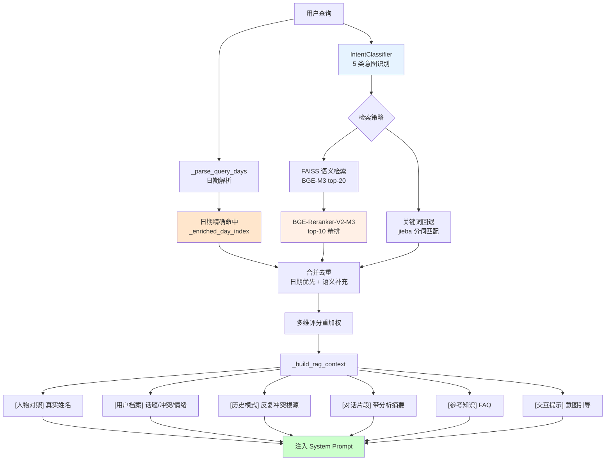

#### 四层检索详解

| 层级 | 组件 | 模型/方法 | 说明 |
|------|------|-----------|------|
| **Layer 1** | FAISS 向量召回 | BGE-M3 (`/data/models/bge-m3`) | top-20 粗召回，1024 维向量 |
| **Layer 2** | 交叉编码器精排 | BGE-Reranker-V2-M3 (`/data/models/bge-reranker-v2-m3`) | top-20 → top-10 精排，跨编码器打分 |
| **Layer 3** | 多维评分重加权 | 规则引擎 | `语义×0.5 + 时间×0.2 + 情感×0.3`，最终取 **top-5** |
| **Layer 4** | 上下文组装 | 模板引擎 | 6 类上下文块拼接注入 |

### 15.3 日期索引与精确检索

**核心**: `_enriched_day_index` — 按 day 编号建立的倒排索引，支持 O(1) 精确命中。

**`_parse_query_days()` 支持的日期格式**:

| 类型 | 示例 | 正则 |
|------|------|------|
| 单日（天数） | 第108天 | `r'(?:第)?(\d+)天'` |
| 单日（月日） | 10月8日 | `r'(\d{1,2})月(\d{1,2})日'` |
| 单日（ISO） | 2025-10-08 | `r'(\d{4})-(\d{1,2})-(\d{1,2})'` |
| 范围（天数） | 第108天到第110天 | `r'第(\d+)天[到至\-]第?(\d+)天'` |
| 范围（月日） | 9月22日到25日 | `r'(\d+)月(\d+)日[到至](\d+)日'` |
| 相对 | 最近一周、上个月、最近三天 | 关键词匹配 + 当前 day 计算 |

**混合检索策略**: 日期命中结果**优先排前** + 语义结果**补充去重**（旧方案是日期替换语义，新方案两者合并）。

### 15.4 多维评分与跨天关联

每个候选 chunk 的最终得分由三个维度加权：

```python
final_score = semantic_score * 0.5 + time_score * 0.2 + emotion_score * 0.3
```

| 维度 | 计算方法 | 说明 |
|------|----------|------|
| **语义相似度** | BGE-M3 余弦距离 → Reranker 交叉编码器分数 | 核心召回信号 |
| **时间相关性** | query 日期与 chunk 日期的距离衰减 | 越近越相关 |
| **情感匹配度** | query 情绪关键词与 chunk 情感标签的重叠度 | 悲伤/愤怒/焦虑等 |

**跨天关联检测**: 当检测到多个不同天的 chunk 包含相似冲突模式（如"回避沟通"、"冷暴力"），自动将它们关联为**历史模式**，注入 `[历史模式]` 上下文块。

### 15.5 意图分类与动态策略

**核心脚本**: `intent_classifier.py`

| 意图类型 | 示例 | 检索策略 |
|----------|------|----------|
| **时间查询** | "第108天发生了什么" | 日期索引优先 |
| **情感倾诉** | "我今天很难过" | 语义召回 + 情感匹配 |
| **建议请求** | "我该怎么办" | 高分析质量 chunk 优先 |
| **模式分析** | "我们总是因为钱吵架" | 跨天关联 + 历史模式 |
| **闲聊** | "你好" | 不触发 RAG |

### 15.6 上下文组装（6 类信息块）

`_build_rag_context()` 将检索结果组装为结构化上下文：

| 信息块 | 内容 | 注入位置 |
|--------|------|----------|
| **[人物对照]** | 真实姓名对照表 | System Prompt 头部 |
| **[用户档案]** | 高频话题、冲突模式、情绪基线 | System Prompt |
| **[历史模式]** | 反复出现的冲突根源和修复尝试 | System Prompt |
| **[对话片段]** | 命中 chunk 的原文 + 分析摘要 | System Prompt |
| **[参考知识]** | FAQ 知识库匹配条目 | System Prompt |
| **[交互提示]** | 基于意图的引导语（如"用户在寻求建议，请提供结构化分析"） | System Prompt |

### 15.7 增量更新

**核心接口**: `ChunkAwareRAG.add_chunks_incremental()` + `POST /api/rag/incremental-update`

| 步骤 | 说明 |
|------|------|
| 1. 新 chunk 编码 | BGE-M3 生成向量 |
| 2. FAISS 追加 | `index.add()` 增量添加 |
| 3. 元数据合并 | `metadata.json` + `enriched_metadata.json` 追加 |
| 4. 日期索引更新 | `_enriched_day_index` 追加新 day 映射 |

无需全量重建索引，支持实时添加新对话数据。

### 15.8 索引构建参数

| 参数 | 值 |
|------|-----|
| 向量模型 | BGE-M3 (`/data/models/bge-m3`) |
| 向量维度 | 1024 |
| 索引类型 | FAISS FlatIP |
| 索引大小 | N 向量（与 chunks 数等同） |
| 覆盖天数 | 覆盖全部对话日期范围 |
| Reranker | BGE-Reranker-V2-M3 (`/data/models/bge-reranker-v2-m3`) |
| 粗召回 top-k | 20 |
| 精排 top-k | 10 → 最终 top-5 注入上下文 |

---

## 16. 在线对话服务与长对话记忆

> 📖 **详细设计文档**：[在线对话服务与前端交互系统](advisor_service_overview.md) Sections 2-6 — Agent/Mode 矩阵、API 兼容层四轮迭代、三层记忆压缩、Key 管理、流式输出与 Thinking UI

### 16.1 三种 Agent × 两种模式

3 种 Agent 类型 × 2 种交互模式 = 6 个独立 System Prompt，覆盖不同咨询场景：

| Agent | 倾听模式（5-7 句） | 咨询模式（1500-3000 字） |
|-------|----------|----------|
| **中立顾问** | 共情 + 开放性问题 | 沟通模式 · 依附风格 · NVC 分析 · 权力动态 · 家庭系统 |
| **支持性顾问** | 无条件情感验证 | 用户视角分析 · 保护性建议 · 边界设立 · time_patterns + multimodal_signals |
| **精神分析顾问** | 均匀悬浮注意力 · 防御机制识别 | 客体关系 · 拉康三界 · 欲望结构 · 移情分析 |

所有 prompt 均包含"如果有历史对话上下文"引导语，确保 RAG 注入时 Agent 正确引用。

### 16.2 API 兼容层（四轮迭代）

不同云端后端的 API 格式差异由统一兼容层处理。GLM-4.7 的 Response API 经历了四轮修复才稳定：

| 轮次 | 问题 | 修复 |
|------|------|------|
| **第一轮** | Response API `input` 含 system role → 400 | 改用 `instructions` 参数传系统提示 |
| **第二轮** | 代理不支持多轮 `input` 数组 → 400 | 扁平化：history 注入 `instructions`，`input` 仅当前消息 |
| **第三轮** | 代理静默忽略 `instructions` → 无视 RAG | 放弃 `instructions`，system 回到 `input[0]` |
| **最终方案** | 单轮格式稳定 | `input[0]=system(含 RAG+历史)`, `input[1]=user(当前消息)` |

| 后端类型 | API 格式 | 兼容策略 |
|---------|----------|----------|
| GLM-4.7 | `/v1/responses` (Response API) | 单轮 system+user input，历史扁平化到 system 末尾 |
| DeepSeek/GLM/Qwen/Kimi/Doubao | `/v1/chat/completions` | 标准多轮，max_tokens ≤ 16384 |
| 本地 Ollama | `/v1/chat/completions` | qwen3:8b，无 token 限制 |

### 16.3 消息预处理

| 处理　　　　　　　　　　| 说明　　　　　　　　　　　　　　　　　 | 解决的问题　　　　　　　　　　　　 |
| -------------------------| ----------------------------------------| ------------------------------------|
| **连续同角色合并**　　　| 多条连续 user/assistant 消息合并为一条 | 用户重试积累导致 DeepSeek/OpenAI 400 |
| **过长消息截断**　　　　| 单条 ≤ 3000 字　　　　　　　　　　　　 | 防止 context window 溢出　　　　　 |
| **max_tokens 统一上限** | 所有后端 ≤ 16384　　　　　　　　　　　 | 第三方api 代理对 131072 返回 400　 |

### 16.4 三层长对话记忆压缩

解决深度对话中 Agent 遗忘和编造问题：

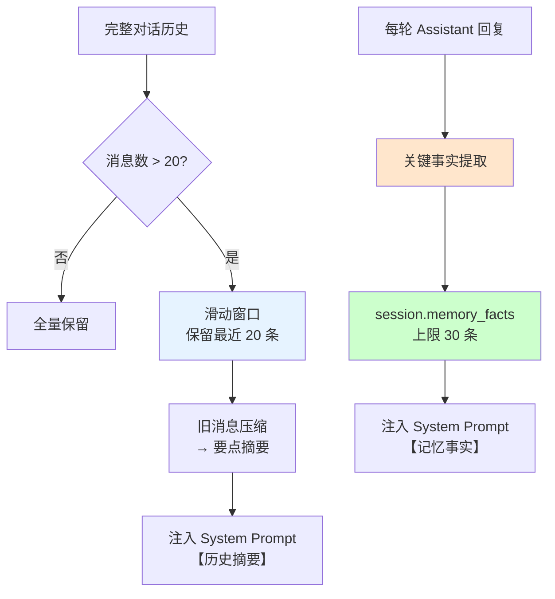

| 层级 | 机制 | 持久化 | 说明 |
|------|------|--------|------|
| **L1 滑动窗口** | 保留最近 20 条完整消息 | session JSON | 超出部分进入 L2 |
| **L2 历史摘要** | 旧消息压缩为要点列表 | session JSON | 注入 system prompt `【历史摘要】` |
| **L3 关键事实** | 自动提取日期事件 · 关系状态判断 | `session.memory_facts` | 跨轮次累积（上限 30 条），注入 `【记忆事实】` |

**事实提取规则**:
- 日期+事件对（如"9月24日发生了冲突"）
- 关系状态判断（如"核心问题：回避型沟通"）
- 用户自述关键信息（如"我们在一起三年了"）

### 16.5 Key 管理与限流

| 组件 | 文件 | 功能 |
|------|------|------|
| **KeyRotator** | `key_rotator.py` | 每后端 3 个 key 轮换，故障自动降级到下一个 key |
| **GlobalRateLimiter** | `key_rotator.py` | 全账户 RPM ≤ 19 硬限制，跨所有 KeyRotator 共享 |
| **platforms.yaml** | `local_secrets/platforms.yaml` | 7 平台定义，所有 API key 集中管理，零硬编码 |

### 16.6 流式输出与 Thinking UI

| 功能 | 实现 | 说明 |
|------|------|------|
| **SSE 流式** | `StreamingResponse` + `async generator` | 所有后端统一 SSE 格式 |
| **Thinking 内容** | `reasoning_content` / `<think>` 标签检测 | DeepSeek/Qwen/DeepSeek 思考过程分离显示 |
| **Qwen3 清理** | 空 `<think>\n</think>` 标签自动移除 | Qwen3 always-think 模式的残留标签 |
| **同步→异步桥接** | `run_in_executor` | GLM/DeepSeek 同步 SDK 在 async generator 中运行 |

---

## 17. 前端交互系统

> 📖 **详细设计文档**：[在线对话服务与前端交互系统](advisor_service_overview.md) Sections 7-9 — React 技术栈、核心组件、API 端点清单、SSE 流式处理

### 17.1 技术栈

| 组件 | 技术 |
|------|------|
| 框架 | React 18 + TypeScript |
| 构建 | Vite |
| UI | TailwindCSS + 自定义组件 |
| 状态 | React hooks (useState/useEffect) |
| 端口 | `localhost:5173` |

### 17.2 核心组件

| 组件 | 文件 | 功能 |
|------|------|------|
| **ChatPanel** | `ChatPanel.tsx` | 主对话界面，SSE 流式渲染，Thinking 折叠展示 |
| **ModelSelector** | `ModelSelector.tsx` | 按角色（分析/审核/对话）选择模型，持久化到 `model_preferences.json` |
| **PipelineStatus** | `PipelineStatus.tsx` | 流水线执行状态可视化（Phase 2/3 进度） |
| **Settings** | Settings 页面 | Agent 类型切换、模式切换、模型偏好 |

### 17.3 API 端点清单

| 端点 | 方法 | 功能 |
|------|------|------|
| `/api/chat` | POST | 流式对话（SSE），支持所有后端 |
| `/api/chat/sessions` | GET | 会话列表 |
| `/api/chat/sessions/{id}` | GET/DELETE | 会话详情/删除 |
| `/api/rag/search` | POST | RAG 检索测试 |
| `/api/rag/feedback` | POST | 用户反馈收集 |
| `/api/rag/incremental-update` | POST | 增量更新 RAG 索引 |
| `/api/models/available` | GET | 可用模型列表（含 `suitable_for` 角色标签） |
| `/api/models/preferences` | GET/POST | 模型偏好读取/保存 |
| `/api/pipeline/run` | POST | 触发流水线执行（Phase 2/3） |
| `/api/pipeline/status` | GET | 流水线执行状态 |

---

## 18. 脚本工程化与流水线可维护性

### 18.1 CLI 脚本链

```
scripts/advisor/run_all/
├── _00_verify_environment.py       # 环境验证（模型路径、依赖、GPU）
├── _01_extract_conversations.py    # 滑动窗口提取 chunks + mm_density
├── _02b_model_comparison.py        # 8 模型 × 5 chunks A/B 对比
├── _02c_fusion_pipeline.py         # MoA 并行融合（--moa / --pipeline）
├── _03b_ai_review.py               # AI 审核 + 自动补齐（--remediate）
├── _04_import_reviewed.py          # 导入审核结果
├── _05_format_training_data.py     # 格式化为 SFT messages（--source moa）
├── _05b_filter_split_training.py   # 过滤 + 80/10/10 分层划分
├── _05c_deanonymize_training.py    # 反匿名化（--deanon-analysis）
├── _06_train_model.py              # QLoRA 训练（--backend unsloth/hf）
├── _07_run_inference.py            # 单条/批量推理
├── _07b_eval_compare.py            # 策略 A/B 定量评估（ROUGE-L/字段覆盖）
├── _08_run_dialogue.py             # 实时对话引擎（listen/consult）
├── _09_build_graph.py              # FAISS 向量索引构建
└── _10_augment_data.py             # 多教师蒸馏数据增强
```

### 18.2 辅助组件清单

| 组件 | 文件 | 功能 |
|------|------|------|
| ConversationExtractor | `extractor.py` | 滑动窗口 chunk 提取 + `_compute_mm_density()` |
| AnalysisGenerator | `generator.py` | 3 种 Agent prompt + mm_context 多模态密度注释 |
| PipelineExecutor | `pipeline_executor.py` | 4 级 asyncio 流水线 + Semaphore + rich 可视化 |
| SchemaValidator | `schema_validator.py` | JSON 校验 + 2 轮 LLM 自修复 + fallback |
| SafetyLayer | `safety_layer.py` | P0: 云端 rationale 不注入本地上下文 |
| ModelRouter | `model_router.py` | 多模型路由 · fallback · 成本控制 · 9 后端配置 |
| IntentClassifier | `intent_classifier.py` | 5 类用户意图识别 → 动态检索策略 |
| QueryRewriter | `query_rewriter.py` | 时间上下文 · 情绪扩展 · 历史关联 |
| ChunkAwareRAG | `chunk_based_rag.py` | 多维检索 + 日期索引 + 增量更新 + Reranker |
| KeyRotator | `key_rotator.py` | API key 轮换 + GlobalRateLimiter (RPM≤19) |
| Formatter | `formatter.py` | Markdown 审核导出 + 13 字段解析 + 5 多模态字段 |
| Inference | `inference.py` | 双模推理（思考/非思考）· 4-bit 量化 · LoRA 加载 |
| StreamingDialogue | `streaming.py` | 流式对话引擎 · Ollama 本地推理 |

### 18.3 运行命令

```bash
# 1. 后端服务
source local_secrets/.env.advisor
conda run -n CHAT_APP_DHA uvicorn scripts.advisor.api.server:app --reload --port 8787

# 2. 前端
cd frontend && npm run dev    # → http://localhost:5173

# 3. 本地 LLM（可选）
ollama run qwen3:8b           # → http://localhost:11434

# 4. MoA 融合分析
conda run -n CHAT_APP_DHA python scripts/advisor/run_all/_02c_fusion_pipeline.py --moa

# 5. 训练（Unsloth 后端）
HF_HUB_OFFLINE=1 conda run -n CHAT_APP_DHA_unsloth python scripts/advisor/run_all/_06_train_model.py \
  --agent-type neutral --use-splits --splits-dir advisor_out/training/splits_deanon \
  --backend unsloth --lora-r 32 --lora-alpha 64 --max-seq-length 4096 --epochs 5

# 6. FAISS 索引构建
conda run -n CHAT_APP_DHA python scripts/advisor/run_all/_09_build_graph.py

# 7. 增量 RAG 更新
curl -X POST http://localhost:8787/api/rag/incremental-update -H 'Content-Type: application/json' \
  -d '{"chunks_path": "advisor_out/chunks/new_chunks.jsonl"}'
```

### 18.4 审计与健壮性保障

| 审计项 | 覆盖范围 | 结果 |
|--------|----------|------|
| 脚本完整性 | 15/15 run_all 脚本 | ✅ 全部可运行 |
| 测试用例 | 154 passed, 10 GPU-skipped | ✅ |
| 代码兼容性 | _02/_02c/_03b 均支持 MoA/单模型 | ✅ |
| JSON 自修复 | schema_validator 2 处 repair+fallback | ✅ |
| API 适配层 | DeepSeek + GLM + Qwen + Kimi + Doubao | ✅ |
| GPU 管理 | 单 GPU 运行，即时释放 | ✅ |
| 安全审计 | .gitignore 覆盖所有 PII/API key 文件 | ✅ |

---

## 19. 成功指标与输出结构

### 19.1 关键指标

| 指标 | 目标 | 实际 | 状态 |
|------|------|------|------|
| MoA 融合成功率 | ≥ 90% | **100%** | ✅ |
| AI 审核通过率 | ≥ 70% | **≥ 85%**, 补齐后 **≥ 97%** | ✅ |
| 训练 eval_loss | < 1.5 | **1.3696** (Unsloth r=32) | ✅ |
| 推理字段完整率 | ≥ 90% | **100%** (≥13 字段) | ✅ |
| 推理 ROUGE-L | > 0.2 | **0.2849** | ✅ |
| PII 泄露 | 0 | **0** | ✅ |
| 推理显存 | < 8 GB | **~5-6 GB** (4-bit) | ✅ |
| 对话首 token 延迟 | < 3s (云端) | Kimi 2.5s, DeepSeek 3s | ✅ |
| 模型连通 | 9/9 后端 | **9/9** ✅ | ✅ |
| RAG 日期精确检索 | 单日/范围/相对 | **全部支持** | ✅ |
| 训练显存 (Unsloth) | < 16 GB | **~8.9 GB** (-38%) | ✅ |
| 测试覆盖 | — | **154 passed** | ✅ |

### 19.2 输出文件结构

```
advisor_out/
├── chunks/conversation_chunks.jsonl              # 对话片段（反匿名化后，含 mm_density）
├── analysis/
│   ├── fused_analysis_neutral_moa.jsonl          # MoA 融合分析（匿名）
│   └── fused_analysis_neutral_moa_deanon.jsonl   # MoA 融合分析（反匿名化）
├── review/ai_review_neutral.jsonl                # AI 审核结果（5维评分）
├── training/
│   ├── advisor_training_neutral_deanon.jsonl      # 反匿名化训练数据
│   └── splits_deanon/
│       ├── train.jsonl                            # 80% 训练集
│       ├── val.jsonl                              # 10% 验证集
│       └── test.jsonl                             # 10% 测试集
├── models/
│   ├── relationship_advisor_neutral/              # LoRA 权重 (HF, seq=1664)
│   └── relationship_advisor_neutral_deanon_unsloth_r32/  # LoRA 权重 (Unsloth, seq=4096) ← 生产模型
├── faiss_index/
│   ├── index.faiss                                # FAISS 向量索引 (BGE-M3, 1024d)
│   ├── metadata.json                              # chunk 元数据
│   ├── enriched_metadata.json                     # 分析摘要索引 + 日期索引
│   └── user_profile.json                          # 用户关系档案
├── chat_sessions/{session_id}.json                # 多轮会话持久化（含 memory_facts）
├── feedback/chat_feedback.jsonl                   # 用户反馈（thumbs up/down + 文本）
├── knowledge/faq.jsonl                            # FAQ 知识库
├── model_preferences.json                         # 前端模型偏好配置
└── comparison/pipeline_plan.md                    # 50 节开发进度日志
```

---

**文档版本**: v4.0  
**创建时间**: 2026-01-15  
**最后更新**: 2026-02-15  
**整合来源**: agent_sft_final_pipeline.md, l1_l2_sft_pipeline.md, advisor_pipeline_overview.md, full_pipeline_overhaul_plan.md, pipeline_plan.md
