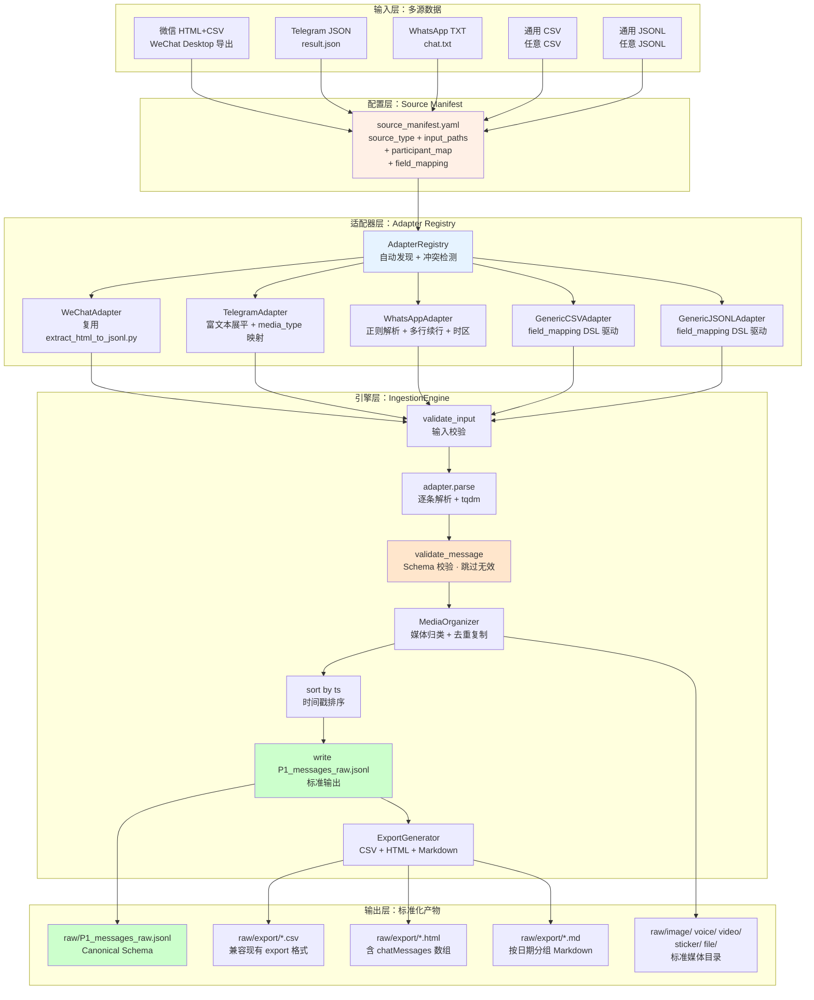

# 归一化输入流水线（Universal Ingestion Pipeline）

> 📌 **本文档定位**：这是 [多模态处理流水线文档](modality_fields_and_models.md) Section 0.2 的详细设计文档，专注于多源数据归一化接入、适配器插件架构、Canonical Schema 定义、媒体文件组织和导出生成。
>
> 📖 **设计规范**：`research/universal-ingestion/design.md` — 18 个正确性属性、Hypothesis 属性测试策略
>
> 📖 **用户指南**：[workspace_init.md](workspace_init.md) | [ingestion_guide.md](ingestion_guide.md)

## 1. 设计理念

### 1.1 核心目标

wechatDHA 流水线原本只支持微信 HTML+CSV 导出格式。随着需求扩展到 Telegram、WhatsApp 等多种即时通讯平台，需要一个**统一归一化入口**，将异构数据源转换为标准格式后进入下游处理流水线。

| 挑战 | 解决方案 |
|------|----------|
| 多源异构格式（HTML/JSON/TXT/CSV/JSONL） | 插件式适配器架构，每种来源一个 Adapter |
| 字段名称/类型不统一 | Canonical Schema 强制约束 + validate_message() 校验 |
| 媒体文件散落目录不一致 | MediaOrganizer 按 modality + 日期归类到 raw/ 标准结构 |
| 新数据源接入成本高 | field_mapping DSL（直接映射 / 常量 / 默认值三语法） |
| 输出与下游管道不兼容 | 与现有 P1_messages_raw.jsonl 100% schema 兼容 |

### 1.2 设计原则

```
┌─────────────────────────────────────────────────────────────────┐
│                      设计原则                                    │
├─────────────────────────────────────────────────────────────────┤
│  1. Schema 驱动：所有输出必须通过 validate_message() 校验        │
│  2. 零 GPU 依赖：全流程 CPU-only 规则引擎，无模型推理            │
│  3. 插件可扩展：新增数据源只需实现 SourceAdapter 抽象基类         │
│  4. 幂等安全：相同输入多次执行产生相同输出                       │
│  5. 渐进验证：dry_run 预检 → run 正式执行 → 报告统计              │
└─────────────────────────────────────────────────────────────────┘
```

---

## 2. 整体架构

### 2.1 端到端流程图



### 2.2 目录结构

```
scripts/workspace/
├── init_workspace.py           # Workspace 初始化入口（含归一化步骤）
├── run_ingest.py               # 独立归一化 CLI 入口
└── ingestion/
    ├── __init__.py
    ├── engine.py               # IngestionEngine 主流程
    ├── schema.py               # CanonicalMessage + validate_message
    ├── manifest.py             # SourceManifest 加载/校验
    ├── registry.py             # AdapterRegistry 自动发现
    ├── media_organizer.py      # 媒体文件归类 + 去重复制
    ├── export_generator.py     # CSV/HTML/MD 导出生成器
    └── adapters/
        ├── base.py             # SourceAdapter ABC
        ├── wechat_html.py      # 微信 HTML+CSV
        ├── telegram_json.py    # Telegram Desktop JSON
        ├── whatsapp_txt.py     # WhatsApp TXT
        ├── generic_csv.py      # 通用 CSV（field_mapping 驱动）
        └── generic_jsonl.py    # 通用 JSONL（field_mapping 驱动）
```

---

## 3. Canonical Schema

### 3.1 字段定义

所有适配器输出的消息记录都必须符合 `CanonicalMessage` dataclass 定义，下游流水线（模态处理、Merge、时间轴后处理、SFT 优化等）只消费此 schema。

#### 必填字段

| 字段名 | 类型 | 格式约束 | 说明 |
|--------|------|----------|------|
| `msg_uid` | str | `{prefix}:{id}` | 唯一标识（P1/TG/WA/CSV/JSONL 前缀） |
| `ts` | int | 正整数 Unix 秒 | 消息时间戳 |
| `speaker` | str | `ME` \| `OTHER` \| `OTHER:{name}` | 发言者标识 |
| `type` | int | 微信类型码兼容 | 消息类型码 |
| `modality` | str | 9 种枚举 | text/image/voice/video/sticker/link_or_file/location/contact/system |
| `text_raw` | str | — | 原始文本内容 |

#### 可选字段

| 字段名 | 类型 | 说明 |
|--------|------|------|
| `seq_in_html` | int | HTML 中的序号（默认 -1） |
| `MsgSvrID` | str | 微信服务器消息 ID |
| `token` | str | 消息 token |
| `time_local` | str | 本地时间 YYYY-MM-DD HH:MM:SS |
| `sub_type` | int | 消息子类型码 |
| `media_path` | str? | 相对于 raw/ 的媒体文件路径 |
| `voice_length` | int? | 语音时长（毫秒） |
| `voice_to_text` | str? | 语音转文字 |
| `link_url` | str? | 链接 URL |
| `link_title` | str? | 链接标题 |
| `miniprogram_appid` | str? | 小程序 AppID |
| `quote_svrid` | str? | 引用消息 ID |
| `quote_type` | int? | 引用消息类型 |
| `quote_text` | str? | 引用消息文本 |
| `file_name` | str? | 文件名 |
| `file_size` | str? | 文件大小 |
| `location_x` | float? | 位置经度 |
| `location_y` | float? | 位置纬度 |
| `location_label` | str? | 位置标签 |
| `contact_nickname` | str? | 名片昵称 |
| `contact_username` | str? | 名片用户名 |

### 3.2 有效 modality 枚举

```python
VALID_MODALITIES = frozenset({
    "text", "image", "voice", "video", "sticker",
    "link_or_file", "location", "contact", "system",
})
```

与现有 `P1_messages_raw.jsonl` 的 modality 分布完全兼容：

| modality | 占比 |
|----------|------|
| text | ~76% |
| link_or_file | ~13% |
| sticker | ~4% |
| image | ~3% |
| voice | ~2.5% |
| system | <1% |
| location | <0.5% |
| video | <0.5% |
| contact | <0.5% |

### 3.3 校验函数

`validate_message(record: dict) -> list[str]` 执行四项检查：

1. **必填字段存在性**：6 个 `REQUIRED_FIELDS` 不得为 None 或缺失
2. **ts 类型与范围**：必须为正整数
3. **modality 枚举约束**：必须属于 `VALID_MODALITIES`
4. **speaker 格式**：必须以 `ME` 或 `OTHER` 开头

---

## 4. 适配器详解

### 4.1 适配器基类

```python
class SourceAdapter(ABC):
    def supported_source_type(self) -> str: ...   # 返回 source_type 标识
    def parse(self, input_path, manifest) -> Iterator[dict]: ...  # 逐条产出
    def validate_input(self, input_path) -> list[str]: ...  # 输入校验
    def detect_media_files(self, input_path) -> list[Path]: ...  # 媒体检测
    def describe(self) -> dict: ...  # 适配器说明
```

### 4.2 五种适配器对比

| 适配器 | source_type | 输入格式 | msg_uid 前缀 | 特殊处理 |
|--------|-------------|----------|-------------|----------|
| **WeChatAdapter** | `wechat_html` | HTML + CSV | `P1:` | 复用 `extract_html_to_jsonl.py` 核心逻辑 |
| **TelegramAdapter** | `telegram_json` | result.json | `TG:` | 富文本数组展平、media_type→modality 映射 |
| **WhatsAppAdapter** | `whatsapp_txt` | *.txt | `WA:` | 8 种时间格式、多行续行、媒体占位符识别 |
| **GenericCSVAdapter** | `generic_csv` | *.csv | 自定义 | field_mapping DSL 驱动 + participant_map |
| **GenericJSONLAdapter** | `generic_jsonl` | *.jsonl | 自定义 | field_mapping DSL 驱动 + participant_map |

### 4.3 微信适配器 (wechat_html)

**核心脚本**: `adapters/wechat_html.py`

复用现有 `extract_html_to_jsonl.py` 的核心函数，无代码重复：

```
输入: HTML 文件（chatMessages 数组）+ CSV 元数据
  ↓ extract_chatmessages_array() — 从 HTML 提取消息数组
  ↓ load_csv_metadata() — 加载 CSV 元数据（可选）
  ↓ normalize_message() — 逐条标准化
输出: Canonical Schema 记录流
```

msg_uid 格式: `P1:{MsgSvrID}`，与现有数据完全兼容。

### 4.4 Telegram 适配器 (telegram_json)

**核心脚本**: `adapters/telegram_json.py`

| 处理环节 | 说明 |
|----------|------|
| 消息过滤 | 仅处理 `type="message"`，跳过 service/action |
| 富文本展平 | `flatten_text()` 将 `[str, {text: str}]` 数组展平为纯文本 |
| modality 映射 | `sticker/animation→sticker`, `voice_message→voice`, `video_message/video_file→video`, `photo→image`, `file→link_or_file` |
| speaker 映射 | `participant_map` 查找，未映射则 `OTHER:{from_name}` |
| 时间戳解析 | `datetime.fromisoformat()` 解析 ISO 8601 格式 |

### 4.5 WhatsApp 适配器 (whatsapp_txt)

**核心脚本**: `adapters/whatsapp_txt.py`

支持 **8 种本地化时间格式**：

| 格式 | 示例 | 地区 |
|------|------|------|
| US 12h | `1/15/25, 10:30 AM` | 美国 |
| US 长年 | `1/15/2025, 10:30 AM` | 美国 |
| EU 24h | `15/01/25, 10:30` | 欧洲 |
| EU 长年 | `15/01/2025, 10:30` | 欧洲 |
| US 含秒 | `1/15/25, 10:30:15 AM` | 美国 |
| EU 含秒 | `15/01/25, 10:30:15` | 欧洲 |
| 德国 | `15.01.25, 10:30` | 德国 |
| 德国长年 | `15.01.2025, 10:30` | 德国 |

关键特性：
- **多行续行**：不匹配行格式的行视为前一条消息的续行
- **媒体占位符**：`<Media omitted>` 等 8 种变体识别为 image
- **文件附件**：`filename.ext (file attached)` 提取文件名并按扩展名映射 modality
- **时区感知**：使用 `manifest.timezone` 配置（默认 `Asia/Shanghai`）

### 4.6 通用适配器 (generic_csv / generic_jsonl)

**核心脚本**: `adapters/generic_csv.py` + `adapters/generic_jsonl.py`

通过 `source_manifest.yaml` 中的 `field_mapping` DSL 驱动，支持三种映射语法：

| 语法 | 格式 | 说明 |
|------|------|------|
| **直接映射** | `source_field: target_field` | 源字段存在时映射 |
| **常量值** | `_const:value: target_field` | 所有记录使用固定值 |
| **默认值** | `_default:value: target_field` | 仅源字段缺失时使用 |

示例配置：

```yaml
field_mapping:
  CreateTime: ts           # 直接映射
  NickName: speaker        # 直接映射（经 participant_map 二次映射）
  Content: text_raw        # 直接映射
  Type: type               # 直接映射
  _const:text: modality    # 常量值
  _const:QQ: _source_prefix  # 自定义 msg_uid 前缀
  _default:0: sub_type     # 默认值
```

`participant_map` 应用时机：field_mapping 映射后、类型转换前，确保原始名称正确转换为 `ME`/`OTHER` 格式。

---

## 5. Source Manifest 配置

### 5.1 配置结构

```yaml
# source_manifest.yaml
source_type: telegram_json       # 必填：适配器类型
input_paths:                     # 必填：输入文件路径
  - ./result.json
participant_map:                 # 可选：名称→speaker 映射
  "Alice": "ME"
  "Bob": "OTHER"
timezone: Asia/Shanghai          # 可选：时区（默认 Asia/Shanghai）
media_base_dir: ./media          # 可选：媒体文件基础目录
workspace_name: my_chat          # 可选：工作区名称
field_mapping: {}                # 可选：通用适配器字段映射
```

### 5.2 校验规则

`validate_manifest(manifest, registered_types)` 检查：
- `source_type` 是否在已注册适配器中
- `input_paths` 不能为空

---

## 6. 媒体文件组织

### 6.1 目标目录结构

`MediaOrganizer` 将输入媒体文件按 modality 和时间组织到标准目录：

```
raw/
├── image/
│   ├── 2025-06/       # 按 YYYY-MM 分组
│   └── 2025-07/
├── voice/             # 不按月分（文件量小）
├── video/
│   └── 2025-08/       # 按 YYYY-MM 分组
├── sticker/           # 不按月分
└── file/              # 其他文件
```

### 6.2 去重策略

`copy_with_dedup(src, dst)` 三种情况：

| 情况 | 处理 |
|------|------|
| 目标不存在 | 直接复制 |
| 目标存在且 SHA-256 相同 | 跳过（幂等） |
| 目标存在但内容不同 | 添加 `_{hash8}` 后缀复制 |

---

## 7. 导出生成

### 7.1 三格式导出

`ExportGenerator` 从有效记录列表生成三种下游兼容格式：

| 格式 | 文件 | 用途 |
|------|------|------|
| **CSV** | `export/{name}.csv` | 兼容现有 export 格式（localId/TalkerId/IsSender/...） |
| **HTML** | `export/{name}.html` | 含 `var chatMessages = [...]`，可被 `extract_html_to_jsonl.py` 解析 |
| **Markdown** | `export/{name}.md` | 按日期分组的可读文本（`## YYYY-MM-DD`） |

### 7.2 CSV 字段映射

| CSV 列名 | 来源 | 说明 |
|-----------|------|------|
| localId | seq_in_html 或行索引 | 消息序号 |
| TalkerId | speaker → 1(ME)/2(OTHER) | 发送者 ID |
| IsSender | speaker → 1(ME)/0(OTHER) | 是否本人 |
| CreateTime | ts | Unix 时间戳 |
| StrContent | text_raw | 消息内容 |
| StrTime | time_local 或从 ts 格式化 | 可读时间 |

---

## 8. 引擎执行模式

### 8.1 正式执行 (run)

```
manifest → validate_input → parse → validate_message → MediaOrganizer
  → sort(ts) → write P1_messages_raw.jsonl → ExportGenerator → IngestionReport
```

`IngestionReport` 包含：
- `total_messages`: 有效消息总数
- `by_modality`: 按 modality 分布
- `by_speaker`: 按 speaker 分布
- `date_range`: 时间范围 (min_date, max_date)
- `records_skipped` + `skip_reasons`: 跳过记录及原因

### 8.2 预检模式 (dry_run)

扫描前 N 条记录（默认 100）生成覆盖率报告：

| 检查项 | 结论 |
|--------|------|
| 所有必填字段覆盖率 = 100% | **PASS** |
| 部分必填字段 < 100% 但 > 0% | **WARN** |
| 任何必填字段覆盖率 = 0% | **FAIL** |

### 8.3 CLI 入口

```bash
# 通过 init_workspace.py（初始化 + 归一化一体）
python scripts/workspace/init_workspace.py \
    --raw-dir /path/to/raw \
    --target-dir /path/to/workspace

# 通过 run_ingest.py（独立归一化）
python scripts/workspace/run_ingest.py \
    --workspace /path/to/workspace \
    --source-type telegram_json

# 工具命令
python scripts/workspace/run_ingest.py --show-schema      # 查看 Schema
python scripts/workspace/run_ingest.py --show-adapters     # 查看适配器
python scripts/workspace/run_ingest.py --dry-run           # 预检模式
python scripts/workspace/run_ingest.py --init-manifest telegram_json  # 生成模板
```

---

## 9. 测试与验证

### 9.1 测试覆盖

17 个测试文件，473 个测试用例，全部通过（9.31s）：

| 测试文件 | 覆盖范围 |
|----------|----------|
| `test_schema.py` | CanonicalMessage、validate_message、序列化 |
| `test_manifest.py` | YAML 加载、校验、默认值 |
| `test_registry.py` | 自动发现、冲突检测、手动注册 |
| `test_engine.py` | run/dry_run/show_schema/detect_source_type |
| `test_media_organizer.py` | 目录分类、去重复制、hash 计算 |
| `test_export_generator.py` | CSV/HTML/MD 生成 |
| `test_field_mapping.py` | 三语法映射、覆盖率校验 |
| `test_wechat_adapter.py` | HTML 解析、CSV 元数据、类型映射 |
| `test_telegram_adapter.py` | 富文本展平、media_type 映射、service 过滤 |
| `test_whatsapp_adapter.py` | 8 种时间格式、多行续行、媒体占位符、扩展名映射 |
| `test_generic_csv_adapter.py` | field_mapping 驱动、类型转换、participant_map |
| `test_generic_jsonl_adapter.py` | field_mapping 驱动、JSON 解析错误处理 |
| `test_adapter_base.py` | 基类默认行为 |
| `test_run_ingest.py` | CLI 参数解析、端到端集成 |
| `test_init_workspace_ingest.py` | 工作区初始化 + 归一化集成 |

### 9.2 下游兼容性验证

| 验证项 | 结果 |
|--------|------|
| CanonicalMessage 覆盖现有 P1_messages_raw.jsonl 所有字段 | ✅ 100% |
| VALID_MODALITIES 覆盖现有 9 种 modality | ✅ 100% |
| 现有全量记录通过 validate_message() | ✅ 0 errors |
| 5 种适配器输出均通过 Schema 校验 | ✅ 473/473 tests |
| E2E 引擎输出 ts 排序正确 | ✅ |
| Export 三格式生成正确 | ✅ |

---

## 10. 自动检测与 Workspace 集成

### 10.1 数据源自动检测

`IngestionEngine.detect_source_type(raw_dir)` 规则：

| 条件 | 检测结果 |
|------|----------|
| 存在 `*.html` 且 `*.csv` | `wechat_html` |
| 存在 `result.json` | `telegram_json` |
| 存在 `*.txt` | `whatsapp_txt` |
| 其他 | 返回 None（需手动指定） |

### 10.2 与 init_workspace.py 集成

`init_workspace.py` 的 Step 5 自动调用归一化引擎：

```
Step 1: 创建标准目录结构
Step 2: 迁移原始文件到 raw/
Step 3: 复制脚本和配置
Step 4: 生成工作区配置（paths.yaml, anonymization.yaml, hotword.txt）
Step 5: 运行归一化引擎 ← 自动检测 source_type 或使用指定值
```

归一化完成后，`raw/P1_messages_raw.jsonl` 即可直接进入下游 Phase 1 模态处理流水线。
